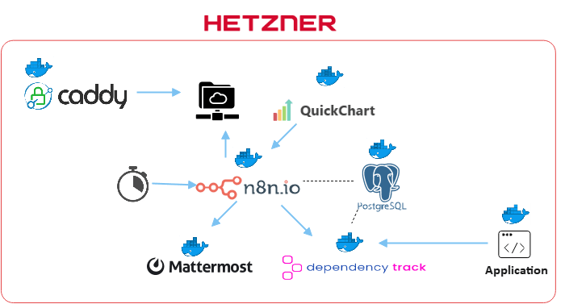
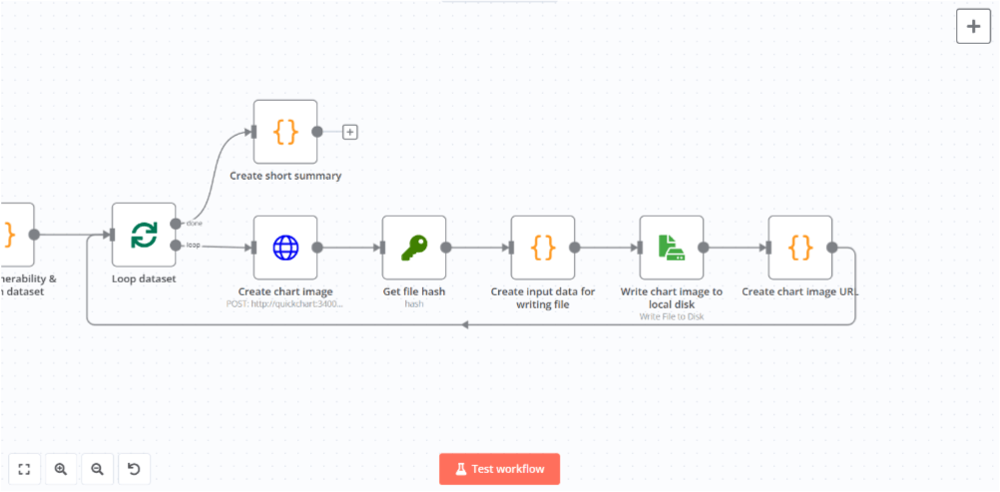

本記事ではアプリケーションで使用されているOSSのライブラリやパッケージ、モジュールなどのリスク評価を行い、評価結果を通知するワークフローを作成します。

## TOC

## フロー概要

作成するワークフローは以下のようになります。
まず、アプリケーションで使用されているOSSのライブラリやパッケージ、モジュールの使用状況を監視し、脆弱性などのリスク評価を行います。それらの評価結果をチャットに送信して通知します。


## システム構成

今回のシステム構成は下図のようになります。アプリケーションのコンポーネント構成をDependency-Trackに登録しリスク評価を行います。n8nが日次で評価結果を取得しQuickChartでグラフ化し画像としてローカルディスクに保存します。そして、Mattermostにグラフ画像を添付して評価結果を送信します。評価結果に添付するグラフ画像はCaddyから配信します。

<figure></figure>


| Resource | Usage | Hosting Type | Licensing Model |
| - | - | - | - |
| [Caddy](https://caddyserver.com/docs/) | グラフ画像を配信する | Self Hosting（Docker container on Hetzner Cloud） | Free<br />Open Source |
| [Mattermost](https://docs.mattermost.com/) | 評価結果の通知先 | Self Hosting（Docker container on Hetzner Cloud） | Freemium<br />Open Source |
| [n8n](https://docs.n8n.io/) | ワークフローを実行する | Self Hosting（Docker container on Hetzner Cloud） | Freemium<br />Open Source |
| [Dependency-Track](https://docs.dependencytrack.org/) | アプリケーションのリスク評価を行う | Self Hosting（Docker container on Hetzner Cloud） | Free<br />Open Source |
| [QuickChart](https://quickchart.io/documentation/) | グラフ画像を生成する | Self Hosting（Docker container on Hetzner Cloud） | Freemium<br />Open Source |
| [PostgreSQL](https://www.postgresql.org/docs/) | Issueの保存および各バックエンドサービスのデータストアとして使用する | Self Hosting（Docker container on Hetzner Cloud） | Free<br />Open Source |


## フローの作成

### コンポーネントの登録＆リスク評価

今回はサンプルとてLaravel＋Vue.jsで構築されたアプリケーションを使用します。
最初にDependency-Trackにアプリケーション用のプロジェクトを作成します。
プロジェクトは下図のように親プロジェクト（オペレーティングシステム）の下にPHPとJavaScriptの子プロジェクト（アプリケーション）を設ける階層構造にします。

<figure></figure>

プロジェクトを作成したら各プロジェクトに使用しているコンポーネントを登録します。
Dependency-Trackへのコンポーネントの登録は`CycloneDX`フォーマットの`SBOM`をインポートして行います。

SBOMの作成には[CycloneDX Generator (cdxgen)](https://cyclonedx.github.io/cdxgen/)を使用します。
ツールをインストールしたら下記のコマンドを実行してDependency-TrackにSBOMを送信します。

```shell
# Retrieve DEB packages, APT sources, RPM packages, ...
cdxgen -t os --server-url "Dependency-TrackのURL" --api-key "Dependency-Trackで発行したAPIキー" --project-id "Dependency-Trackで作成した親プロジェクトのID"

# Parse composer.lock
cdxgen -t php "プロジェクトのルートディレクトリ" --server-url "Dependency-TrackのURL" --api-key "Dependency-Trackで発行したAPIキー" --project-id "Dependency-Trackで作成した子プロジェクトのID"

# Parse package-lock.json
cdxgen -t javascript "プロジェクトのルートディレクトリ" --server-url "Dependency-TrackのURL" --api-key "Dependency-Trackで発行したAPIキー" --project-id "Dependency-Trackで作成した子プロジェクトのID"
```

コンポーネントの登録が完了するとリスク評価が行われ下図のように一覧が表示されます。

<figure></figure>


### リスク評価結果の通知

プロジェクトの設定が完了しましたのでリスク評価結果を通知するワークフローを作成していきます。

ワークフローは1日1回（毎日午前0時）にスケジュール起動するようにします。
まずはワークフローをスケジュール起動するための`Schedule`ノード（ノードパネルから`On a schedule`を選択）と`Workflow`ノード（ノードパネルから`When called by another workflow`を選択）を追加します。

<figure></figure>

Scheduleノードは設定パネルで以下のように設定します。

| Name | Value |
| - | - |
| Trigger Interval | Days |
| Days Between Triggers | 1 |
| Trigger at Hour | Midnight |
| Trigger at Minute | 0 |

次にDependency-Trackに登録したプロジェクトのリスク評価結果のサマリーをREST API経由で取得するために`HTTP Request`ノードを追加します。

<figure></figure>

ノードを追加して設定パネルで以下のように設定します。

| Name | Value |
| - | - |
| Method | GET |
| URL | http://(Dependency-Track APIサーバーのサービス名):8080/api/v1/project |
| Authentication | Generic Credential Type |
| Generic Auth Type | Header Auth |
| Credential for Basic Auth | Nameに`X-Api-Key`、ValueにDependency-Trackで発行したAPIキーを設定 |
| Send Query Parameters | OFF |
| Send Headers | OFF |
| Send Body | OFF |

APIを実行すると以下のような形でリスク評価結果のサマリーを取得することができます。

```json
[
  {
    "name": "demo-app-php",
    ・・・
    "metrics": {
      "critical": 1,
      "high": 6,
      "medium": 0,
      "low": 0,
      "unassigned": 0,
      "vulnerabilities": 7,
      "vulnerableComponents": 3,
      "components": 97,
      "suppressed": 0,
      "findingsTotal": 7,
      "findingsAudited": 0,
      "findingsUnaudited": 7,
      "inheritedRiskScore": 40,
      "policyViolationsFail": 0,
      "policyViolationsWarn": 0,
      "policyViolationsInfo": 130,
      "policyViolationsTotal": 130,
      ・・・
    }
  }
]
```

QuickChartでグラフ作成するために`Code`ノードで取得したデータを加工します（ノードパネルの`Data transformation`から選択）。

<figure></figure>

ノードを追加して設定パネルのコード入力欄に以下のJavaScriptを入力します。

```javascript
const base = {
  version: "2",
  backgroundColor: "transparent",
  width: 500,
  height: 300,
  devicePixelRatio: 1.0,
  format: "png",
  chart: {
    type: "bar",
    data: {
      labels: [],
      datasets: []
    },
    options: {
      title: {
        display: true,
        position: "top",
        text: ""
      }
    }
  }
}
const vulnerabilities = JSON.parse(JSON.stringify(base))
const violations = JSON.parse(JSON.stringify(base))

vulnerabilities.chart.data.labels = ["critical", "high", "medium", "low"]
vulnerabilities.chart.options.title.text = "vulnerabilities"
violations.chart.data.labels = ["fail", "warn", "info"]
violations.chart.options.title.text = "violations"

for (const project of $input.all()) {
  vulnerabilities.chart.data.datasets.push({
    label: project.json.name,
    data: [
      project.json.metrics.critical,
      project.json.metrics.high,
      project.json.metrics.medium,
      project.json.metrics.low
    ],
  })
  violations.chart.data.datasets.push({
    label: project.json.name,
    data: [
      project.json.metrics.policyViolationsFail,
      project.json.metrics.policyViolationsWarn,
      project.json.metrics.policyViolationsInfo,
    ]
  })
}

return [vulnerabilities, violations]
```

上記の処理で脆弱性およびポリシー違反の２つのグラフを作成するためのデータセットが準備できましたので、次にグラフを作成していきます。
まず`Loop Over Items`ノード（ノードパネルの`Flow`から選択）を使って繰り返しフローを作成し、loopブランチに`HTTP Request`ノードを追加してREST API経由でQuickChartにグラフ画像の生成を要求します。

<figure></figure>

ノードを追加して設定パネルで以下のように設定します。

| Name | Value |
| - | - |
| Method | POST |
| URL | http://(QuickChartのサービス名):3400/chart |
| Authentication | None |
| Send Query Parameters | OFF |
| Send Headers | ON |
| Header Parameters (Name1)  | Content-Type |
| Header Parameters (Value1)  | application/json |
| Header Parameters (Name2)  | Accept |
| Header Parameters (Value2)  | image/png |
| Send Body | ON |
| Body Content Type | JSON |
| Specify Body | Using JSON |
| JSON | &#123;&#123; $json.toJsonString() &#125;&#125; |

>[!NOTE]
>QuickChartはGETメソッドでもグラフ画像を作成できるため送信メッセージにクエリパラメータ付きのURLを埋め込んでグラフを表示させることも可能です。ただし、その場合外部から誰でも画像生成リクエストを送信できるようになってしまうため悪用される危険性があります。
>そのため、ここではQuickChartへのアクセスは同じDockerネットワークにあるサービスからのみに制限し、生成した画像はローカルディスクに保存してCaddyを介して静的ファイルとして配信するようにしています。

グラフ画像を生成したらそのバイナリデータをもとに`Crypto`ノード（ノードパネルの`Data transformation`から選択）を使用してハッシュ値を計算します。ハッシュ値はグラフ画像を保存する際のファイル名に使用します。

<figure></figure>

ノードを追加して設定パネルで以下のように設定します。

| Name | Value |
| - | - |
| Action | Hash |
| Type | SHA256 |
| Binary File | ON |
| Binary Property Name | Data |
| Property Name | hash |
| Encoding | HEX |

次にグラフ画像のバイナリデータをファイル出力ノード（`Read/Write Files from Disk`）を使ってローカルディスクにファイル出力します（ファイル出力ノードに渡すinputデータにバイナリデータを追加する必要があるため先に`Code`ノードで加工を行います）。

<figure></figure>

Codeノードの設定パネルでコード入力欄に以下のJavaScriptを入力します。

```javascript
items[0].binary = $('グラフ画像生成ノードの名前').first().binary
return items
```

ファイル出力ノードの設定パネルで以下のように設定します。

| Name | Value |
| - | - |
| Operation | Write File to Disk |
| File Path and Name | /（出力先ディレクトリ）/&#123;&#123; $('ハッシュ値生成ノードの名前').item.json.hash &#125;&#125;.png |
| Input Binary Field | data |

>[!NOTE]
>ホストマシンのディレクトリをバインドマウントでn8nのコンテナ内に出力先ディレクトリとしてマウントし、Caddyのコンテナでもそのホストマシンのディレクトリをマウントして静的ファイルとして配信します。
>Caddyの静的ファイル配信は[file_server](https://caddyserver.com/docs/caddyfile/directives/file_server)ディレクティブを使用します。

ファイルの出力が完了したら通知するリスク評価結果のメッセージを作成します。

<figure></figure>

ファイル出力ノードの後に`Code`ノードを追加して設定パネルのコード入力欄に以下のJavaScriptを入力し、画像ファイルを参照するためのURLを組み立てます。

```javascript
return {
  filepath: 'http://(Caddyの静的ファイル配信用アドレス)/' + $('ハッシュ値作成ノードの名前').first().json.hash + '.png'
}
```

Loopノードのdoneブランチに`Code`ノードを追加して設定パネルのコード入力欄に以下のJavaScriptを入力し、Markdown形式のメッセージを作成します。

```javascript
let message = ''

for (const f of $input.all()) {
  message += `\n`
}

for (const p of $('プロジェクト取得ノードの名前').all()) {
  message += `
**${p.json.name}**

|vulnerability|count|
|:---|---:|
|critical|${p.json.metrics.critical}|
|high|${p.json.metrics.high}|
|medium|${p.json.metrics.medium}|
|low|${p.json.metrics.low}|

|policy violation|count|
|:---|---:|
|fail|${p.json.metrics.policyViolationsFail}|
|warn|${p.json.metrics.policyViolationsWarn}|
|info|${p.json.metrics.policyViolationsInfo}|

`
}

return {
  message
}
```

最後に`Mattermost`ノード（ノードパネルの`Action in an app`から選択）を追加してメッセージを送信します。

<figure></figure>

ノードを追加して設定パネルで以下のように設定します。

| Name | Value |
| - | - |
| Credential to connect with | Mattermostで発行したアクセストークンとMattermostのホストアドレスを設定 |
| Resource | Message |
| Operation | Post |
| Channel Name or ID | 投稿したいチャネルのIDを設定 |
| Message | 下記のメッセージを入力 |

```
### Security Report

{{ $json.message }}
```

## 動作確認

ワークフローの全体像は以下のようになります。

<figure></figure>

ワークフローが実行されると以下のようなメッセージが通知されます。

<figure></figure>


