[前の記事](./application-risk-assessment-workflow-with-n8n)ではアプリケーションで使用されているOSSのライブラリやパッケージ、モジュールなどのリスク評価を行い、評価結果を通知するワークフローを作成しました。
本記事でこれらのリスク評価プロセスを組み込んだCI/CDパイプラインをTeamCityを使って作成します。

## TOC

## パイプライン概要

作成するCI/CDパイプラインは以下のようになります。
まず、APIキーなどのシークレット情報がソースコードにハードコーディングされていないかどうかをチェックし、その結果を脆弱性管理・監視ツールに連携します。
次にソースコードの静的解析を行い、コード内の脆弱性を脆弱性管理・監視ツールに連携します。
次にDockerfileの解析を行い、設定の不備などを脆弱性管理・監視ツールに連携します。
最後にバックエンド・フロントエンドアプリケーションおよびコンテナイメージのSBOMを作成し、脆弱性管理・監視ツールに連携します。

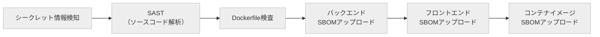
```mermaid
flowchart LR
    classDef commonStyle fill:#EEE,stroke:#BBB;
    detect_secrets[シークレット情報検知]:::commonStyle --> sast[SAST\n（ソースコード解析）]:::commonStyle --> scan_dockerfile[Dockerfile検査]:::commonStyle --> upload_backend_sbom[バックエンド\nSBOMアップロード]:::commonStyle --> upload_frontend_sbom[フロントエンド\nSBOMアップロード]:::commonStyle --> upload_container_sbom[コンテナイメージ\nSBOMアップロード]:::commonStyle;
```

上記パイプラインに加えて、脆弱性管理・監視ツールに連携した情報を日次でPDFレポートとして通知するワークフローも作成します。

## システム構成

今回のシステム構成は下図のようになります。TeamCityがGitHubのリポジトリを監視し、リポジトリへのpushを検知したらCI/CDパイプラインを起動します。
TeamCityで実行されたセキュリティチェックの結果がDefectDojoに連携されます。
作成したSBOMはDependency-Trackにアップロードされ、Dependency-TrackからDefectDojoに脆弱性情報が連携されます。
n8nが日次でDefectDojoから脆弱性情報を取得し、carboneを使用してPDFレポートを作成し、MattermostにPDFを添付して送信します。

<figure>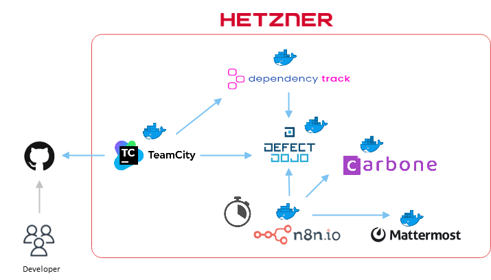</figure>


| Resource | Usage | Hosting Type | Licensing Model |
| - | - | - | - |
| [TeamCity](https://www.jetbrains.com/help/teamcity/teamcity-documentation.html) | CI/CDを自動化する | Self Hosting（Docker container on Hetzner Cloud） | Freemium |
| [DefectDojo](https://defectdojo.github.io/django-DefectDojo/) | 様々なセキュリティツールから送信される脆弱性情報などを集約して一元管理する | Self Hosting（Docker container on Hetzner Cloud） | Free<br />Open Source |
| [Dependency-Track](https://docs.dependencytrack.org/) | SBOMをもとにソフトウェアの脆弱性情報を収集する | Self Hosting（Docker container on Hetzner Cloud） | Free<br />Open Source |
| [Carbone](https://carbone.io/documentation.html) | PDFレポートを生成する | Self Hosting（Docker container on Hetzner Cloud） | Freemium<br />Open Source |
| [n8n](https://docs.n8n.io/) | ワークフローを実行する | Self Hosting（Docker container on Hetzner Cloud） | Freemium<br />Open Source |
| [Mattermost](https://docs.mattermost.com/) | 評価結果の通知先 | Self Hosting（Docker container on Hetzner Cloud） | Freemium<br />Open Source |


## CI/CDパイプラインの作成

### ビルドエージェントのセットアップ

TeamCityはサーバーとビルドエージェントの２つのソフトウェアで構成されます。
ビルドエージェントは、TeamCityサーバーからのコマンドをリッスンし、実際のビルドプロセスを実行します。
ビルドエージェントの[コンテナイメージ](https://hub.docker.com/r/jetbrains/teamcity-agent/)が提供されていますので、そちらをベースに下表のOSSをインストールしてコンテナを作成します。

| Software | Usage | License |
| - | - | - |
| [ggshield](https://github.com/GitGuardian/ggshield)（GitGuardian CLI） | シークレット情報を検知する | MIT |
| [Semgrep](https://github.com/semgrep/semgrep) | ソースコードの静的解析を行い脆弱性を検知する | LGPL |
| [Checkov](https://github.com/bridgecrewio/checkov) | Dockerfileの静的解析を行い設定ミスや脆弱性を検知する | Apache-2.0 |
| [cdxgen](https://github.com/CycloneDX/cdxgen) | アプリケーションのSBOMを作成する | Apache-2.0 |
| [Syft](https://github.com/anchore/syft) | コンテナイメージのSBOMを作成する | Apache-2.0 |

コンテナ起動時の環境変数`SERVER_URL`にTeamCityのサーバーURLを指定するとビルドエージェントが自動的に登録されます。

<figure>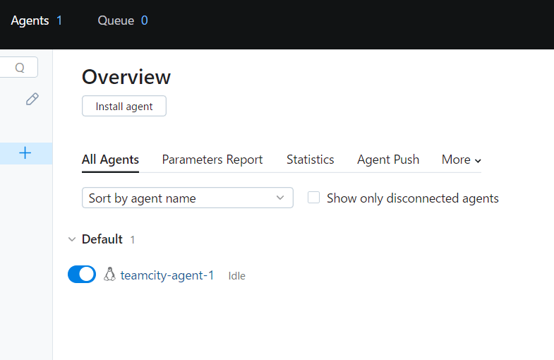</figure>


### ビルドのセットアップ

ビルドエージェントのセットアップが完了したらビルドのセットアップを行っていきます。

#### ビルドコンフィギュレーションの作成

まずはビルドコンフィギュレーションの作成を行います。
作成画面で対象となるリポジトリのURLや監視するブランチなどを指定します。

<figure>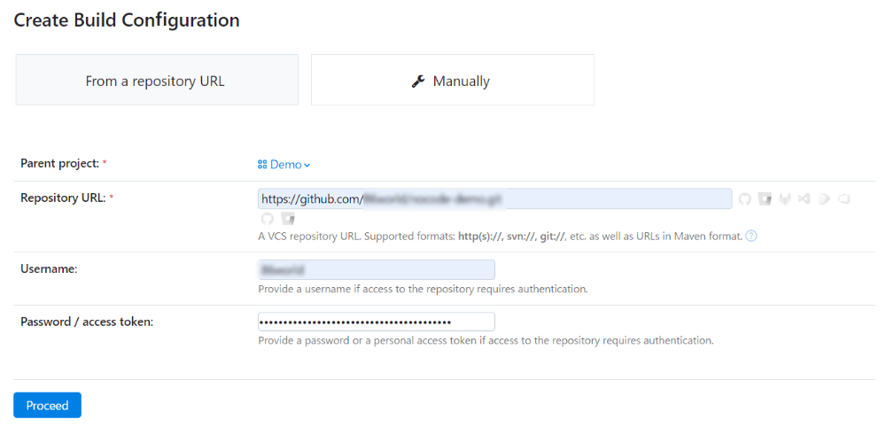</figure>

<figure>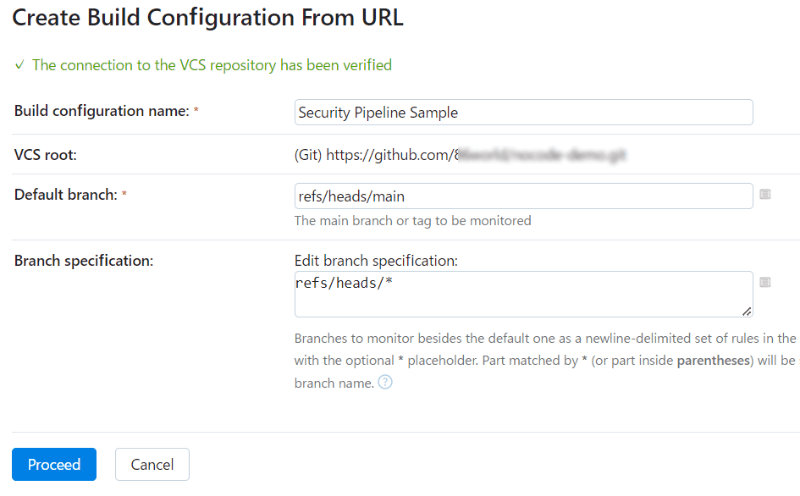</figure>

#### ビルドステップの追加

ビルドコンフィギュレーションの作成が完了したら、作成したビルドに対してビルドステップを追加していきます。
追加するステップは以下の７つです。

1. 前回ビルドのコミットハッシュ値を取得
1. ソースコードのスキャンを行いシークレット情報を検出
1. ソースコードの静的解析を行い脆弱性を検出
1. Dockerfileのスキャンを行い設定不備・脆弱性を検出
1. バックエンドアプリ（PHP）のSBOMを作成
1. フロントエンドアプリ（JavaScript）のSBOMを作成
1. コンテナイメージのSBOMを作成

2~7のビルドステップの結果をDefectDojoインポートするために、DefectDojoの管理画面でそれぞれの[エンゲージメント](https://documentation.defectdojo.com/usage/models/#engagement)をあらかじめ作成しておきます。

<figure>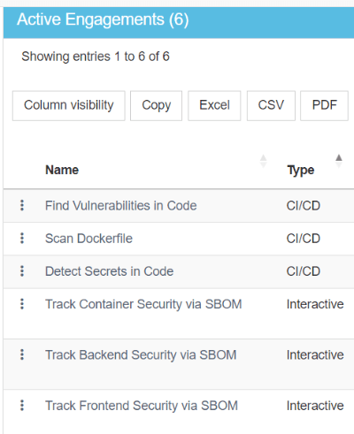</figure>

5~7のビルドステップではSBOMをDependency-Trackに送信するところまでを行い、その後はDependency-TrackからDefectDojoに脆弱性情報を連携します。連携の設定は下記の公式ドキュメントに従って行います。

https://docs.dependencytrack.org/integrations/defectdojo/

>[!IMPORTANT]
>DefectDojoはuWSGI上で動作しており、Dependency-TrackとDefectDojoを連携する際はuwsgiリバースプロキシを挟む必要があります。
>Caddyの[caddy-uwsgi-transport](https://caddyserver.com/docs/json/apps/http/servers/routes/handle/reverse_proxy/transport/uwsgi/)モジュールを使用することでDefectDojoと通信することが可能ですが、このモジュールはHTTPリクエストヘッダーの`Content-Length`をそのままセットします。
>しかし、Dependency-TrackはDefectDojoにデータを送信する際に、リクエストヘッダーに`Transfer-Encoding: chunked`を送信しますが、`Content-Length`ヘッダーは送信しません。
>DefectDojoではContent-Lengthがないリクエストは処理されないためDependency-Trackから送信されたデータもインポートされません。
>そのため、Caddyを使用する際は本モジュールをベースにして、Content-Lengthを自動でセットするオリジナルのモジュールを作成する必要があります。

##### 前回ビルドのコミットハッシュ値を取得

後続のステップでソースコードのスキャンを行う際に、全てのファイルを対象とするのではなく変更があったファイルのみを対象とするために、前回ビルドのコミットハッシュ値を取得します。

ビルドステップで`Python`を選択し、設定画面でScript欄に以下のPythonスクリプトを入力します。

```python
import os
import requests

buildConfName = os.getenv("TEAMCITY_BUILDCONF_NAME")
token = os.getenv("TEAMCITY_API_TOKEN")
url = f"http://'TeamCityサーバーのホスト名とポート番号'/app/rest/builds/multiple/buildType:name:{buildConfName},count:1"
headers = {"Authorization": f"Bearer {token}", "Accept": "application/json"}
response = requests.get(url, headers=headers)
lastBuild = response.json()

if lastBuild["count"] > 0:
    lastBuildId = lastBuild["build"][0]["id"]
    url = f"http://'TeamCityサーバーのホスト名とポート番号'/app/rest/builds/id:{lastBuildId}"
    response = requests.get(url, headers=headers)
    buildInfo = response.json()
    if buildInfo["lastChanges"]["count"] > 0:
        commitHash = buildInfo["lastChanges"]["change"][0]["version"]
        print(f"##teamcity[setParameter name='demo.lastCommit' value='{commitHash}']")
```

`TEAMCITY_BUILDCONF_NAME`はビルド実行時に自動的に設定される環境変数です。REST APIでビルド情報を取得する際の絞り込み条件（該当パイプラインのビルド情報のみ取得する）として使用します。

`TEAMCITY_API_TOKEN`はビルドエージェントのコンテナ起動時に設定したオリジナルの環境変数です。TeamCityサーバーの管理者画面のユーザー管理で発行したアクセストークンを設定します。

1番目のAPI実行でビルド一覧を新しい順に1件だけ取得し、取得できた場合は該当ビルドのIDをもとに2番目のAPI実行でビルド情報の詳細を取得しています。

最終行でプリント出力している`##teamcity[setParameter name='パラメーター名' value='パラメーター値']`は[サービスメッセージ](https://www.jetbrains.com/help/teamcity/service-messages.html#set-parameter)です。後続のステップで使用するビルドパラメーターを追加したり更新することができます。ここでは取得したコミットハッシュ値をビルドパラメーターに追加しています。

>[!NOTE]
>サービスメッセージでビルドパラメーターを追加すると、ビルドのコンフィギュレーションで同名のコンフィギュレーションパラメーターが追加されます。値を設定しないとビルドが有効になりません。デフォルト値を設定してください（今回の場合は空文字）。

##### ソースコードのスキャンを行いシークレット情報を検出

`ggshield`を使ってソースコードにシークレット情報がハードコーディングされていないかどうかチェックを行います。
ビルドステップで`Command Line`を選択し、設定画面でCustom script欄に以下のシェルスクリプトを入力します。

```shell
#!/bin/bash
if [ -n "%demo.lastCommit%" ]; then
	ggshield secret scan commit-range %demo.lastCommit%...HEAD --json > ggshield_results.json
else
	ggshield secret scan repo ./ --json > ggshield_results.json
fi

python3 /your/path/your-import-defect-dojo-script.py --host "DefectDojoのURL" --engagement "DefectDojoのエンゲージメントID" --scan_type "Ggshield Scan" --build_id $BUILD_NUMBER --report ggshield_results.json
```

ビルドパラメーターに前回ビルドのコミットハッシュ値が設定されている場合は[secret scan commit-range](https://docs.gitguardian.com/ggshield-docs/reference/secret/scan/commit-range)で差分に対してスキャンを行います。
コミットハッシュ値が設定されていない場合は[secret scan repo](https://docs.gitguardian.com/ggshield-docs/reference/secret/scan/repo)でリポジトリに対してスキャンを行います。

スキャン結果のJSONファイルをDefectDojoに送信してインポートします。
サンプルのPythonスクリプトは以下のようになります。ビルドエージェントのコンテナ起動時に環境変数`DEFECT_DOJO_API_TOKEN`にDefectDojoで発行したAPIキーを設定しておき、REST APIを使ってインポートを行います。

```python
import requests
import sys
import os


def uploadToDefectDojo(token, url, engagement_id, scan_type, build_id, filename):
    multipart_form_data = {
        'file': (filename, open(filename, 'rb')),
        'scan_type': (None, scan_type),
        'engagement': (None, engagement_id),
        'build_id': (None, build_id),
        'active': (None, 'true'),
        'verified': (None, 'true'),
    }

    endpoint = '/api/v2/import-scan/'
    r = requests.post(
        url + endpoint,
        files=multipart_form_data,
        headers={
            'Authorization': 'Token ' + token,
        }
    )
    if r.status_code >= 400:
        sys.exit(f'Post failed: {r.text}')
    print(r.text)

if __name__ == "__main__":
    try:
        token = os.getenv("DEFECT_DOJO_API_TOKEN")
    except KeyError: 
        print("Please set the environment variable DEFECT_DOJO_API_TOKEN") 
        sys.exit(1)
    if len(sys.argv) == 11:
        url = sys.argv[2]
        engagement_id = sys.argv[4]
        scan_type = sys.argv[6]
        build_id = sys.argv[8]
        report = sys.argv[10]
        uploadToDefectDojo(token, url, engagement_id, scan_type, build_id, report)
    else:
        print(
            'Usage: --host DOJO_URL --engagement ENGAGEMENT_ID --scan_type SCAN_TYPE --build_id BUILD_ID --report REPORT_FILE')
        sys.exit(1)

```

シークレット情報が検出されるとDefectDojoに下図のように表示されます。

<figure>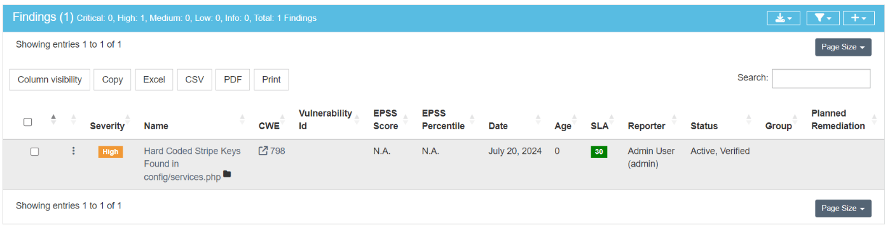</figure>

##### ソースコードの静的解析を行い脆弱性を検出

`Semgrep`を使ってソースコードに脆弱なコードが含まれていないかどうかチェックを行います。
ビルドステップで`Command Line`を選択し、設定画面でCustom script欄に以下のシェルスクリプトを入力します。

```shell
#!/bin/bash
if [ -n "%demo.lastCommit%" ]; then
  export SEMGREP_BASELINE_REF=%demo.lastCommit%
fi
semgrep scan --json -o semgrep_report.json

python3 /your/path/your-import-defect-dojo-script.py --host "DefectDojoのURL" --engagement "DefectDojoのエンゲージメントID" --scan_type "Semgrep JSON Report" --build_id $BUILD_NUMBER --report semgrep_report.json
```

ビルドパラメーターに前回ビルドのコミットハッシュ値が設定されている場合は環境変数`SEMGREP_BASELINE_REF`にコミットハッシュ値をセットしています。これにより[diff-aware scan](https://semgrep.dev/docs/deployment/customize-ci-jobs#set-up-diff-aware-scans)（差分に対するスキャン）を実行することができます。

脆弱性が検出されるとDefectDojoに下図のように表示されます。

<figure>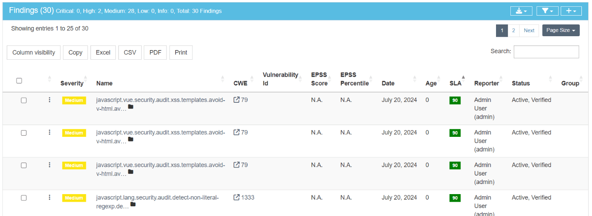</figure>

##### Dockerfileのスキャンを行い設定不備・脆弱性を検出

`Checkov`を使ってDockerfileの設定内容に不備や脆弱性が含まれていないかどうかチェックを行います。
ビルドステップで`Command Line`を選択し、設定画面でCustom script欄に以下のシェルスクリプトを入力します。

```shell
#!/bin/bash
checkov -f /your/path/Dockerfile -o json --output-file-path checkov

python3 /your/path/your-import-defect-dojo-script.py --host "DefectDojoのURL" --engagement "DefectDojoのエンゲージメントID" --scan_type "Checkov Scan" --build_id $BUILD_NUMBER --report checkov/results_json.json
```

設定の不備や脆弱性が検出されるとDefectDojoに下図のように表示されます。

<figure>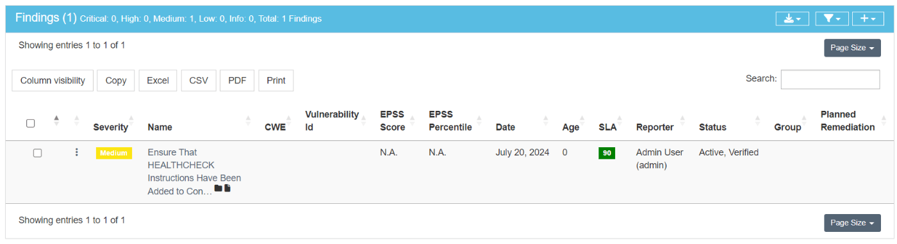</figure>

##### バックエンドアプリ（PHP）のSBOMを作成

`cdxgen`を使ってバックエンドアプリのSBOMを作成し、Dependency-Trackに送信します。
ビルドステップで`Command Line`を選択し、設定画面でCustom script欄に以下のシェルスクリプトを入力します。

```shell
#!/bin/bash
cdxgen -t php ./ --server-url "Dependency-Track APIサーバーのURL" --api-key "Dependency-TrackのAPIキー" --project-id "Dependency-TrackのプロジェクトID"
```

Dependency-Trackにコンポーネントの一覧と脆弱性情報が下図のように表示されます。

<figure>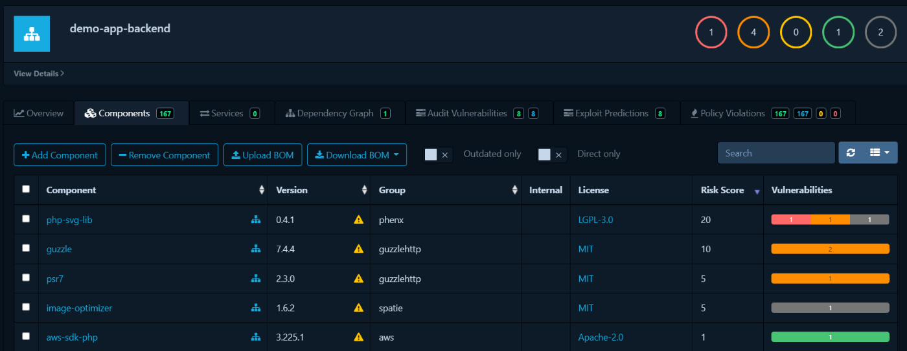</figure>

Dependency-Trackから脆弱性情報が連携されDefectDojoに下図のように表示されます。

<figure>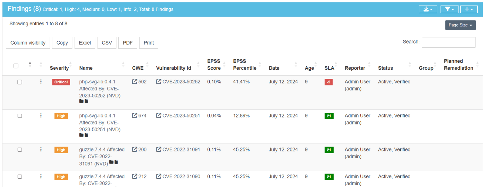</figure>

##### フロントエンドアプリ（JavaScript）のSBOMを作成

`cdxgen`を使ってバックエンドアプリのSBOMを作成し、Dependency-Trackに送信します。
ビルドステップで`Command Line`を選択し、設定画面でCustom script欄に以下のシェルスクリプトを入力します。

```shell
#!/bin/bash
cdxgen -t javascript ./ --server-url "Dependency-Track APIサーバーのURL" --api-key "Dependency-TrackのAPIキー" --project-id "Dependency-TrackのプロジェクトID"
```

>[!NOTE]
>依存ライブラリが多いと上記コマンド実行時に`JavaScript heap out of memory`が発生することがあります。
>もしメモリエラーが発生した場合はコマンド実行時に[--max-old-space-size=SIZE](https://nodejs.org/api/cli.html#--max-old-space-sizesize-in-megabytes)を指定してメモリサイズの上限値を増やしてください。

Dependency-Trackにコンポーネントの一覧と脆弱性情報が下図のように表示されます。

<figure>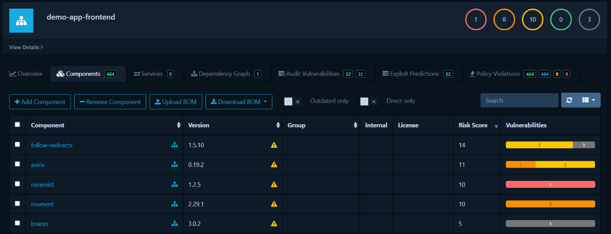</figure>

Dependency-Trackから脆弱性情報が連携されDefectDojoに下図のように表示されます。

<figure>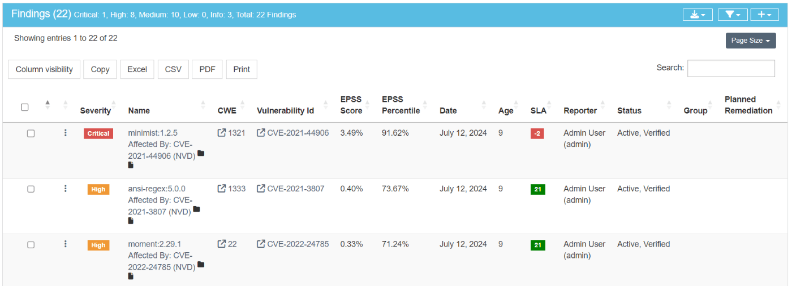</figure>

##### コンテナイメージのSBOMを作成

`syft`を使ってコンテナイメージのSBOMを作成し、Dependency-Trackに送信します。
ビルドステップで`Command Line`を選択し、設定画面でCustom script欄に以下のシェルスクリプトを入力します。

```shell
#!/bin/bash
syft "コンテナイメージ" -o cyclonedx-json@1.5 > container_sbom.json
python3 /your/path/your-import-dependency-track-script.py --host "Dependency-Track APIサーバーのURL" --project "Dependency-TrackのプロジェクトID" --sbom container_sbom.json
```
>[!NOTE]
>今回はパイプラインの中でコンテナイメージを作成するのではなく、事前にDockerホストで作成したコンテナイメージを使用しています。
>エージェントコンテナからホストで作成したイメージを参照するためにホストの`/var/run/docker.sock`をコンテナの`/var/run/docker.sock`にマウントする必要があります。

出力したSBOMファイルをDependency-Trackに送信してインポートします。
サンプルのPythonスクリプトは以下のようになります。ビルドエージェントのコンテナ起動時に環境変数`DTRACK_API_KEY`にDependency-Trackで発行したAPIキーを設定しておき、REST APIを使ってインポートを行います。

```python
import requests
import json
import base64
import sys
import os


def uploadToDTrack(api_key, url, project_id, sbom):
    with open(sbom, 'r') as file:
        sbom_data = file.read()

    print(sbom_data)

    data = {
        'bom': base64.b64encode(bytes(sbom_data, 'utf-8')).decode('utf-8'),
        'project': project_id,
    }

    json_data = json.dumps(data)

    endpoint = '/api/v1/bom/'
    r = requests.put(
        url + endpoint,
        data=json_data,
        headers={
            'X-Api-Key': api_key,
            'Content-Type': 'application/json',
            'Accept': 'application/json',
        }
    )
    if r.status_code >= 400:
        sys.exit(f'Put failed: {r.text}')
    print(r.text)

if __name__ == "__main__":
    try:
        api_key = os.getenv("DTRACK_API_KEY")
    except KeyError: 
        print("Please set the environment variable DTRACK_API_KEY") 
        sys.exit(1)
    if len(sys.argv) == 7:
        url = sys.argv[2]
        project_id = sys.argv[4]
        sbom = sys.argv[6]
        uploadToDTrack(api_key, url, project_id, sbom)
    else:
        print('Usage: --host DTRACK_URL --project PROJECT_ID --sbom SBOM_FILE')
```

Dependency-Trackにコンポーネントの一覧と脆弱性情報が下図のように表示されます。

<figure>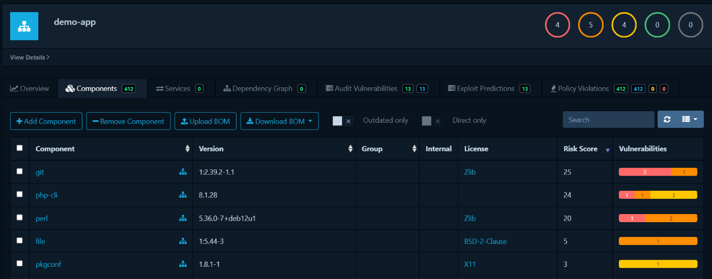</figure>

Dependency-Trackから脆弱性情報が連携されDefectDojoに下図のように表示されます。

<figure>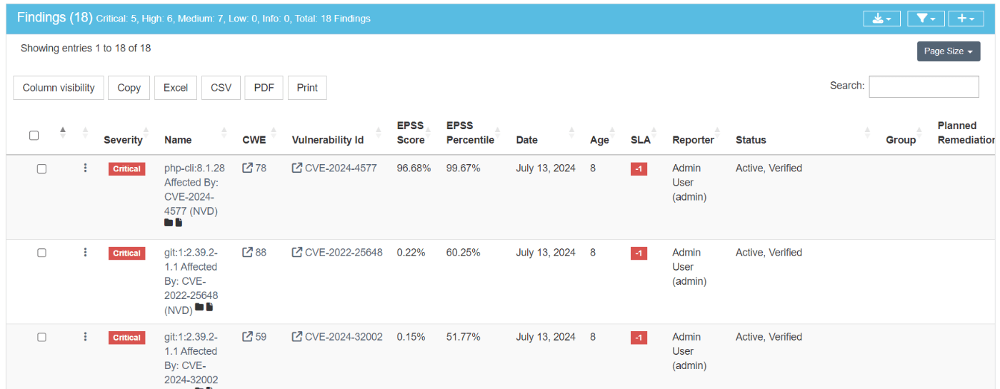</figure>

#### ビルドステップ全体像

ビルドステップ全体をコード表示すると以下のようになります。

```kotlin
package _Self.buildTypes

import jetbrains.buildServer.configs.kotlin.*
import jetbrains.buildServer.configs.kotlin.buildFeatures.perfmon
import jetbrains.buildServer.configs.kotlin.buildSteps.python
import jetbrains.buildServer.configs.kotlin.buildSteps.script
import jetbrains.buildServer.configs.kotlin.triggers.vcs

object PipelineDemo : BuildType({
    name = "Pipeline Demo"

    params {
        param("demo.lastCommit", "")
    }

    vcs {
        root(HttpsGithubCom86worldNocodeDemoRefsHeadsMain)
    }
    steps {
        python {
            name = "Get Last Commit of Previous Build"
            id = "get_last_commit"
            command = script {
                content = """
                    import os
                    import requests
                    
                    buildConfName = os.getenv("TEAMCITY_BUILDCONF_NAME")
                    token = os.getenv("TEAMCITY_API_TOKEN")
                    url = f"http://your-teamcity-server:port/app/rest/builds/multiple/buildType:name:{buildConfName},count:1"
                    headers = {"Authorization": f"Bearer {token}", "Accept": "application/json"}
                    response = requests.get(url, headers=headers)
                    lastBuild = response.json()
                    
                    if lastBuild["count"] > 0:
                        lastBuildId = lastBuild["build"][0]["id"]
                        url = f"http://your-teamcity-server:port/app/rest/builds/id:{lastBuildId}"
                        response = requests.get(url, headers=headers)
                        buildInfo = response.json()
                        if buildInfo["lastChanges"]["count"] > 0:
                            commitHash = buildInfo["lastChanges"]["change"][0]["version"]
                            print(f"##teamcity[setParameter name='demo.lastCommit' value='{commitHash}']")
                """.trimIndent()
            }
        }
        script {
            name = "Detect Secrets in Code"
            id = "detect_secret"
            scriptContent = """
                #!/bin/bash
                if [ -n "%demo.lastCommit%" ]; then
                	ggshield secret scan commit-range %demo.lastCommit%...HEAD --json > ggshield_results.json
                else
                	ggshield secret scan repo ./ --json > ggshield_results.json
                fi
                
                python3 /your/path/your-import-defect-dojo-script.py --host http://your-defectdojo-server:port --engagement your-engagemant-id --scan_type "Ggshield Scan" --build_id ${'$'}BUILD_NUMBER --report ggshield_results.json
            """.trimIndent()
        }
        script {
            name = "Find Vulnerabilities in Code"
            id = "find_vulnerabilities"
            scriptContent = """
                #!/bin/bash
                if [ -n "%demo.lastCommit%" ]; then
                  export SEMGREP_BASELINE_REF=%demo.lastCommit%
                fi
                semgrep scan --json -o semgrep_report.json
                python3 /your/path/your-import-defect-dojo-script.py --host http://your-defectdojo-server:port --engagement your-engagemant-id --scan_type "Semgrep JSON Report" --build_id ${'$'}BUILD_NUMBER --report semgrep_report.json
            """.trimIndent()
        }
        script {
            name = "Scan Dockerfile"
            id = "scan_dockerfile"
            scriptContent = """
                #!/bin/bash
                checkov -f /your/path/Dockerfile -o json --output-file-path checkov
                python3 /your/path/your-import-defect-dojo-script.py --host http://your-defectdojo-server:port --engagement your-engagemant-id --scan_type "Checkov Scan" --build_id ${'$'}BUILD_NUMBER --report checkov/results_json.json
            """.trimIndent()
        }
        script {
            name = "Upload Backend SBOM"
            id = "upload_backend_sbom"
            scriptContent = """
                #!/bin/bash
                cdxgen -t php ./ --server-url http://your-dtrack-apiserver:port --api-key ${'$'}DTRACK_API_KEY --project-id your-project-id
            """.trimIndent()
        }
        script {
            name = "Upload Frontend SBOM"
            id = "upload_frontend_sbom"
            scriptContent = """
                #!/bin/bash
                NODE_OPTIONS=--max-old-space-size=4096 cdxgen -t javascript ./ --server-url http://your-dtrack-apiserver:port --api-key ${'$'}DTRACK_API_KEY --project-id your-project-id
            """.trimIndent()
        }
        script {
            name = "Upload Container SBOM"
            id = "upload_container_sbom"
            scriptContent = """
                #!/bin/bash
                syft your-docker-image -o cyclonedx-json@1.5 > container_sbom.json
                python3 /your/path/your-import-dependency-track-script.py --host http://your-dtrack-apiserver:port --project your-project-id --sbom container_sbom.json
            """.trimIndent()
        }
    }
    triggers {
        vcs {
        }
    }

    features {
        perfmon {
        }
    }
})
```

## 通知ワークフローの作成

DefectDojoに連携した脆弱性情報を日次でPDFレポートとして通知するワークフローを作成します。
作成するワークフローは以下のようになります。
まず、DefectDojoから脆弱性情報の一覧を取得します。取得した脆弱性情報の一覧をPDFファイルとして出力します。
出力したPDFをチャットツールに送信して通知します。

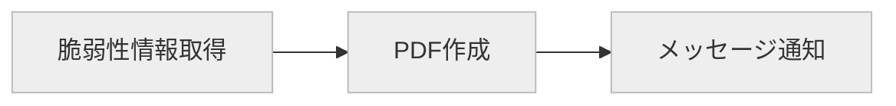
```mermaid
flowchart LR
    classDef commonStyle fill:#EEE,stroke:#BBB;
    get_vulnerabilities[脆弱性情報取得]:::commonStyle --> create_pdf[PDF作成]:::commonStyle --> notification[メッセージ通知]:::commonStyle;
```

### 脆弱性情報の取得

ワークフローは1日1回（毎日午前0時）にスケジュール起動するようにします。
まずはワークフローをスケジュール起動するための`Schedule`ノード（ノードパネルから`On a schedule`を選択）と`Workflow`ノード（ノードパネルから`When called by another workflow`を選択）を追加します。

Scheduleノードは設定パネルで以下のように設定します。

| Name | Value |
| - | - |
| Trigger Interval | Days |
| Days Between Triggers | 1 |
| Trigger at Hour | Midnight |
| Trigger at Minute | 0 |

次にDefectDojoに連携した脆弱性情報をREST API経由で取得するために`HTTP Request`ノードを追加します。

<figure>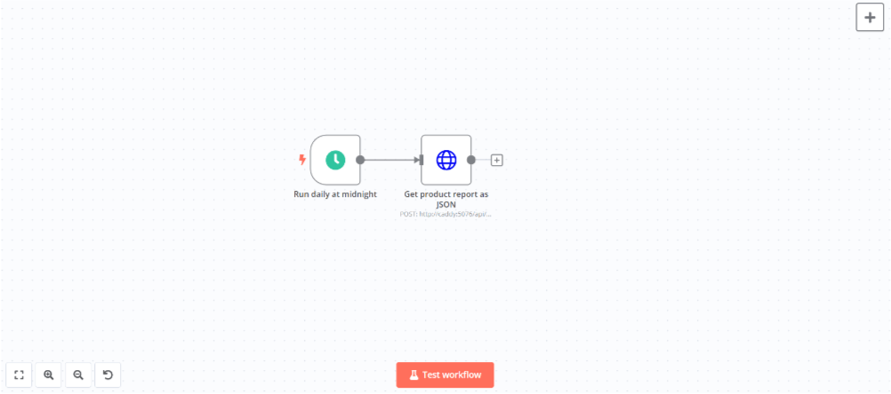</figure>

ノードを追加して設定パネルで以下のように設定します。

| Name | Value |
| - | - |
| Method | POST |
| URL | http://(DefectDojoのホスト名とポート番号)/api/v2/products/2/generate_report/ |
| Authentication | Generic Credential Type |
| Generic Auth Type | Header Auth |
| Credential for Basic Auth | Nameに`Authorization`、Valueに`Token "DefectDojoで発行したAPIキー"`を設定 |
| Send Query Parameters | OFF |
| Send Headers | ON |
| Header Parameters (Name1)  | Content-Type |
| Header Parameters (Value1)  | application/json |
| Header Parameters (Name2)  | Accept |
| Header Parameters (Value2)  | application/json |
| Send Body | ON |
| Body Content Type | JSON |
| Specify Body | Using JSON |
| JSON | &#123; "include_finding_notes":false,"include_finding_images":false,"include_executive_summary":false,"include_table_of_contents":false &#125; |

APIを実行すると以下のような形で脆弱性情報の一覧を取得することができます。

```json
[
  {
    "report_name": "Product Report: demo-app",
    ・・・
    "findings": [
        {
            "id": 1,
            "title": "perl:5.36.0-7+deb12u1 Affected By: CVE-2023-47100 (NVD)",
            "cwe": 755,
            "cvssv3_score": 9.8,
            "severity": "Critical",
            "description": "You are using a component with a known vulnerability. Version 5.36.0-7+deb12u1 of the perl component is affected by the vulnerability with an id of CVE-2023-47100...."
            ・・・
        },
        {
            "id": 2,
            ・・・
        }
    ],
    ・・・
  }
]
```

脆弱性の件数をseverity（Critical/High/Medium/Low/Info）ごとに集計して通知するために`Code`ノードで取得したデータを加工します（ノードパネルの`Data transformation`から選択）。

<figure>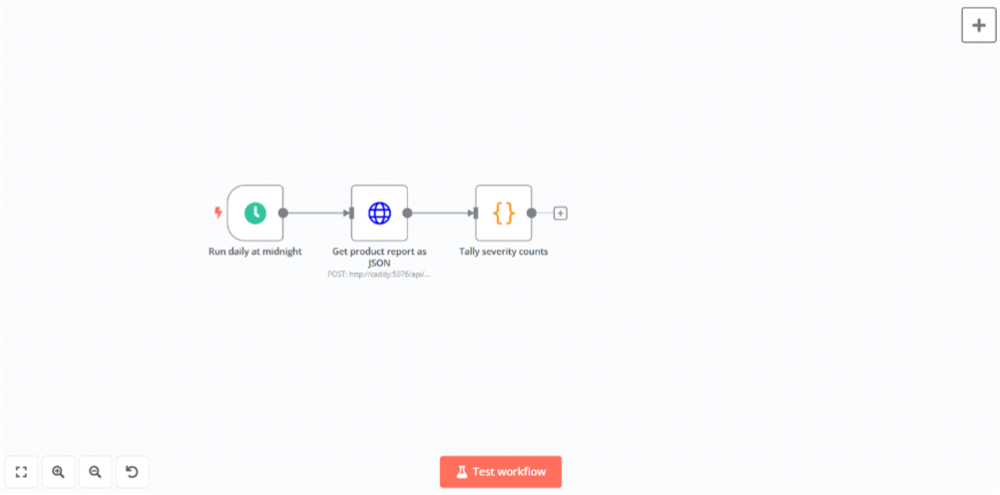</figure>

ノードを追加して設定パネルのコード入力欄に以下のJavaScriptを入力します。

```javascript
for (const item of $input.all()) {
  item.json.severity_count = { critical: 0, high: 0, medium: 0, low: 0, info: 0 }
  const findings = item.json.findings
  for (const finding of findings) {
    switch (finding.severity) {
      case 'Critical':
        item.json.severity_count.critical++
        break
      case 'High':
        item.json.severity_count.high++
        break
      case 'Medium':
        item.json.severity_count.medium++
        break
      case 'Low':
        item.json.severity_count.low++
        break
      case 'Info':
        item.json.severity_count.info++
        break
      default:
    }
    
    finding.description = finding.description.length > 1000 ? 
        finding.description.slice(0, 1000) + '...' : 
        finding.description
  }
}

return $input.all()
```

>[!CAUTION]
>文字数が多い項目があると後続のPDF作成の際にCarboneでエラーが発生する可能性があります。必要に応じて適当な長さに切り詰めてください。

### PDF作成

PDFの作成には[Carbone](https://carbone.io/documentation.html)を使用します。
CarboneはMS WordやMS ExcelなどのテンプレートにJSONデータをバインドしてPDFを作成します。

<figure>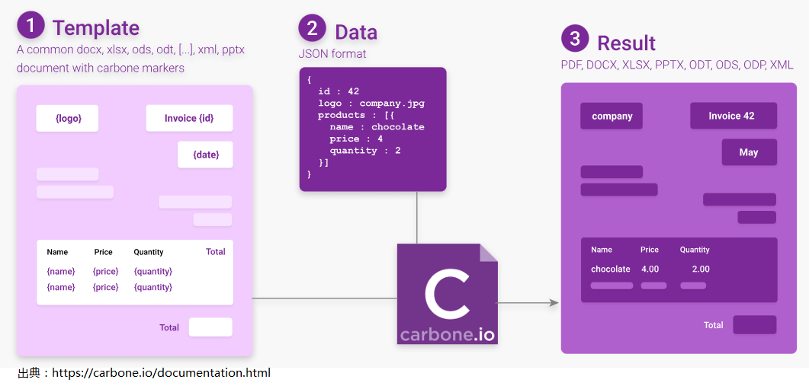</figure>

今回はMS Wordを使用して以下のようなテンプレートを作成します。

<figure>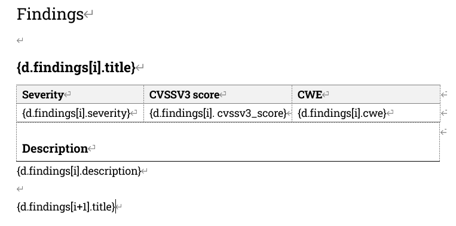</figure>

テンプレートを作成したらCarbone Studio（`https://(Carboneのホスト名とポート番号)/`）にアクセスしてGUIからテンプレートをアップロードし、テンプレートIDを取得します。

<figure>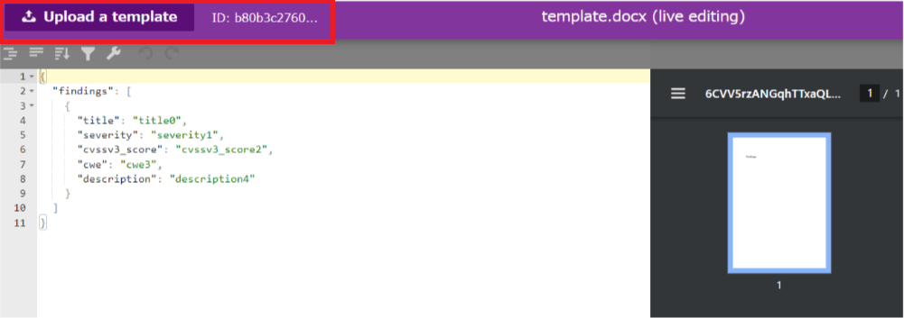</figure>

PDFをREST API経由で作成するために`HTTP Request`ノードを追加します。

<figure>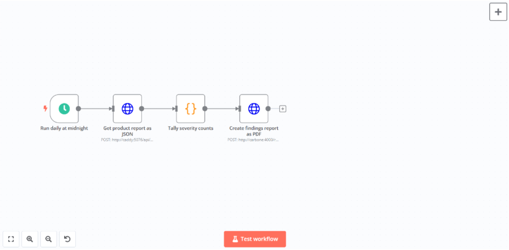</figure>

ノードを追加して設定パネルで以下のように設定します。

| Name | Value |
| - | - |
| Method | POST |
| URL | http://(Carboneのホスト名とポート番号)/render/(Carbone StudioでアップロードしたテンプレートのID) |
| Authentication | None |
| Send Query Parameters | OFF |
| Send Headers | ON |
| Header Parameters (Name1)  | Content-Type |
| Header Parameters (Value1)  | application/json |
| Header Parameters (Name2)  | carbone-version |
| Header Parameters (Value2)  | 4 |
| Send Body | ON |
| Body Content Type | JSON |
| Specify Body | Using JSON |
| JSON | &#123; "data": &#123;&#123; $json.toJsonString() &#125;&#125;, "convertTo": "pdf" &#125; |

作成したPDFはCarboneコンテナの`/app/render`に保存されます。

>[!CAUTION]
>`/app/render`に保存されたPDFは一定時間が経過すると自動的に削除されます。

### メッセージ通知

まずはローカルディスクに保存されたPDFを読み込むためにファイル読み込みノード（`Read/Write Files from Disk`）を使って読み込みます。

<figure>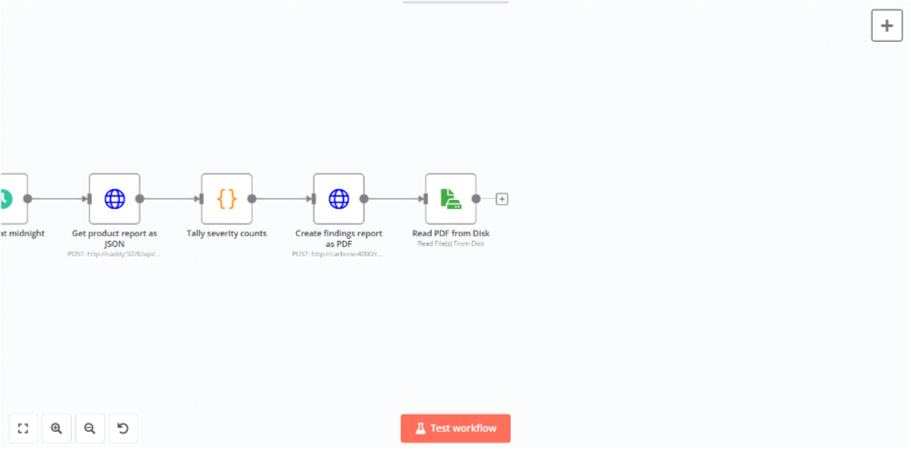</figure>

ノードを追加して設定パネルで以下のように設定します。

| Name | Value |
| - | - |
| Operation | Read File(s) From Disk |
| File(s) Selector | /（n8nコンテナのPDF保存フォルダのパス）/&#123;&#123; $json.data.renderId &#125;&#125; |

>[!NOTE]
>Carboneコンテナの`/app/render`をホストの任意のディレクトリでマウントし、n8nコンテナのPDF保存フォルダも同じホストのディレクトリでマウントすることでPDFを参照できるようにしています。

次に、読み込んだファイルをMattermostにアップロードするために`HTTP Request`ノードを追加します。

<figure>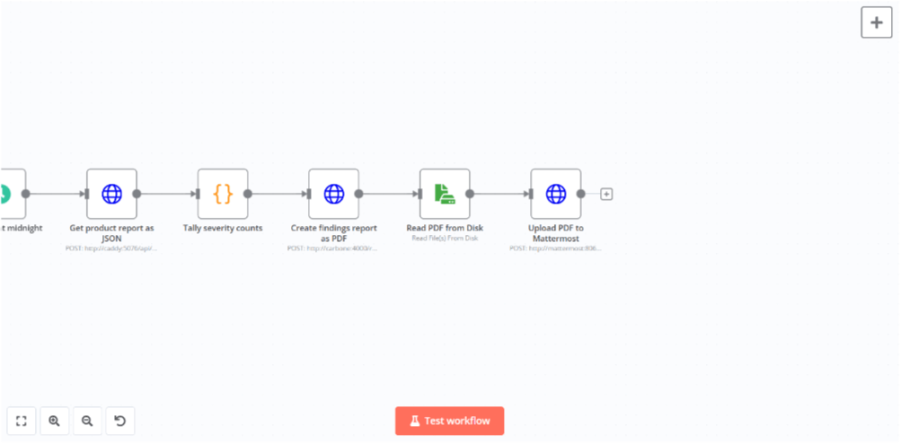</figure>

ノードを追加して設定パネルで以下のように設定します。

| Name | Value |
| - | - |
| Method | POST |
| URL | http://(Mattermostのホスト名とポート番号)/api/v4/files |
| Authentication | Predefined Credential Type |
| Credential Type | Mattermost API |
| Mattermost API | `Access Token`にMattermostで発行したアクセストークン、`Base URL`にhttp://(Mattermostのホスト名とポート番号)/を設定 |
| Send Query Parameters | ON |
| Query Parameters (Name1)  | channel_id |
| Query Parameters (Value1)  | 投稿したいチャネルのIDを設定 |
| Query Parameters (Name2)  | filename |
| Query Parameters (Value2)  | アップロードファイルに付けるファイル名 |
| Send Headers | OFF |
| Send Body | ON |
| Body Content Type | n8n Binary File |
| Input Data Field Name | data |

>[!CAUTION]
>ボットアカウントはファイルアップロードの権限がないため、アクセストークンに設定するトークンはユーザーアカウントのアクセストークンを設定してください。

最後に、Mattermostにメッセージを送信するために`HTTP Request`ノードを追加します（Mattermostノードではアップロードしたファイルを添付するためのオプションがないためHTTP Requestノードを使用しています）。

<figure>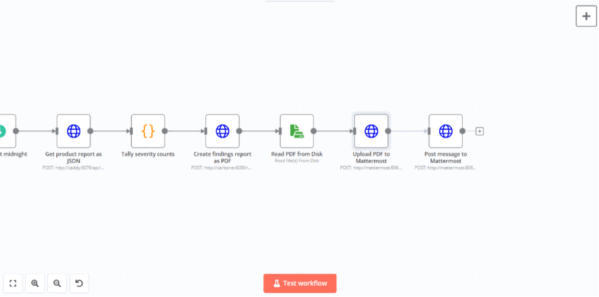</figure>

ノードを追加して設定パネルで以下のように設定します。

| Name | Value |
| - | - |
| Method | POST |
| URL | http://(Mattermostのホスト名とポート番号)/api/v4/posts |
| Authentication | Predefined Credential Type |
| Credential Type | Mattermost API |
| Mattermost API | `Access Token`にMattermostで発行したアクセストークン、`Base URL`にhttp://(Mattermostのホスト名とポート番号)/を設定 |
| Send Query Parameters | OFF |
| Send Headers | ON |
| Header Parameters (Name1)  | Content-Type |
| Header Parameters (Value1)  | application/json |
| Header Parameters (Name2)  | Accept |
| Header Parameters (Value2)  | application/json |
| Send Body | ON |
| Specify Body | Using JSON |
| JSON | 下記のJSONを設定 |

```json
{
  "channel_id": "投稿したいチャネルのID",
  "message": "### Daily Security Report\n\n|findings|count|\n|:---|---:|\n|critical|{{ $('severity集計ノードの名前').first().json.severity_count.critical }}|\n|high|{{ $('severity集計ノードの名前').first().json.severity_count.high }}|\n|medium|{{ $('severity集計ノードの名前').first().json.severity_count.medium }}|\n|low|{{ $('severity集計ノードの名前').first().json.severity_count.low }}|\n|info|{{ $('severity集計ノードの名前').first().json.severity_count.info }}|\n\nPlease check the attachment for more details.",
  "file_ids": [
    "{{ $json.file_infos[0].id }}"
  ]
}
```

>[!CAUTION]
>メッセージにファイルを添付することができるのは、ファイルをアップロードしたアカウントのみです。アクセストークンはファイルアップロードと同じものを設定してください（ファイルアップロードはユーザーアカウントで行い、メッセージ送信はボットアカウントで行うということは出来ません）。

## 動作確認

コードをGitHubのリポジトリにpushして少し待つと自動的にビルドが開始されます。

<figure>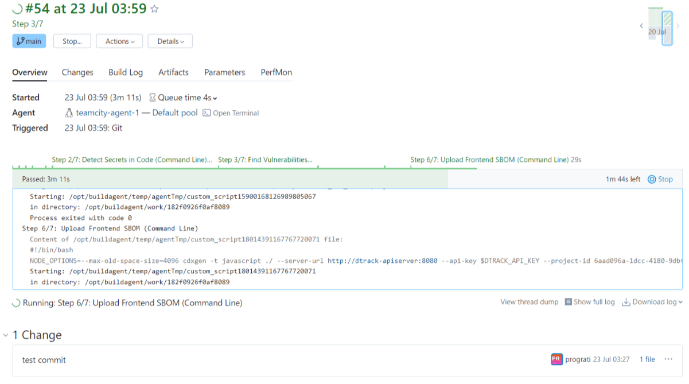</figure>

ビルドが完了するとDefectDojoに脆弱性情報が反映されます。

<figure>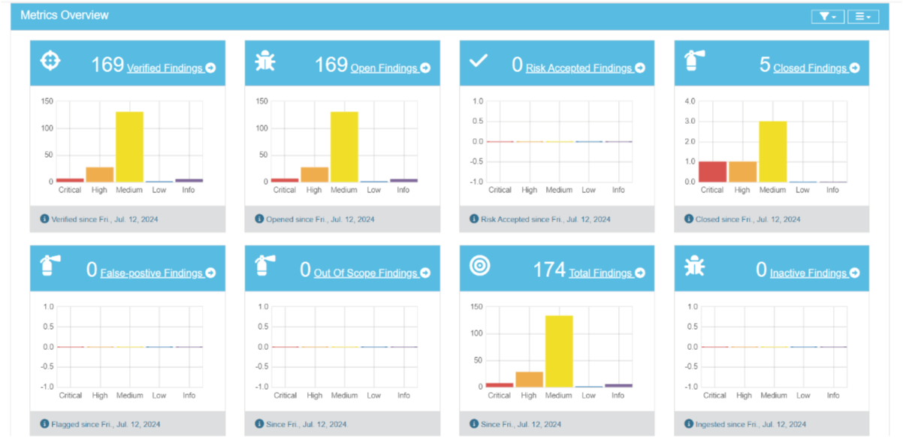</figure>

次にワークフローを実行します。ワークフローの全体図は下図のようになります。

<figure>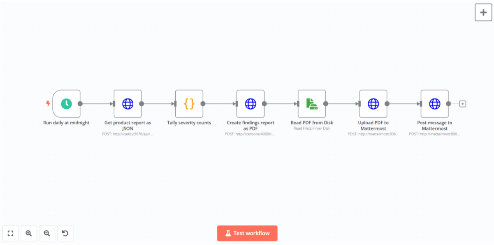</figure>

ワークフローが実行されると以下のようなメッセージが通知されます。

<figure>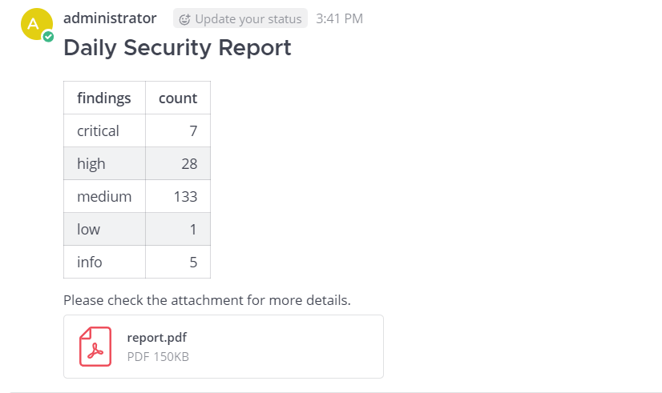</figure>

メッセージには下図のようなPDFが添付されます。

<figure>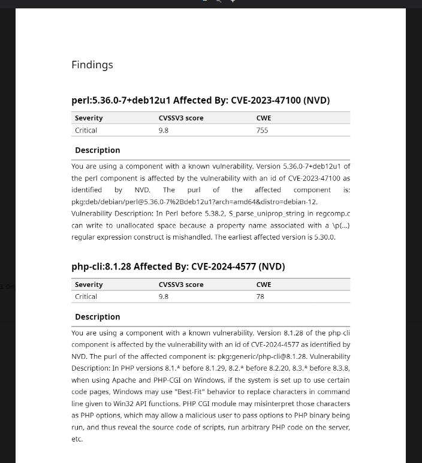</figure>
