[パート1](./contact-form-submission-workflow-with-n8n)ではお問い合わせ内容をDBに登録してチャットに通知するワークフローを作成しました。
本記事で通知を受けた後のフォローアップとして、チケットの登録および顧客管理システム（CRM）への登録を行うワークフローを作成します。

## TOC

## フロー概要

作成するワークフローは以下のようになります。
まず、管理者がチャットに通知されたお問い合わせ内容を確認し、チケットを登録するコマンドをチャットを使ってメッセージ送信します。次に、コマンドで送信されたお問い合わせ番号でDBを照会し、登録されているお問い合わせ情報を取得します。そして、取得したお問い合わせ情報をもとにチケット管理システムでチケットを発行します。CRMへの登録もチケットと同様にコマンドを使って行います。


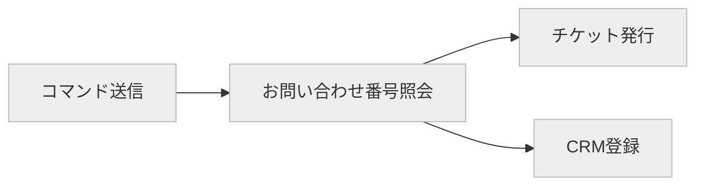
```mermaid
flowchart LR
    classDef commonStyle fill:#EEE,stroke:#BBB;
    sendCommand[コマンド送信]:::commonStyle --> lookup[お問い合わせ番号照会]:::commonStyle --> issueTicket[チケット発行]:::commonStyle & addLead[CRM登録]:::commonStyle;
```

## システム構成

今回のシステム構成は下図のようになります。カスタマーサポートはMattermostし、命令文を使ってお問い合わせ番号をメッセージ送信します。お問い合わせ番号がMattermost経由でn8nに送信され、n8nで作成したワークフローが実行されます。

<figure>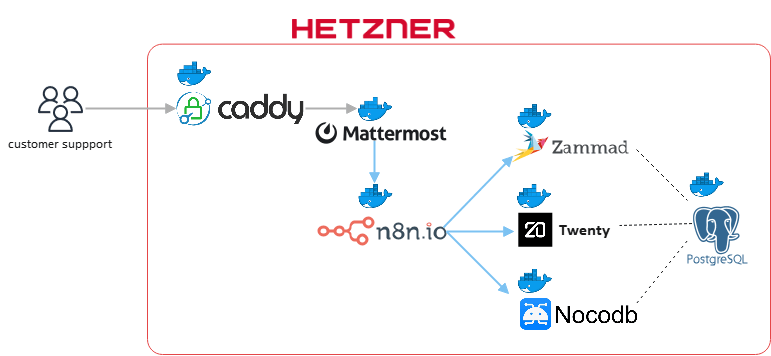</figure>


| Resource | Usage | Hosting Type | Licensing Model |
| - | - | - | - |
| [Caddy](https://caddyserver.com/docs/) | バックエンドサービスに対するHTTPS通信を中継、SSLオフロードやIPアドレスによるアクセス制限などを行う | Self Hosting（Docker container on Hetzner Cloud） | Free<br />Open Source |
| [Mattermost](https://docs.mattermost.com/) | お問い合わせ内容の通知先および命令文の実行 | Self Hosting（Docker container on Hetzner Cloud） | Freemium<br />Open Source |
| [n8n](https://docs.n8n.io/) | Mattermostからのイベントをトリガーにしてワークフローを実行する | Self Hosting（Docker container on Hetzner Cloud） | Freemium<br />Open Source |
| [Zammad](https://docs.zammad.org/en/latest/) | チケットの発行・管理を行う | Self Hosting（Docker container on Hetzner Cloud） | Free<br />Open Source |
| [Twenty](https://docs.twenty.com/) | 顧客情報の管理を行う | Self Hosting（Docker container on Hetzner Cloud） | Free<br />Open Source |
| [Nocodb](https://docs.nocodb.com/) | お問い合わせDBの外部インターフェースおよび管理UIを提供する | Self Hosting（Docker container on Hetzner Cloud） | Free<br />Open Source |
| [PostgreSQL](https://www.postgresql.org/docs/) | お問い合わせ内容、チケット、顧客情報の保存 | Self Hosting（Docker container on Hetzner Cloud） | Free<br />Open Source |


## フローの作成

### コマンド送信

Mattermostは[Slash commands](https://docs.mattermost.com/integrations/cloud-slash-commands.html)というSlackのスラッシュコマンドと同等の機能を有しています。ビルトインのコマンド以外にユーザー自身が独自のコマンドを追加することができ、特定のURLに対してPOSTまたはGETのHTTPリクエストを送信することができます。今回はチケットの作成とCRMへの登録の2種類のコマンドを作成します。

スラッシュコマンドは`Integrations`から`Slash Commands`を選択し`Add Slash Command`で作成することができます。

<figure>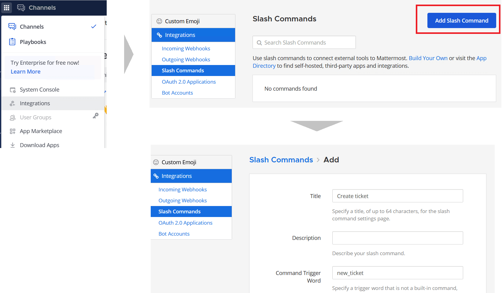</figure>

今回は以下のように設定します。

■チケット作成

| Name | Value |
| - | - |
| Title | 任意のタイトルを設定 |
| Description | 空白 |
| Command Trigger Word | new_ticket |
| Request URL | WebフックのURLを設定 |
| Request Method | POST |
| Response Username | 空白 |
| Response Icon | 空白 |
| Autocomplete | チェック |
| Autocomplete Hint | [Contact Number] |
| Autocomplete Description | 空白 |


■CRM登録

| Name | Value |
| - | - |
| Title | 任意のタイトルを設定 |
| Description | 空白 |
| Command Trigger Word | new_lead |
| Request URL | WebフックのURLを設定 |
| Request Method | POST |
| Response Username | 空白 |
| Response Icon | 空白 |
| Autocomplete | チェック |
| Autocomplete Hint | [Contact Number] |
| Autocomplete Description | 空白 |

コマンドを作成すると下図のようにトークンが発行されます。このトークンはリクエスト送信時のAuthorizationヘッダーおよびPOSTパラメータとして送信されます。

<figure>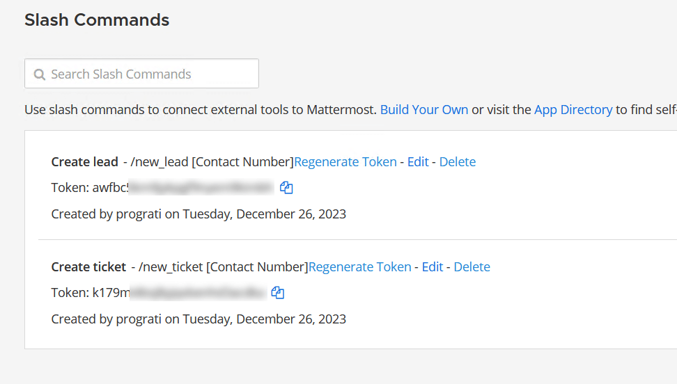</figure>

今回HTTPリクエストの送信先であるn8nは同一サーバー内のローカルネットワーク上にあります。Mattermostはローカルネットワーク間での通信を制限しているため許可リストにn8nを追加する必要があります。許可リストの設定は`System Console`の`ENVIRONMENT`から`Developer`を選択し`Allow untrusted internal connections to`に許可したいホスト名やIPアドレス、CIDRをスペース区切りで入力して行います。

<figure>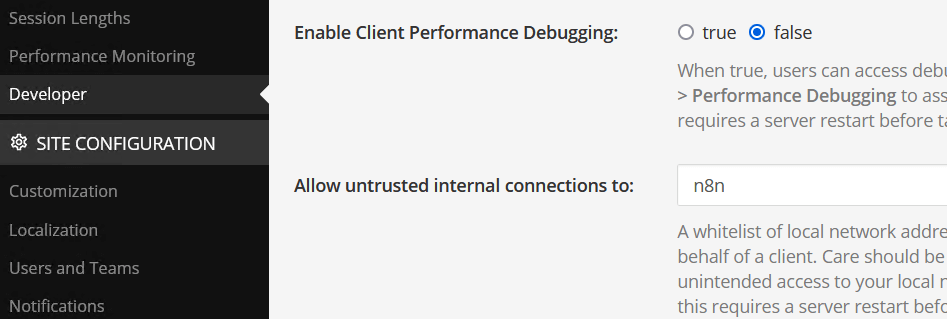</figure>

以上でMattermost側の設定は完了です。

### コマンドの受信

次にn8nの設定を行います。
まずコマンドからのリクエストを受信するWebフックを作成します。
今回はチケット作成コマンド用のWebフックとCRM登録用のWebフックの2種類を作成します（ノードパネルから`On webhook call`を選択）。

<figure>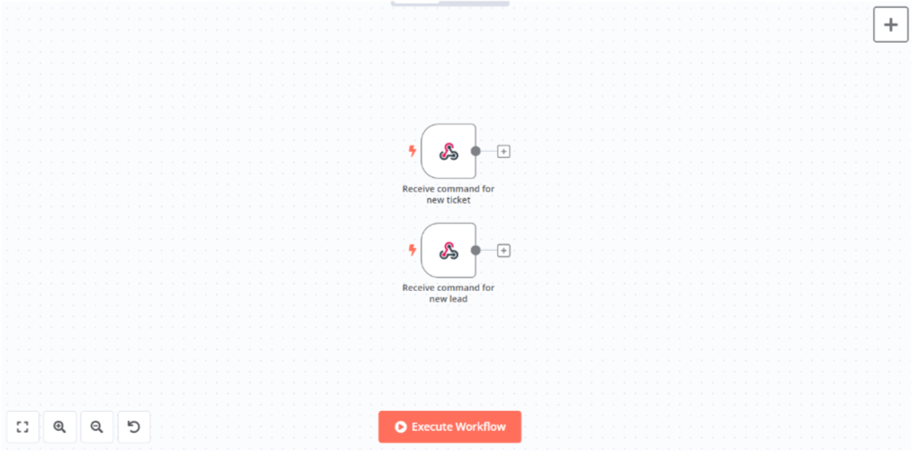</figure>

ノードを2つ追加して設定パネルでそれぞれ以下のように設定します（設定内容はそれぞれのコマンドでCredentialとPathの値を変更してください）。

| Name | Value |
| - | - |
| Authentication | Header Auth |
| Credential for Header Auth | Nameに`Authorization`、Valueに`Token <Mattermostでコマンド作成時に発行されたトークン>`を設定 |
| HTTP Method | POST |
| Path | 任意のパスを設定 |
| Respond | Using 'Respond to Webhook' Node |


### お問い合わせ番号照会

コマンドを受信したWebフックノードの出力は以下のようにヘッダー、パラメータ、クエリ、ボディで構成されたJSONデータになります。
ボディ部に実行したコマンドやコマンドのトークン、お問い合わせ番号が格納されています。

```json
[
  {
    "headers": {},
    "params": {},
    "query": {},
    "body": {
      "channel_id": "...",
      "channel_name": "...",
      "command": "/new_ticket",
      "response_url": "...",
      "team_domain": "...",
      "team_id": "...",
      "text": "cs_1234567890",
      "token": "abcdefghijklmnopqrstuvwxyz",
      "trigger_id": "...",
      "user_id": "...",
      "user_name": "..."
    }
  }
]
```

まずはデータからボディ部のみを取り出すために`Code`ノードを追加します（ノードパネルの`Data transformation`から選択）。

<figure>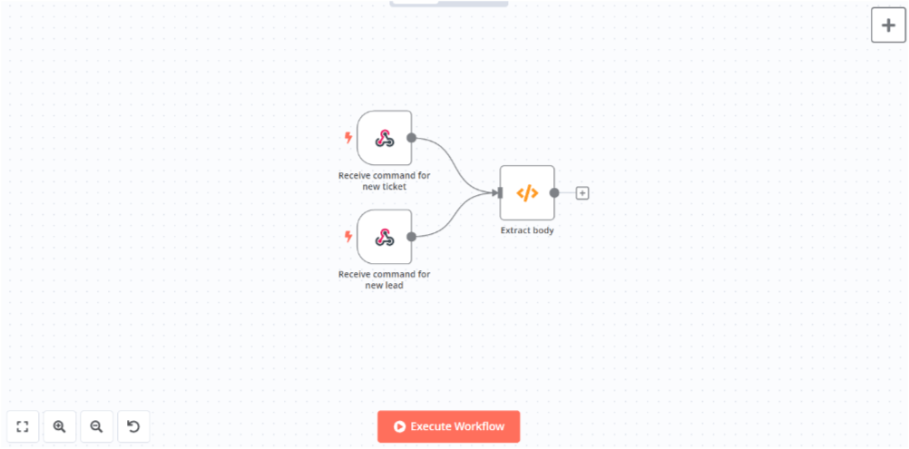</figure>

ノードを追加して設定パネルのコード入力欄に以下のJavaScriptを入力します。
`$input`は現在のノードに対する入力を表す変数で、一つ前のWebhookノードからの出力を参照しています（参考：[Current node input](https://docs.n8n.io/code/builtin/current-node-input/)）。

```javascript
newItems = []

for (const item of $input.all()) {
  newItems.push(item.json.body)
}

return newItems
```

これで後続のノードは以下のように階層のないフラットな構造のJSONデータで参照できるため記述が簡潔になります。

```json
[
  {
    "channel_id": "...",
    "channel_name": "...",
    "command": "/new_ticket",
    "response_url": "...",
    "team_domain": "...",
    "team_id": "...",
    "text": "cs_1234567890",
    "token": "abcdefghijklmnopqrstuvwxyz",
    "trigger_id": "...",
    "user_id": "...",
    "user_name": "..."
  }
]
```

次にお問い合わせ番号を使ってDBに登録されているお問い合わせ情報を照会する処理を追加します。
NocoDBと連携するためのノードはn8nに標準で用意されており、データを一意に特定するIDをキーにして1件取得することができます。
ただし、NocoDBのノードではID以外のキーを指定できないため、お問い合わせ番号で照会することができません。
代わりに`HTTP Request`ノードからNocoDBのREST APIを実行する方法で照会を行います（ノードパネルの`Helpers`から選択）。

<figure>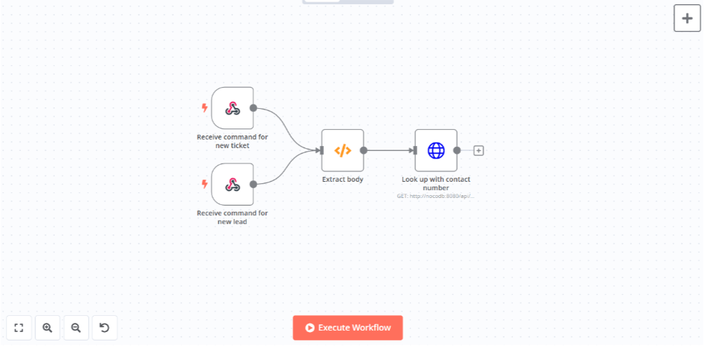</figure>

ノードを追加して設定パネルで以下のように設定します。

| Name | Value |
| - | - |
| Method | GET |
| URL | http://(NocoDBのサービス名):8080/(NocoDB APIの一覧取得エンドポイント) |
| Authentication | Predefined Credential Type |
| Credential Type | NocoDB API Token |
| Credential for NocoDB API Token | パート1のお問い合わせ内容登録で作成したクレデンシャルを設定 |
| Send Query Parameters Code | ON |
| Specify Query Parameters | Using Fields Below |
| Query Parameters (Name1) | where |
| Query Parameters (Value1) | (contact_no,eq,&#123;&#123; $json.text &#125;&#125;) |

APIのエンドポイントはNocoDBの管理画面で対象テーブルのベースをマウスオーバーして表示される3点リードから`Swagger: REST APIs`を選択することで確認することができます。

<figure>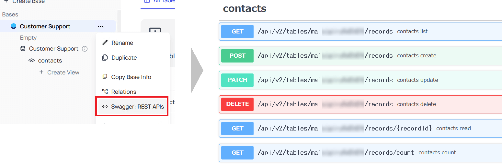</figure>


これでお問い合わせ番号での照会ができるようになりましたので、`IF`ノードを追加してデータが存在する場合はワークフローを継続し、存在しない場合はワークフローを終了してエラーレスポンスを返すようにします（ノードパネルの`Flow`から選択）。

<figure>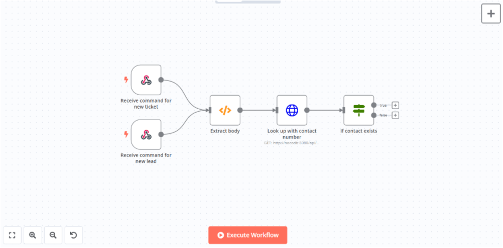</figure>

ノードを追加して設定パネルで以下のように設定します。

| Name | Value |
| - | - |
| Conditions | Number |
| Value 1  | &#123;&#123; $json.pageInfo.totalRows &#125;&#125; |
| Operation | Equal |
| Value 2 | 1 |

`$json.pageInfo.totalRows`は該当データの件数を表すAPIレスポンス値で、件数が1の場合はtrue、1以外の場合はfalseとなります。
falseの場合はエラーレスポンスを返すようにするためにfalseのブランチに`Respond to Webhook`ノードを追加します（ノードパネルの`Flow`から選択）。

<figure>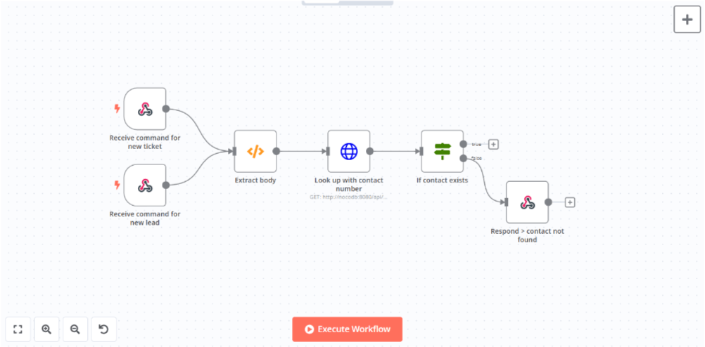</figure>

ノードを追加して設定パネルで以下のように設定します。

| Name | Value |
| - | - |
| Respond With | Text |
| Response Body  | 任意のエラーメッセージ |

Mattermostでコマンドを実行してお問い合わせ番号照会に失敗した場合、ここで設定した任意のエラーメッセージがMattermostに表示されます。

次にtrueの場合のフローを作成していきます。
チケット発行とCRM登録はフローを分ける必要があるため、IFノードのtrueのブランチに`Switch`ノードを追加します（ノードパネルの`Flow`から選択）。

<figure>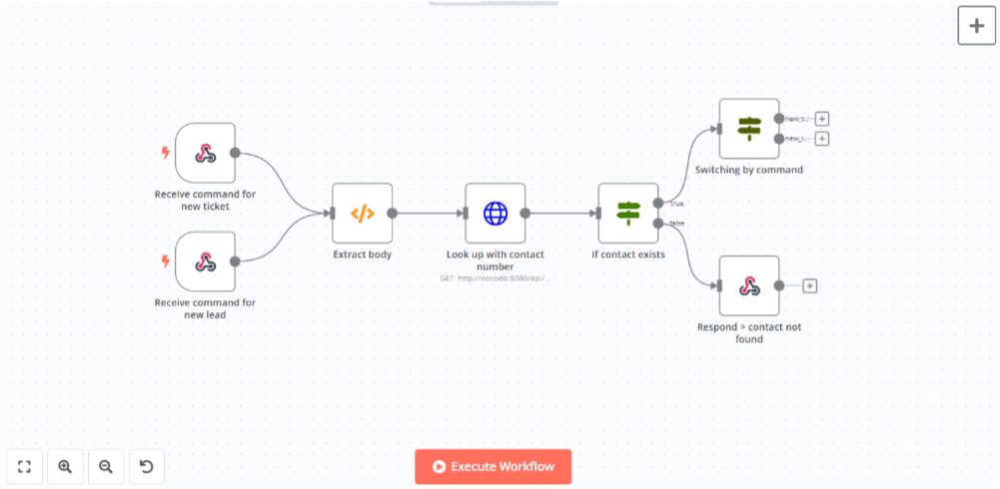</figure>

ノードを追加して設定パネルで以下のように設定します。

| Name | Value |
| - | - |
| Mode | Rules |
| Data Type  | String |
| Value1  | &#123;&#123; $('前出Codeノードの名前').item.json.command &#125;&#125; |
| Operation  | Equal |
| Value 2  | /new_ticket |
| Output Key  | new_ticket |
| Operation  | Equal |
| Value 2  | /new_lead |
| Output Key  | new_lead |

これでコマンド毎に別々のフローを作成できるようになりました。

### チケット発行

チケットの発行は以下のようなフローで行います。最初にお問い合わせユーザーがチケット管理システムにユーザー登録されているかどうかを確認します。登録されている場合はチケットを発行し、登録されていない場合はユーザー登録した上でチケットを発行します。

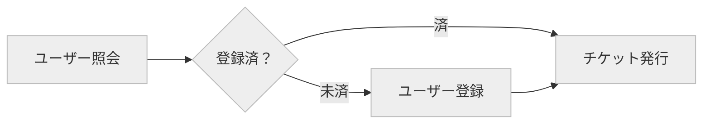
```mermaid
flowchart LR
    classDef commonStyle fill:#EEE,stroke:#BBB;
    lookup[ユーザー照会]:::commonStyle --> IF{登録済？}:::commonStyle;
    IF -->|済| issueTIcket[チケット発行]:::commonStyle;
    IF -->|未済| createUser[ユーザー登録]:::commonStyle --> issueTIcket[チケット発行];
```

まず、先ほど作成したSwitchノードのnew_ticketとラベリングされたブランチにユーザー照会のためのノードを追加します。
n8nには今回使用するチケット管理システム（`Zammad`）からユーザーを取得するノードが標準で用意されていますのでそちらを使用します（ノードパネルの`Action in an app`から選択）。

<figure>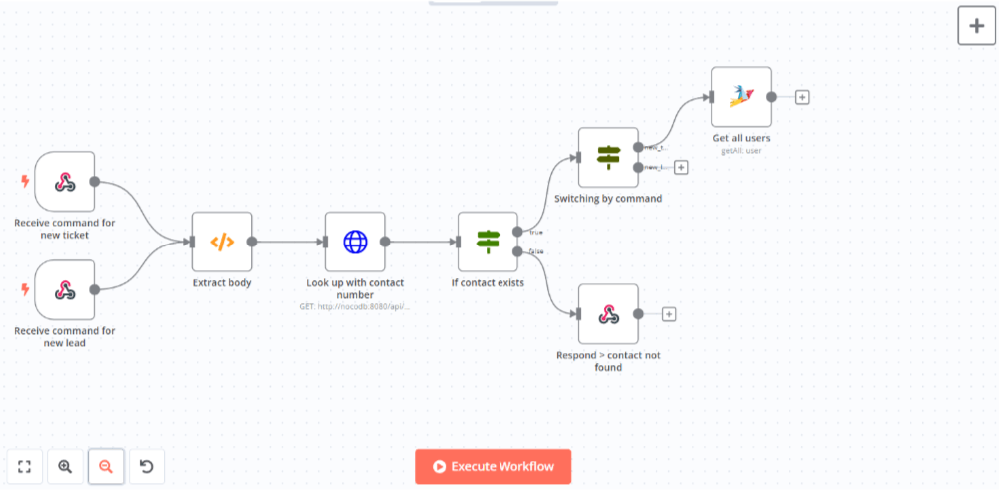</figure>

ノードを追加して設定パネルで以下のように設定します。

| Name | Value |
| - | - |
| Credential to connect with | Zammadで発行したアクセストークンとZammadのホストアドレス（`http://(Zammadのサービス名):3000/`）を設定 |
| Resource | User |
| Operation  | Get Many |
| Return All  | ON |

アクセストークンはユーザープロファイルから発行することができます。発行するトークンに必要なパーミッションは`ticket.agent`になります。
どのパーミッションが必要になるかは[システムドキュメント](https://docs.zammad.org/en/latest/)の各APIのエンドポイントに記載されていますのでそちらをご参照ください。

<figure>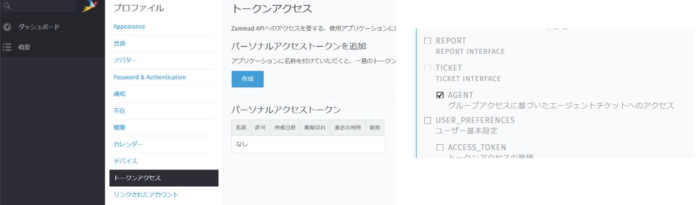</figure>

>[!NOTE]
>今回Zammadのノードで全ユーザーを取得していますが、お問い合わせ情報のメールアドレスを条件にして1件だけ取得することも可能です。
>本来は絞り込んで取得すべきですが条件を指定した検索にはElasticsearchが必要となるため今回は全ユーザーを取得しています。

次に、取得した全ユーザーからお問い合わせユーザーのメールアドレスと一致するユーザーを取り出すために`Code`ノードを追加します。

<figure>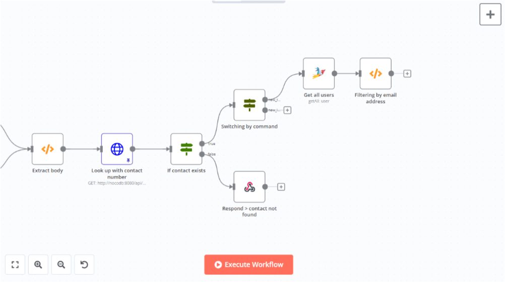</figure>

ノードを追加して設定パネルのコード入力欄に以下のJavaScriptを入力します。
下記コードでZammadで取得した全ユーザーからお問い合わせ情報のメールアドレスと一致するユーザーを取り出しています。

```javascript
const user = $input.all().filter(item => item.json.email === $('お問い合わせ番号照会ノードの名前').item.json.list[0].email)

return user.length === 0 ? 
  [
    {
      json: {
        exists: false,
        user: null
      },
      pairedItem: 0
    }
  ] : 
  [
    {
      json: {
        exists: true,
        user: user
      },
      pairedItem: 0
    }
  ]
```

>[!IMPORTANT]
>`pairedItem`はこの出力アイテムのもととなった入力アイテムのインデックスを表すメタデータです。
>n8nには[Item linking](https://docs.n8n.io/data/data-mapping/data-item-linking/item-linking-concepts/)という概念があり、ノードによって作成された各出力アイテムには、それらを生成するために使用した入力アイテムにリンクするためのメタデータが含まれています。
>n8nでは明示的にメタデータを設定しない限り自動で入力アイテムと出力アイテムの紐づけが行われますが、今回は入力アイテムをもとに全く新しい出力アイテムを作成しており自動紐づけができません（紐づけが行われていないと後続のワークフローでエラーになります）。
>そのため明示的にメタデータを設定しています。

次に、`IF`ノードを追加して一致するユーザーがいる場合といない場合の分岐を作成します。

<figure>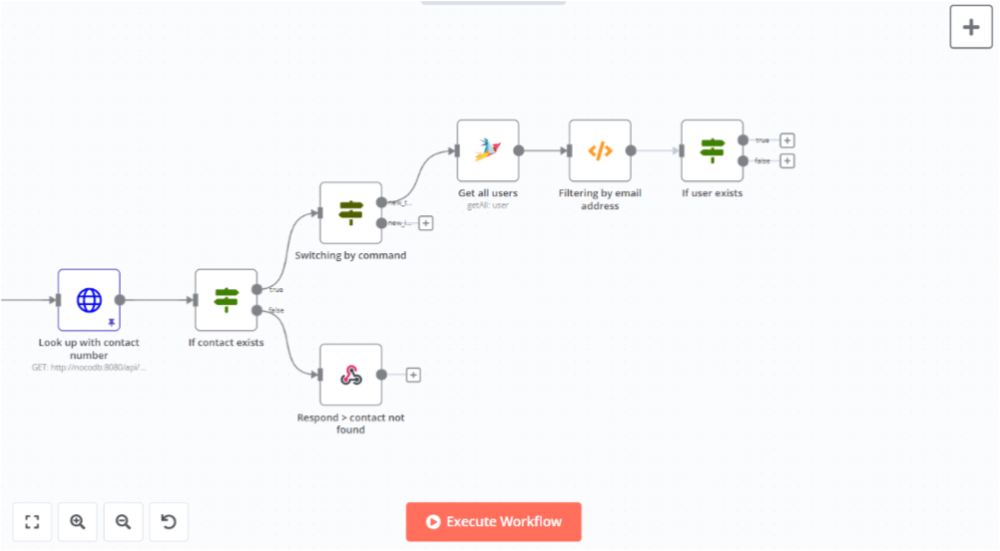</figure>

ノードを追加して設定パネルで以下のように設定します。

| Name | Value |
| - | - |
| Conditions | Boolean |
| Value 1  | &#123;&#123; $json.exists &#125;&#125; |
| Operation | Equal |
| Value 2 | &#123;&#123; true &#125;&#125; |

分岐を作成したらfalseブランチの方にユーザー登録のためのノードを追加します。n8nには`Zammad`にユーザーを登録するノードが標準で用意されていますのでそちらを使用します（ノードパネルの`Action in an app`から選択）。

<figure>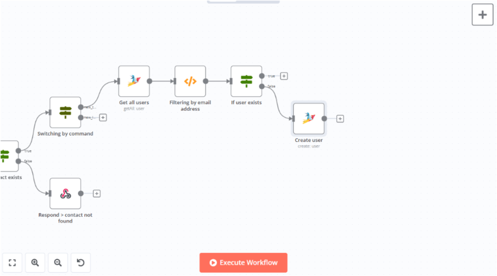</figure>

ノードを追加して設定パネルで以下のように設定します。

| Name | Value |
| - | - |
| Credential to connect with | ユーザー照会と同じ認証情報を使用 |
| Resource | User |
| Operation  | Create |
| First Name | &#123;&#123; $('お問い合わせ番号照会ノードの名前').item.json.list[0].first_name &#125;&#125; |
| Last Name | &#123;&#123; $('お問い合わせ番号照会ノードの名前').item.json.list[0].last_name &#125;&#125; |
| Email Address | &#123;&#123; $('お問い合わせ番号照会ノードの名前').item.json.list[0].email &#125;&#125; |

次に、trueのブランチの方にチケット発行のためのノードを追加し、先ほど追加したユーザー登録のノードからもリンクします。

>[!NOTE]
>n8nにはチケットを作成するノードが標準で用意されていますが、Zammadの[チケットAPI](https://docs.zammad.org/en/latest/api/ticket.html)で指定できるパラメーターを部分的にしか対応していません。
>今回は対応していないパラメーターを使用するため`HTTP Request`ノードで代替しています。

<figure>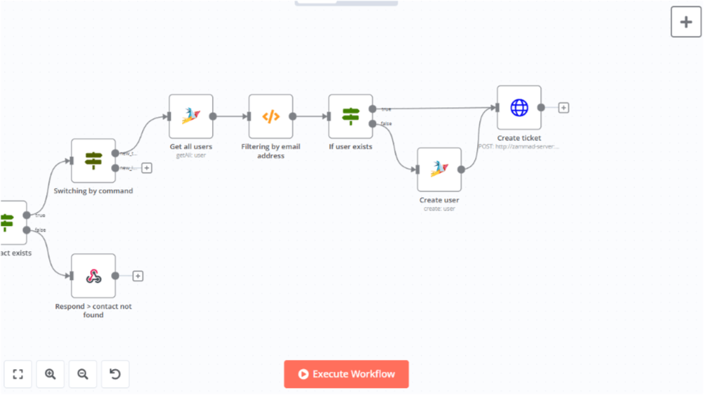</figure>

ノードを追加して設定パネルで以下のように設定します。

| Name | Value |
| - | - |
| Method | POST |
| URL | http://(Zammadのサービス名):3000/api/v1/tickets |
| Authentication | Generic Credential Type |
| Credential Type | Header Auth |
| Credential for Header Auth | Nameに`Authorization`、Valueに`Token token=<Zammadで発行したアクセストークン>`を設定 |
| Send Body | ON |
| Body Content Type | JSON |
| Specify Body | Using JSON |
| JSON | 下記参照 |

```json
{
   "title": "任意のチケットタイトル",
   "group": "Zammadで作成したグループ",
   "customer": "{{ $('お問い合わせ番号照会ノードの名前').item.json.list[0].email }}",
   "article": {
      "subject": "空白もしくは任意のサブジェクト",
      "body": "{{ $('お問い合わせ番号照会ノードの名前').item.json.list[0].message.replace(/\r?\n/g, '\\n') }}",
      "type": "web",
      "internal": true,
      "sender": "Customer"
   }
}
```

最後に`Respond to Webhook`ノードを追加して完了メッセージを返します。

<figure>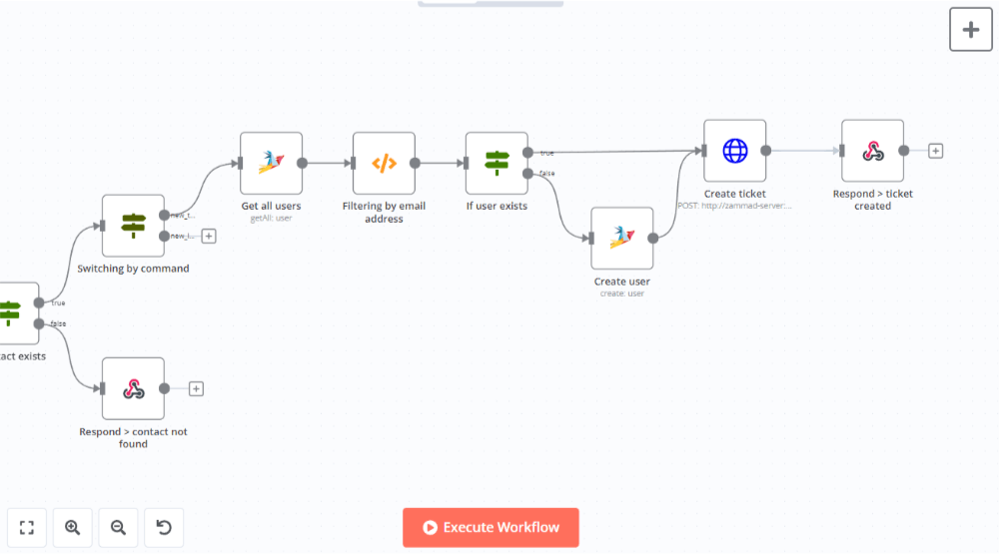</figure>

これでチケット発行のフローは完成です。次にCRM登録のフローを作成します。

### CRM登録

CRMへの発行は以下のようなフローで行います。最初にお問い合わせユーザーがCRMにリード登録されているかどうかを確認します。登録されている場合はワークフローを終了し、登録されていない場合はリード登録を行います。

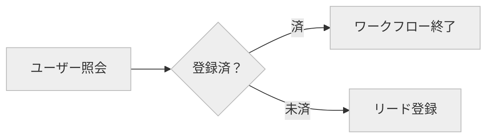
```mermaid
flowchart LR
    classDef commonStyle fill:#EEE,stroke:#BBB;
    lookup[ユーザー照会]:::commonStyle --> IF{登録済？}:::commonStyle;
    IF -->|済| endFlow[ワークフロー終了]:::commonStyle;
    IF -->|未済| createLead[リード登録]:::commonStyle;
```

n8nには今回使用するCRM（`Twenty`）と連携するためのノードは用意されていません。代わりに`GraphQL`ノードからTwentyのGraphQL APIを実行する方法でユーザー照会やリード登録を行います。

TwentyのGraphQL APIを実行するためには`JWT`によるトークンベース認証が必要となります。JWTに設定するペイロードは以下の通りです。

| Claim | Value |
| - | - |
| sub | ユーザーID（ワークスペース管理者のID） |
| workspaceId | ワークスペースのID |
| iat | トークンを発行した日時 |
| exp | トークンの有効期限（期間は任意） |

`sub`と`workspaceId`にセットする値はTwentyの画面上で確認することができないため、TwentyのDBを直接確認して値をセットします。
`iat`と`exp`はワークフローの中で動的に算出してセットします。
そこで、最初にSwitchノードのnew_leadとラベリングされたブランチに値を算出するための`Code`ノードを追加します。

<figure>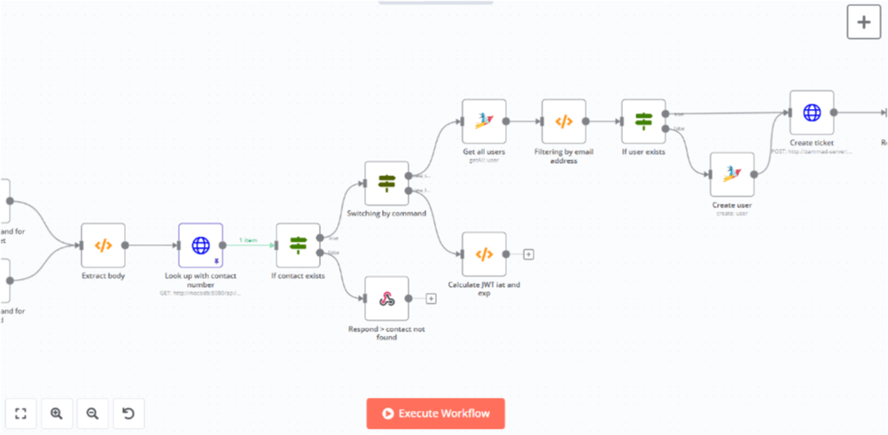</figure>

ノードを追加して設定パネルのコード入力欄に以下のJavaScriptを入力します。

```javascript
const iat = $now.toSeconds()
const exp = iat + 3600

return [
  {
    json: {
      iat: iat,
      exp: exp
    },
    pairedItem: 0
  }
]
```

ペイロードの値が揃いましたのでJWTの署名を行います。ただし、n8nにはJWTの署名を行うためのノードがありませんので、今回は[n8n-nodes-jwt](https://github.com/Joffcom/n8n-nodes-jwt)というコミュニティノードを使用します。
[公式ドキュメント](https://docs.n8n.io/integrations/community-nodes/installation/manual-install/)の手順に従ってコミュニティノードをインストールしてくだい。インストールするとノードパネルの`Action in an app`に`JWT`ノードが追加されますのでフローに追加します。

<figure>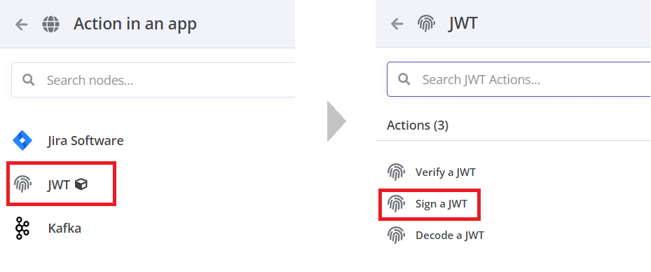</figure>

<figure>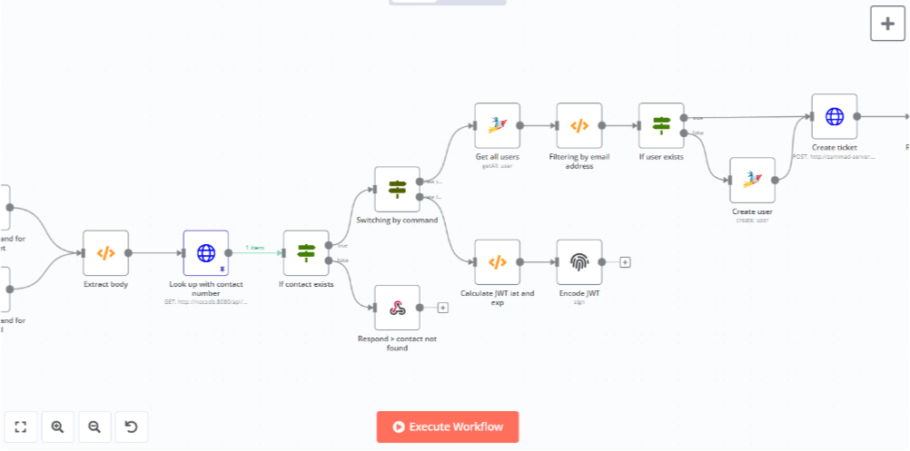</figure>

ノードを追加して設定パネルで以下のように設定します。

| Name | Value |
| - | - |
| Credential to connect with | Key Typeに`Passphrase`、Secretに環境変数`TWENTY_ACCESS_TOKEN_SECRET`の値を設定 |
| Operation | Sign |
| Algorithm | HS256 |
| Advanced Claim Builder | ON |
| Claims | 下記参照 |

```json
{
  "sub": "userテーブルに登録されている値を入力",
  "workspaceId": "workspaceテーブルに登録されている値を入力",
  "iat": {{ $json.iat }},
  "exp": {{ $json.exp }}
}
```

JWTの用意ができましたので`GraphQL`ノードを追加してユーザー照会を行います（ノードパネルの`Action in an app`から選択）。

<figure>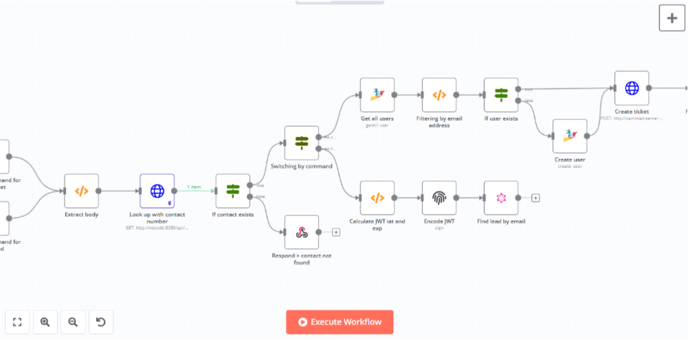</figure>

ノードを追加して設定パネルで以下のように設定します。

| Name | Value |
| - | - |
| Authentication | None |
| HTTP Request Method | POST |
| Endpoint | http://(Twenty Serverのサービス名):3000/graphql |
| Request Format | GraphQL(Raw) |
| Query | 下記参照 |
| Response Format | JSON |
| Headers (Name1) | Authorization |
| Headers (Value1) | Bearer &#123;&#123; $json.token &#125;&#125; |

```graphql
query FindManyPeople {
  people(
    first:1,
    filter:{
      and:[
        {
          email:{
            eq:"{{ $('お問い合わせ番号照会ノードの名前').item.json.list[0].email }}"
          }
        }
      ]
  	}
  ) {
    edges {
      node {
        id
      }
    }
  }
}
```

>[!NOTE]
>Authenticationに`Header Auth`がありますが、今回は固定値ではなく動的に生成したトークンをセットするため使用していません。
>代わりにHeadersに`Authorization`を追加してそちらにトークンをセットしています。

ユーザーが存在する場合は何もせずにワークフローを終了しますので`IF`ノードを追加してtrueブランチに`Respond to Webhook`ノードを追加します。

<figure>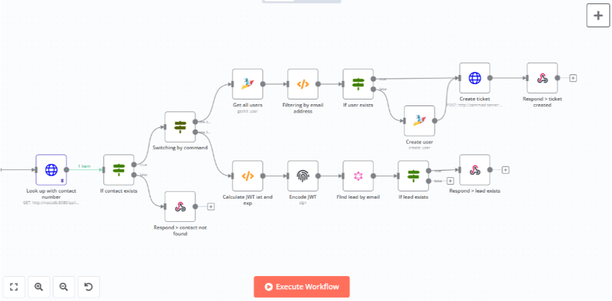</figure>

IFノードを追加して設定パネルで以下のように設定します。

| Name | Value |
| - | - |
| Conditions | Number |
| Value 1  | &#123;&#123; $json.data.people.edges.length &#125;&#125; |
| Operation | Equal |
| Value 2 | 1 |

ユーザーが存在しない場合はリード登録を行いますので`GraphQL`ノードを追加します。

<figure>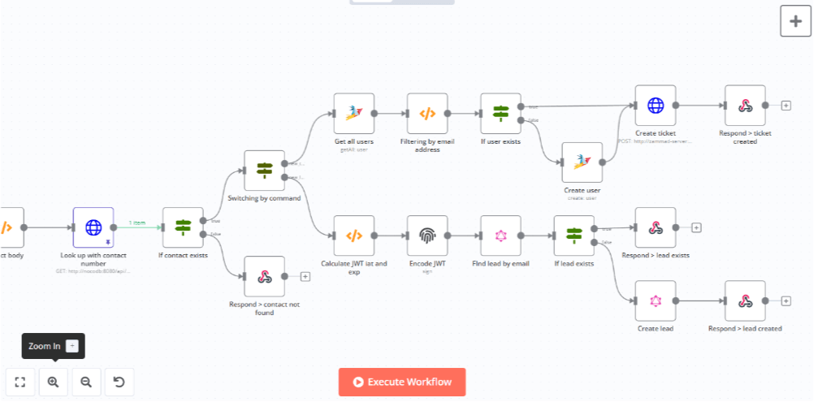</figure>

| Name | Value |
| - | - |
| Authentication | None |
| HTTP Request Method | POST |
| Endpoint | http://(Twenty Serverのサービス名):3000/graphql |
| Request Format | GraphQL(Raw) |
| Query | 下記参照 |
| Response Format | JSON |
| Headers (Name1) | Authorization |
| Headers (Value1) | Bearer &#123;&#123; $('JWT署名ノードの名前').item.json.token &#125;&#125; |

```graphql
mutation CreatePerson {
  createPerson(
    data:{
      name: {
        firstName: "{{ $('お問い合わせ番号照会ノードの名前').item.json.list[0].first_name }}",
        lastName: "{{ $('お問い合わせ番号照会ノードの名前').item.json.list[0].last_name }}"
      },
      email: "{{ $('お問い合わせ番号照会ノードの名前').item.json.list[0].email }}"
    }
  )
  {id}
}
```

## 動作確認

ワークフローの全体像は以下のようになります。

<figure>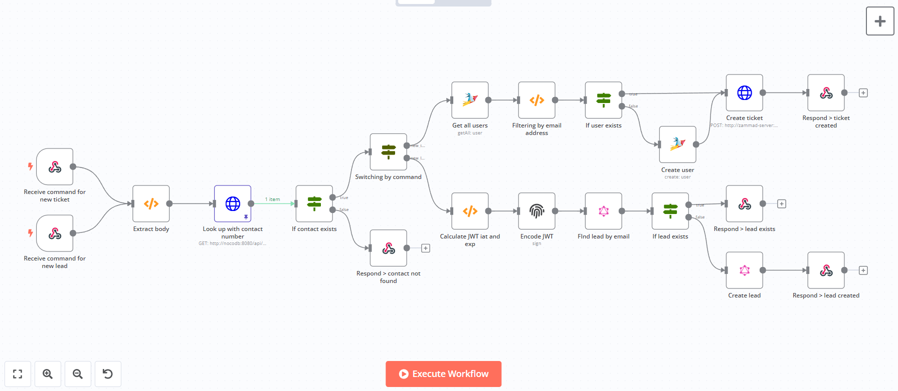</figure>

ワークフローをアクティブにしてMattermostでスラッシュコマンドを実行してみます。

最初にチケットを発行してみます。

<figure>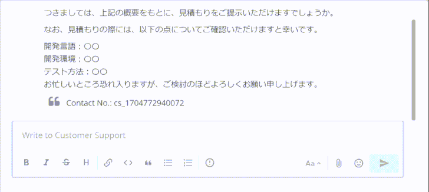</figure>

チケット発行に成功すると`Respond to Webhook`ノードで設定したメッセージが返ってきます。
Zammadにアクセスするとチケットが発行されていることが確認できます。

<figure>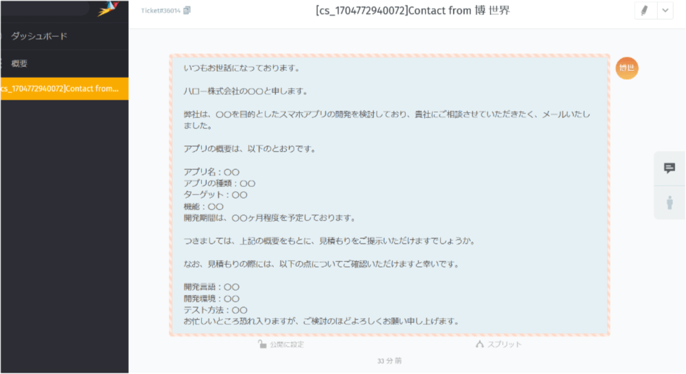</figure>

n8nにアクセスするとワークフローが実行されていることが確認できます。

<figure>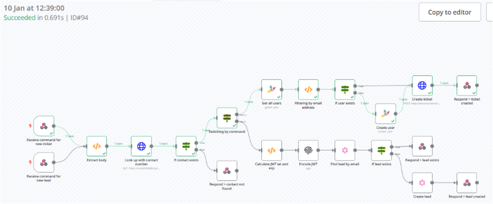</figure>

次ににリードを登録してみます。

<figure>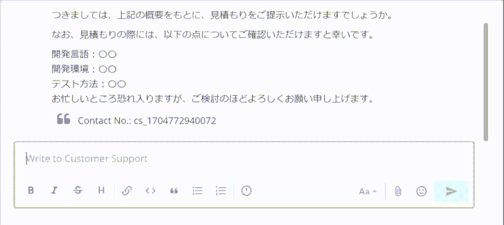</figure>

チケット発行に成功すると`Respond to Webhook`ノードで設定したメッセージが返ってきます。
Twentyにアクセスするとリードが登録されていることが確認できます。

<figure>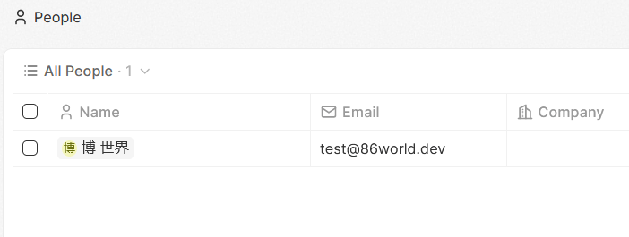</figure>

n8nにアクセスするとワークフローが実行されていることが確認できます。

<figure>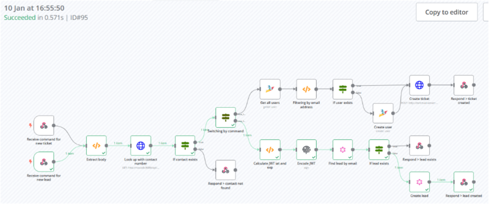</figure>
