本記事ではWebサイトのお問い合わせフォームの受付を自動化する簡単なワークフローを作成します。

## TOC

## フロー概要

作成するワークフローは以下のようになります。
まず、お問い合わせフォームから送信されたお問い合わせ内容をDBに自動登録します。その後にお問い合わせ内容をチャットに送信して通知します。


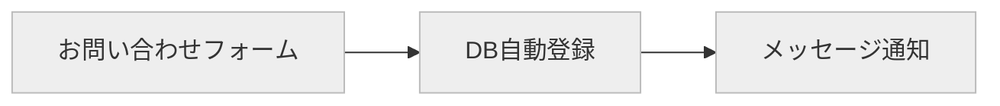

## システム構成

今回のシステム構成は下図のようになります。ユーザーはCloudflareに配置したWebフォームからお問い合わせを行います。お問い合わせ内容はHetzner Cloudに配置したn8nに送信され、n8nで作成したワークフローが実行されます。管理者はMattermostから通知を受け取りお問い合わせ内容を確認します。

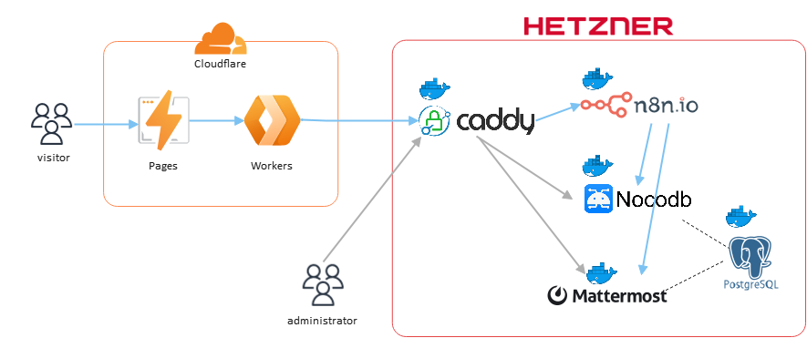


| Resource | Usage | Hosting Type | Licensing Model |
| - | - | - | - |
| [Cloudflare Pages](https://developers.cloudflare.com/pages) | Webサイトのホスティング | Managed Service | Freemium<br />Proprietary |
| [Cloudflare Workers](https://developers.cloudflare.com/workers/) | お問い合わせ内容をバックエンドサーバーに送信する | Managed Service | Freemium<br />Proprietary |
| [Caddy](https://caddyserver.com/docs/) | バックエンドサービスに対するHTTPS通信を中継、SSLオフロードやIPアドレスによるアクセス制限などを行う | Self Hosting（Docker container on Hetzner Cloud） | Free<br />Open Source |
| [n8n](https://docs.n8n.io/) | Cloudflare Workersからのイベントをトリガーにしてワークフローを実行する | Self Hosting（Docker container on Hetzner Cloud） | Freemium<br />Open Source |
| [Nocodb](https://docs.nocodb.com/) | お問い合わせDBの外部インターフェースおよび管理UIを提供する | Self Hosting（Docker container on Hetzner Cloud） | Free<br />Open Source |
| [Mattermost](https://docs.mattermost.com/) | お問い合わせ内容の通知先 | Self Hosting（Docker container on Hetzner Cloud） | Freemium<br />Open Source |
| [PostgreSQL](https://www.postgresql.org/docs/) | お問い合わせ内容の保存および各バックエンドサービスのデータストアとして使用する | Self Hosting（Docker container on Hetzner Cloud） | Free<br />Open Source |


## フローの作成

### お問い合わせ内容の送信

[Cloudflare Pages Functions](https://developers.cloudflare.com/pages/platform/functions/get-started/)を使用してバックエンドサービスにお問い合わせ内容を送信します。簡単なサンプルコードは以下のようになります。

データの受け口となるn8nのWebフックに対してフォームの内容をJSON形式でPOST送信しています。
WebフックはBasic認証で保護するためHTTPヘッダーに認証情報をセットしています。

>[!NOTE]
>今回各バックエンドサービスには8080、8081...のようにカスタムポートを割り当て、Caddy側でポートに応じて各サービスにトラフィックを転送していますが、本記事の執筆時点ではPages Functionsの中で使用するfetch関数にカスタムポート付のURLを指定しても、カスタムポートが無視されてしまいます（例えばfetch関数に`https://example.com:8080`を指定しても`https://example.com`になってしまう）。
>そのため、サービス固有のカスタムヘッダー`X-CUSTOM-PORT`をセットし、Caddy側でこのヘッダーを見てトラフィックを転送するようにしています。

```ts
export const onRequestPost: PagesFunction<{
  WEBHOOK_AUTH_USER: string
  WEBHOOK_AUTH_PASSWORD: string
  WEBHOOK_URL: string
  WEBHOOK_PORT: string
}> = async (context) => {
	try {
    const formData = await context.request.formData()
    const data = {};
    formData.forEach((v, k) => data[k] = v);
    const response = await fetch(context.env.WEBHOOK_URL, {
      method: 'POST',
      headers: {
        'Content-Type': 'application/json',
        'Authorization': 'Basic ' + btoa(`${context.env.WEBHOOK_AUTH_USER}:${context.env.WEBHOOK_AUTH_PASSWORD}`),
        'X-CUSTOM-PORT': context.env.WEBHOOK_PORT
      },
      body: JSON.stringify(data)
    })

    if (response.ok) {
      return new Response(null, {
        status: 200,
      })
    } else {
      console.log(JSON.stringify(await response.json()))
    }
  } catch (e) {
    console.log(e)
  }

 	return new Response(null, {
    status: 500,
  })
}
```

### お問い合わせ内容のDB自動登録

#### テーブルの作成

事前準備としてお問い合わせ内容を登録するテーブルをNocodbで作成します。
NocodbはNocodb自体が使用するデフォルトのDB以外に、外部のDB（MySQL、PostgreSQL...）と接続してデータを管理することが可能です。
今回はお問い合わせデータを他システムと共有して使用することを考慮して外部DB（PostgreSQL）と接続します。

まず、テーブルを作成したいBase（複数のテーブルをまとめる領域）を選択してデータソースの追加ボタンをクリックします。

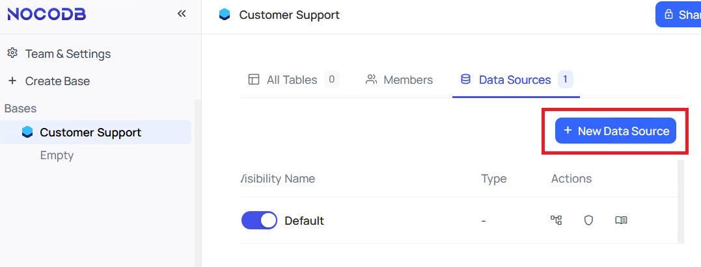

フォームに追加したいデータソースの接続情報を入力して疎通確認を行い接続情報を保存します[^1]。

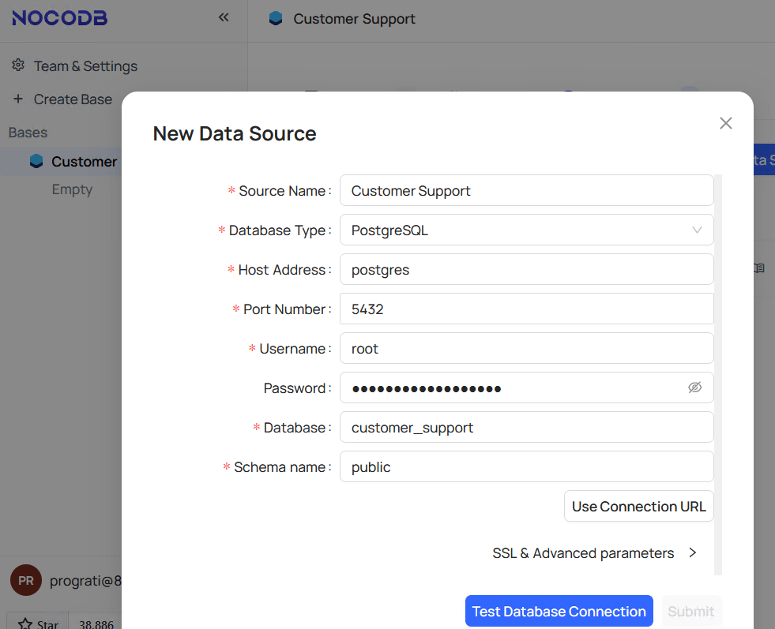

データソースが追加されると下記イメージのようになります。なお、一つのBaseに追加できるデータソースは一つのみとなっています。

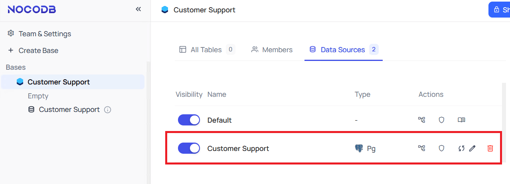

次に、追加したデータソースにテーブルを作成します。

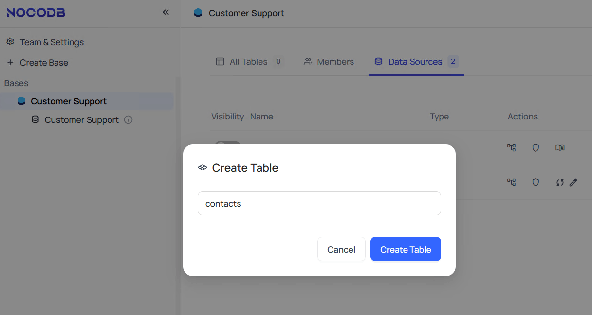

作成したテーブルにお問い合わせデータの項目を定義したらテーブルの作成は完了です。

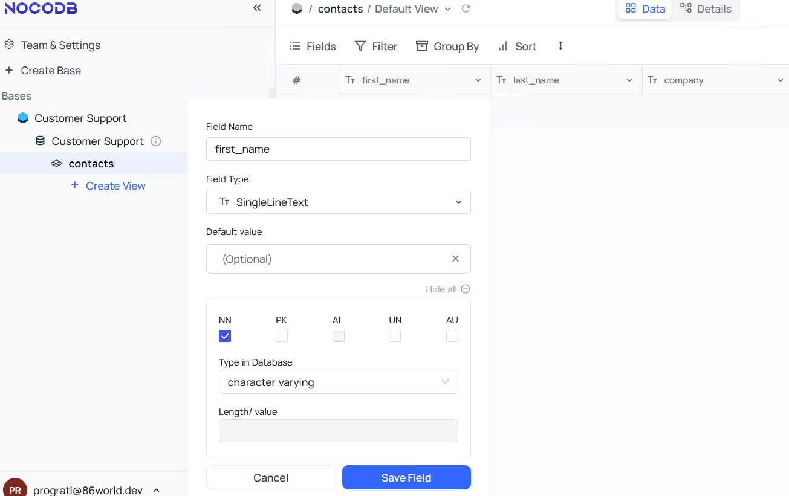

作成したテーブルは以下のようになります。

```
customer_support=# \d contacts
                                        Table "public.contacts"
   Column   |            Type             | Collation | Nullable |               Default
------------+-----------------------------+-----------+----------+--------------------------------------
 id         | integer                     |           | not null | nextval('contacts_id_seq'::regclass)
 first_name | character varying           |           | not null |
 last_name  | character varying           |           | not null |
 company    | character varying           |           |          |
 email      | character varying           |           | not null |
 message    | text                        |           | not null |
 contact_no | character varying           |           | not null |
 created_at | timestamp without time zone |           |          | now()
 updated_at | timestamp without time zone |           |          | now()
Indexes:
    "contacts_pkey" PRIMARY KEY, btree (id)
    "contacts_ukey1" UNIQUE, btree (contact_no)
Triggers:
    xc_trigger_updated_at BEFORE UPDATE ON contacts FOR EACH ROW EXECUTE FUNCTION xc_au_updated_at()
```

#### 自動登録

##### Step1. お問い合わせ内容の受信

n8nでNocodbで作成したテーブルにお問い合わせ内容を自動登録すワークフローを作成します。
ワークフローを起動するトリガーはCloudflareからPOSTされるお問い合わせ内容の受信となるため最初にWebhookノードを追加します（ノードパネルから`On webhook call`を選択）。

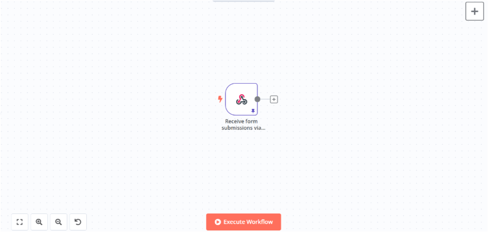

ノードを追加して設定パネルで以下のように設定します。

| Name | Value |
| - | - |
| Authentication | Basic Auth |
| Credential for Basic Auth | 任意のユーザーとパスワードを設定 |
| HTTP Method | POST |
| Path | 任意のパスを設定 |
| Respond | Immediately |
| Response Code | 200 |


##### Step2. お問い合わせ番号の割り当て

次にお問い合わせ情報に識別用のお問い合わせ番号を割り当てるためにCodeノードを追加します（ノードパネルの`Data transformation`から選択）。

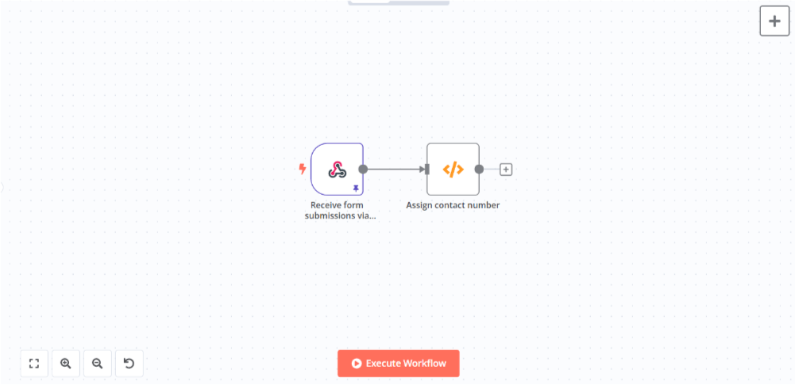

ノードを追加して設定パネルのコード入力欄に以下のJavaScriptを入力します。
`$input`は現在のノードに対する入力を表す変数で、今回の場合は一つ前のWebhookノードからの出力を参照しています（参考：[Current node input](https://docs.n8n.io/code/builtin/current-node-input/)）。

```javascript
const contacts = []

for (const item of $input.all()) {
  let contact = item.json.body
  contact.contactNo = 'cs_' + $now.toMillis()
  contacts.push(contact)
}

return contacts
```

Webhookから出力されるデータは下記のようなJSONデータとなっており、上記コード内でお問い合わせ内容を抽出し、そこにお問い合わせ番号を割り当てて次のノードにデータを渡しています。
お問い合わせ番号はタイムスタンプの先頭にプリフィックスを付けた簡易的な文字列にしています。コード内で使用している`$now`はビルトインの日付オブジェクトになります（参考：[Built-in date and time methods](https://docs.n8n.io/code/builtin/date-time/)）。

```json
[
  {
    "headers": {},
    "params": {},
    "query": {},
    "body": {
      "firstName": "...",
      "lastName": "...",
      "company": "...",
      "email": "...",
      "message": "..."
    }
  }
]
```

##### Step3. お問い合わせ内容の登録

次にお問い合わせ内容をNocoDBに登録します。
NocoDBと連携するためのノードはn8nに標準で用意されているためそれを利用します（ノードパネルの`Action in an app`から選択）。

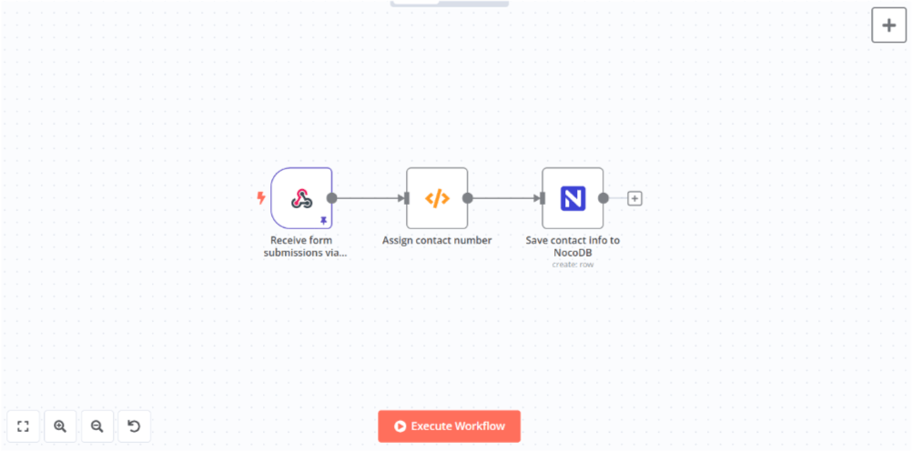

ノードを追加して設定パネルで以下のように設定します。

| Name | Value |
| - | - |
| Credential to connect with | NocoDBで発行したAPIトークンとNocodbのホストアドレス（`http://(NocoDBのサービス名):8080`）を設定 |
| Resource | Row |
| Operation | Create |
| Workspace Name or ID | リストの中から選択（NocoDBからAPI経由で自動取得） |
| Base Name or ID | リストの中から選択（NocoDBからAPI経由で自動取得） |
| Table Name or ID | リストの中から選択（NocoDBからAPI経由で自動取得） |
| Data to Send | Define Below for Each column |

Fields to Send（NocoDBに送信するフィールド） の項目には以下のフィールドと値を追加します。
フィールド名はNocoDBで定義したフィールド名と一致させる必要があります。
フィールド値は前のノードから動的に値を取得しますのでFixedではなくExpressionを選択し式を入力します。
`$json`は`$input.item.json`のショートハンドで、現在のノードに対するJSONデータの入力を表す変数です。

| Field Name | Field Value |
| - | - |
| first_name | &#123;&#123; $json.firstName &#125;&#125; |
| last_name | &#123;&#123; $json.lastName &#125;&#125; |
| company | &#123;&#123; $json.company &#125;&#125; |
| email | &#123;&#123; $json.email &#125;&#125; |
| message | &#123;&#123; $json.message &#125;&#125; |
| contact_no | &#123;&#123; $json.contactNo &#125;&#125; |

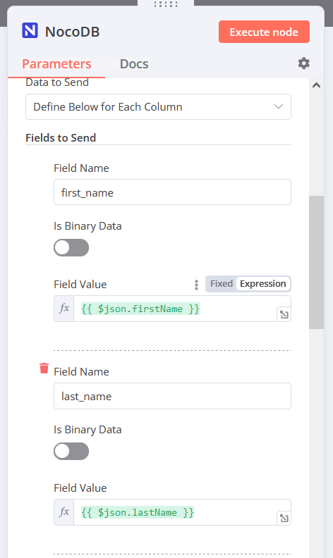


### お問い合わせ内容のメッセージ通知

最後にお問い合わせ内容の通知をワークフローに追加します。
今回はMattermostというSlackとよく似たWebアプリケーションを通知先にします。
Mattermostと連携するためのノードはn8nに標準で用意されているためそれを利用します（ノードパネルの`Action in an app`から選択）。

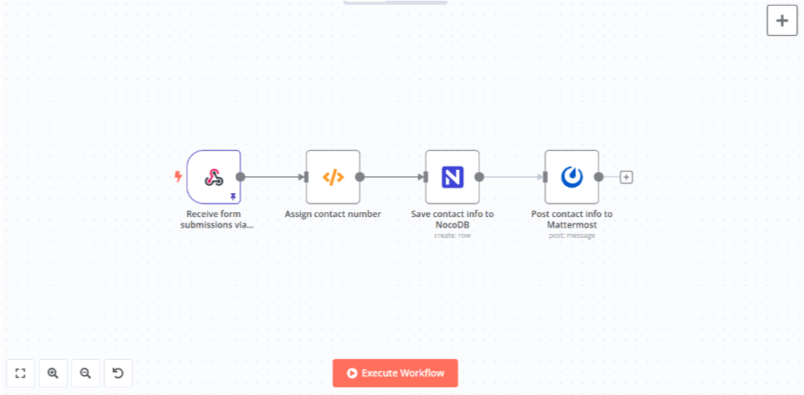

ノードを追加して設定パネルで以下のように設定します。

| Name | Value |
| - | - |
| Credential to connect with | Mattermostで発行したアクセストークンとMattermostのホストアドレス（`http://(Mattermostのサービス名):8065/`）を設定 |
| Resource | Message |
| Operation | Post |
| Channel Name or ID | 投稿したいチャネルのIDを設定 |

投稿するメッセージは以下のようにお問い合わせ内容を埋め込みます。

```
The following message was sent from the contact form.

>First Name: {{ $json.first_name }}
>Last Name: {{ $json.last_name }}
>Company: {{ $json.company }}
>Email: {{ $json.email }}
>Message: {{ $json.message }}
>Contact No.: {{ $json.contact_no }}
```

今回はBotアカウントがメッセージを投稿するようにしたいので、アクセストークンはBotアカウントのものを作成します。
アクセストークンは`Integrations`から`Bot Accounts`を選択し`Create New Token`で作成することができます。

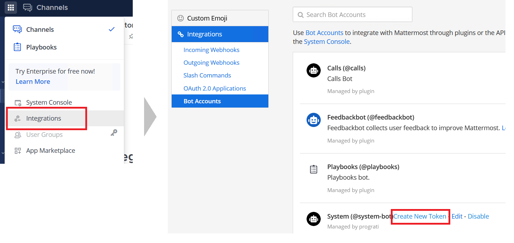

なお、ボットアカウントがチャネルに投稿できるように`post:channels`の権限を付与する必要があります。

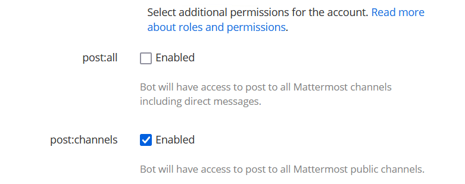

## 動作確認

ワークフローをアクティブにしてCloudflare Pagesにデプロイしたお問い合わせフォームからお問い合わせを送信してみます。

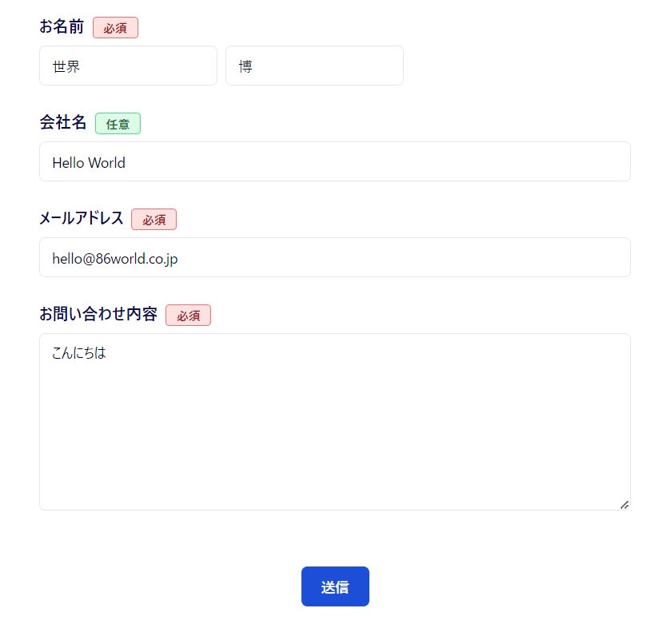

n8nにアクセスするとワークフローが実行されていることが確認できます。

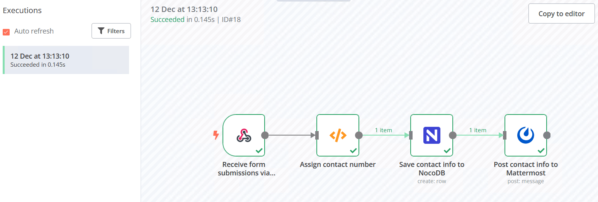

NocoDBにアクセスするとお問い合わせ内容が登録されていることが確認できます。

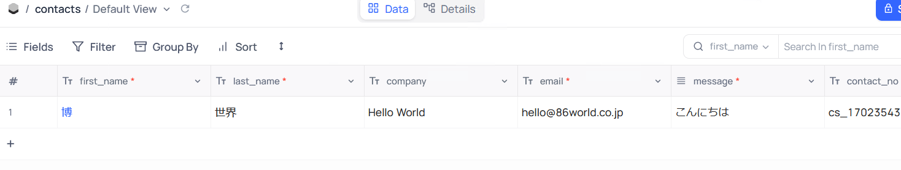

MattermostにアクセスするとBotアカウントからお問い合わせ内容が投稿されていることが確認できます。

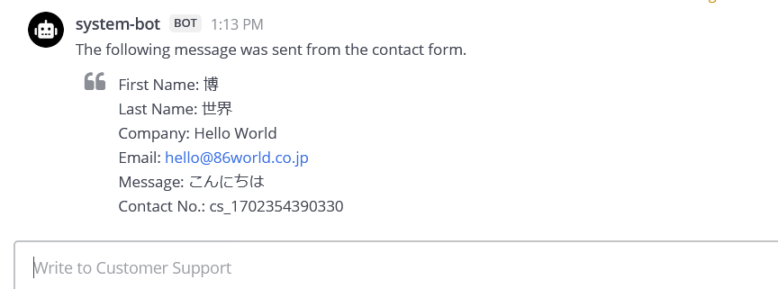

[^1]: 外部DBとバックエンドサービスは同一のブリッジ・ネットワーク内にあるため、ホストアドレスはサービス名を指定しています
