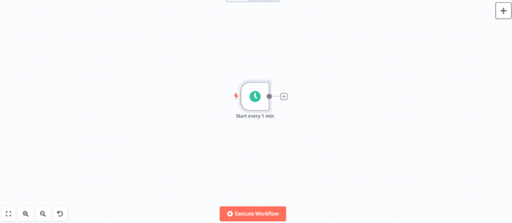
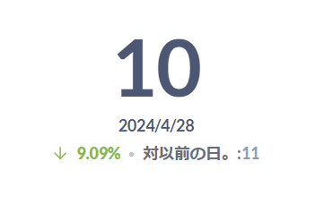

本記事ではWebアプリケーションで発生したエラーを通知する簡単なワークフローを作成します。

## TOC

## フロー概要

作成するワークフローは以下のようになります。
まず、Webアプリケーションで発生したエラーをトラッキングツールに自動登録します。その後にエラー内容をチャットに送信して通知します。


## システム構成

今回のシステム構成は下図のようになります。Cloudflare Workersでエラーが発生した場合にHetzner Cloudに配置したGlitchTipにエラー内容を送信します。n8nがGlitchTipに登録されたエラーを一定間隔で取得しチャットに送信して通知します。Metabaseで発生したエラーの集計を行い、グラフ表示します。

<figure></figure>


| Resource | Usage | Hosting Type | Licensing Model |
| - | - | - | - |
| [Cloudflare Workers](https://developers.cloudflare.com/workers/) | エラー発生源となるアプリケーション | Managed Service | Freemium<br />Proprietary |
| [GlitchTip](https://glitchtip.com/documentation) | エラーのトラッキングを行う | Self Hosting（Docker container on Hetzner Cloud） | Freemium<br />Open Source |
| [Caddy](https://caddyserver.com/docs/) | バックエンドサービスに対するHTTPS通信を中継、SSLオフロードやIPアドレスによるアクセス制限などを行う | Self Hosting（Docker container on Hetzner Cloud） | Free<br />Open Source |
| [n8n](https://docs.n8n.io/) | 一定間隔でワークフローを実行する | Self Hosting（Docker container on Hetzner Cloud） | Freemium<br />Open Source |
| [Mattermost](https://docs.mattermost.com/) | エラー内容の通知先 | Self Hosting（Docker container on Hetzner Cloud） | Freemium<br />Open Source |
| [Metabase](https://www.metabase.com/docs/latest/) | エラーの集計およびグラフ表示を行う | Self Hosting（Docker container on Hetzner Cloud） | Freemium<br />Open Source |
| [PostgreSQL](https://www.postgresql.org/docs/) | エラー内容の保存および各バックエンドサービスのデータストアとして使用する | Self Hosting（Docker container on Hetzner Cloud） | Free<br />Open Source |


## フローの作成

### エラー内容の送信および登録

エラーの発生源となるアプリケーションを`Cloudflare Workers`上に作成します。アプリケーションはフレームワークの[Hono](https://hono.dev/)を使用し、エラーの送信はHonoの[Sentryミドルウェア](https://www.npmjs.com/package/@hono/sentry)を使用します（エラーの送信先となる`GlitchTip`はSentryのAPIと互換性があるためそのまま使用可能です）。簡単なサンプルコードは以下のようになります。

プログラム内で意図的にエラーを発生させ、`captureException`関数でエラー内容を送信しています。エラーは`info`、`warning`、`error`の３つのレベルで送信しており、その他に`debug`、`log`,`fatal`が指定可能です（fatal>error>warning>info=log>debug）。

Sentryクライアントの`DSN`（Data Source Name）に設定する値はGlitchTipのプロジェクト設定画面から確認することができます。

<figure></figure>


```ts
import { Hono } from 'hono'
import { sentry } from '@hono/sentry'

type Bindings = {
  SENTRY_DSN: string
  SENTRY_RELEASE: string
  CUSTOM_PORT: string
}

const app = new Hono<{ Bindings: Bindings }>()

app.use('*', async (c, next) => {
  await sentry({
    dsn: c.env.SENTRY_DSN,
    release: c.env.SENTRY_RELEASE,
    transportOptions: {
      headers: {
        "X-CUSTOM-PORT": c.env.CUSTOM_PORT
      }
    }
  }).call(null, c, next)
})

app.get('/:id{[0-9]+}', (c) => {
  const { id } = c.req.param()
  switch (id) {
    case '1':
    case '2':
    case '3':
    case '4':
    case '5':
      c.get('sentry').captureException(new Error(id), { captureContext: { level: 'info' } })
      break;
    case '6':
    case '7':
    case '8':
    case '9':
      try {
        JSON.parse('not json')
      } catch (e) {
        c.get('sentry').captureException(e, { captureContext: { level: 'warning' } })
      }
      break;
    default:
      throw new RangeError(id)
  }
  return c.text('Hello World!')
})

app.onError((e, c) => {
  c.get('sentry').captureException(e, { captureContext: { level: 'error' } })
  return c.text('Internal Server Error', 500)
})

export default app
```

>[!NOTE]
>今回各バックエンドサービスには8080、8081...のようにカスタムポートを割り当て、Caddy側でポートに応じて各サービスにトラフィックを転送していますが、本記事の執筆時点ではcaptureExceptionの中で使用するfetch関数にカスタムポート付のURLを指定しても、Cloudflare Workers側でカスタムポートが無視されてしまいます（例えばfetch関数に`https://example.com:8080`を指定しても`https://example.com`になってしまう）。
>そのため、サービス固有のカスタムヘッダー`X-CUSTOM-PORT`をセットし、Caddy側でこのヘッダーを見てトラフィックを転送するようにしています。

上記のプログラムをCloudflareにデプロイしてリクエストを送信してみます。送信後にGlitchTipを確認すると下図のようにissueが登録されていることが確認できます。

<figure></figure>

<figure></figure>

ただし、このままだとJavaScriptにトランスパイルされた後のスタックトレースが出力されてしまい原因調査が行いにくくなってしまいます。

```
RangeError:10
 at <anonymous> (index.js:21:29258)
 at o (index.js:21:12992)
 at <anonymous> (index.js:21:13000)
 at <anonymous> (index.js:21:8979)
 at <anonymous> (index.js:21:28885)
 at o (index.js:21:12992)
 at <anonymous> (index.js:21:12734)
 at <anonymous> (index.js:21:20348)
 at _s.dispatch (index.js:21:20526)
 at _s.fetch (index.js:21:20549)
```

そこで、`sentry-cli`を使用してGlitchTipにSource Mapを連携し、TypeScriptファイルの内容で出力するようにしたいと思います。

まず最初に以下のコマンドを実行して認証を行います。

```shell
sentry-cli --url <GlitchTipのURL> login
```

指示に従って進むとブラウザが起動してトークン発行画面に誘導されますのでトークンを発行します。

<figure></figure>

発行したトークンをシェル画面に入力するとホームディレクトリ直下の`.sentryclirc`ファイルにトークンが保存されます。

<figure></figure>

sentry-cliはデフォルトではsentry.ioに接続するようになっています。そこで、.sentryclircにURLを追加してGlitchTipに接続するように変更します。

```
[auth]
token=<保存されたトークン>

[defaults]
url=<GlitchTipのURL>
```

これでsentry-cliの準備は整いましたので、Source Mapを作成してGlitchTipにアップロードします。コマンドは以下のようになります。リリースのバージョンはCloudflare Workersで設定した`SENTRY_RELEASE`と同じ値を指定します。

```shell
wrangler deploy --dry-run --outdir=dist src/index.ts

sentry-cli releases new <リリースのバージョン> --finalize --org <GlitchTipで作成した組織のslug> --project <GlitchTipで作成したプロジェクトのslug> && \
sentry-cli releases files <リリースのバージョン> upload-sourcemaps ./dist --org <GlitchTipで作成した組織のslug> --project <GlitchTipで作成したプロジェクトのslug>
```

アップロードが完了するとGlitchTipのリリースの画面にアップロードしたバージョンが表示されます。

<figure></figure>

この状態で再度リクエストを送信してみます。そうすると今度は以下のように登録されます。

<figure></figure>

```
RangeError:10
 at <anonymous> (dist/../src/index.ts:47:13)
 at dispatch (dist/../node_modules/hono/dist/compose.js:29:23)
 at <anonymous> (dist/../node_modules/hono/dist/compose.js:30:20)
 at <anonymous> (dist/../node_modules/@hono/sentry/dist/index.js:37:15)
 at <anonymous> (dist/../src/index.ts:21:6)
 at dispatch (dist/../node_modules/hono/dist/compose.js:29:23)
 at <anonymous> (dist/../node_modules/hono/dist/compose.js:6:12)
 at <anonymous> (dist/../node_modules/hono/dist/hono-base.js:188:31)
 at Hono2.dispatch (dist/../node_modules/hono/dist/hono-base.js:198:5)
 at Hono2.fetch (dist/../node_modules/hono/dist/hono-base.js:201:17)
```

これでアプリケーションで発生したエラーをトラッキングツールに登録するまでの仕組みが完成しましたので、次にエラー内容を通知するワークフローを作成します。

### エラー内容の通知

エラー内容の通知は以下のような流れで行います。
まず、トラッキングツール経由で保存されたエラー情報を1分間隔でポーリングします。新しいエラーが登録されていればレポート参照用DBに保存し、チャットツールに通知します。レポート参照用DBに保存したエラー情報はBIツールを使って集計・グラフ表示します。


#### 新規エラーのポーリング

ワークフローを一定間隔で起動するために`Schedule`ノードを追加します（ノードパネルから`On a schedule`を選択）。

<figure></figure>

ノードを追加して設定パネルで以下のように設定します。

| Name | Value |
| - | - |
| Trigger Interval | Minutes |
| Minutes Between Triggers | 1 |

次にエラー情報を照会するためのノードを追加します。GlitchTipにはエラー情報を照会するためのREST APIも提供されていますがワークフローが複雑になるため、`Postgres`ノード（ノードパネルの`Action in an app`から選択）を使ってDBを直接参照します。

<figure></figure>

ノードを追加して設定パネルで以下のように設定します。

| Name | Value |
| - | - |
| Credential to connect with | GlitchTipのDB接続情報を設定 |
| Operation | Execute Query |
| Query | 下記のSQLクエリを入力 |
| Options - Query Parameters | &#123;&#123; $json.timestamp &#125;&#125; |

```sql
SELECT
    iss.id,
    iss.level,
    iss.metadata,
    iss.title,
    iss.type,
    iss.last_seen,
    pj.id AS project_id,
    pj.name AS project_name,
    iss.count AS count
FROM
    issue_events_issue AS iss
    INNER JOIN projects_project AS pj ON iss.project_id = pj.id
WHERE
    iss.is_deleted = false
    AND iss.status = 0
    AND iss.last_seen + (interval '1.5 minute') > $1::TIMESTAMP WITH TIME ZONE
```

>[!IMPORTANT]
>SQLクエリに他のノードの出力データを直接読み込むことはSQLインジェクションにつながるリスクがあるため極力避けるようにしてください。クエリパラメーターを使用するとデータが自動的にサニタイズされるため安全にSQLクエリを実行することができます。

上記Postgresノードでエラー情報が取得できた場合は、取得した情報1件1件に対してDB保存およびメッセージ通知を行いますので、`Loop Over Items`ノード（ノードパネルの`Flow`から選択）を使って繰り返しフローを作成します。

<figure></figure>

#### エラー情報の登録

レポート参照用のDBにエラー情報を登録するために以下のようなテーブルを用意します。

```
# \d issues
                                        Table "public.issues"
    Column    |           Type           | Collation | Nullable |              Default
--------------+--------------------------+-----------+----------+------------------------------------
 id           | integer                  |           | not null | nextval('issues_id_seq'::regclass)
 issue_id     | bigint                   |           | not null |
 level        | character varying        |           | not null |
 metadata     | jsonb                    |           | not null |
 title        | character varying        |           | not null |
 type         | smallint                 |           | not null |
 last_seen    | timestamp with time zone |           | not null |
 project_id   | bigint                   |           | not null |
 project_name | character varying        |           | not null |
 count        | integer                  |           | not null |
 created_at   | timestamp with time zone |           |          | now()
```

GlitchTipから取得したエラー情報に対して以下の処理を行い上記テーブルに登録します。

- エラー情報のレベルを数値(1,2,3,...)から文字列(debug,info,warning,...)に変換する
- エラーレベルがdebugとinfoの場合は登録および通知対象外とする
- 前回ポーリング時から新たに発生したエラーの件数をGlitchTipのDBから集計する

まず、レベルを数値から文字列に変換するために`Code`ノードを追加します（ノードパネルの`Data transformation`から選択）。

<figure></figure>

ノードを追加して設定パネルのコード入力欄に以下のJavaScriptを入力します。

```javascript
const levels = ['debug', 'info', 'warning', 'error', 'fatal']

for (const item of $input.all()) {
  const level = parseInt(item.json.level)
  item.json.level_label = levels[level - 1]
}

return $input.all()
```

エラーレベルがdebugやinfoは登録対象外とするために`If`ノードを追加してdebugやinfoは繰り返しフローの開始地点に戻るようにします（ノードパネルの`Flow`から選択）。

<figure></figure>

ノードを追加して設定パネルで以下のように設定します。

| Name | Value |
| - | - |
| Conditions | Number |
| Value 1  | &#123;&#123; $json.level &#125;&#125; |
| Operation | Larger or Equal |
| Value 2 | 3 |

trueブランチに`Postgres`ノードを追加して前回ポーリング時から新たに発生したエラーの件数を集計します。

<figure></figure>

ノードを追加して設定パネルで以下のように設定します。

| Name | Value |
| - | - |
| Credential to connect with | GlitchTipのDB接続情報を設定 |
| Operation | Execute Query |
| Query | 下記のSQLクエリを入力 |
| Options - Query Parameters | &#123;&#123; $json.id &#125;&#125;,&#123;&#123; $('前出Scheduleノードの名前').item.json.timestamp &#125;&#125; |

```sql
SELECT
    COUNT(*) AS count
FROM
    issue_events_issueevent
WHERE
    issue_id = $1
    AND received + (interval '1.5 minute') > $2::TIMESTAMP WITH TIME ZONE
```

`Postgres`ノードを追加してレポート参照用のDBにエラー情報を登録します。

<figure></figure>

ノードを追加して設定パネルで以下のように設定します。

| Name | Value |
| - | - |
| Credential to connect with | レポート参照用DBの接続情報を設定 |
| Operation | Execute Query |
| Query | 下記のSQLクエリを入力 |
| Options - Query Parameters | &#123;&#123; $('前出Codeノードの名前').item.json.id &#125;&#125;,&#123;&#123; $('前出Codeノードの名前').item.json.level_label &#125;&#125;,&#123;&#123; JSON.stringify($('前出Codeノードの名前').item.json.metadata) &#125;&#125;,&#123;&#123; $('前出Codeノードの名前').item.json.title &#125;&#125;,&#123;&#123; $('前出Codeノードの名前').item.json.type &#125;&#125;,&#123;&#123; $('前出Codeノードの名前').item.json.last_seen &#125;&#125;,&#123;&#123; $('前出Codeノードの名前').item.json.project_id &#125;&#125;,&#123;&#123; $('前出Codeノードの名前').item.json.project_name &#125;&#125;,&#123;&#123; $json.count &#125;&#125; |

```sql
INSERT INTO issues (issue_id, level, metadata, title, type, last_seen, project_id, project_name, count) 
VALUES ($1, $2, $3, $4, $5, $6::TIMESTAMP WITH TIME ZONE, $7, $8, $9)
```

`If`ノードを追加して登録に失敗した場合は繰り返しフローの開始地点に戻るようにします。

<figure></figure>

ノードを追加して設定パネルで以下のように設定します。

| Name | Value |
| - | - |
| Conditions | Boolean |
| Value 1  | &#123;&#123; $json.success &#125;&#125; |
| Operation | Equal |
| Value 2 | &#123;&#123; true &#125;&#125; |

#### エラー情報のメッセージ通知

同一エラーが大量に発生してチャットが通知であふれてしまわないように、同一エラーの通知は1時間に1回のみにしたいと思います。

まず、`Postgres`ノードを追加して直近1時間以内に同一エラーが発生していないかどうかを確認します。

<figure></figure>

ノードを追加して設定パネルで以下のように設定します。

| Name | Value |
| - | - |
| Credential to connect with | レポート参照用DBの接続情報を設定 |
| Operation | Execute Query |
| Query | 下記のSQLクエリを入力 |
| Options - Query Parameters | &#123;&#123; $('前出Codeノードの名前').item.json.id &#125;&#125;,&#123;&#123; $('前出Codeノードの名前').item.json.level_label &#125;&#125;,&#123;&#123; JSON.stringify($('前出Codeノードの名前').item.json.metadata) &#125;&#125;,&#123;&#123; $('前出Codeノードの名前').item.json.title &#125;&#125;,&#123;&#123; $('前出Codeノードの名前').item.json.type &#125;&#125;,&#123;&#123; $('前出Codeノードの名前').item.json.last_seen &#125;&#125;,&#123;&#123; $('前出Codeノードの名前').item.json.project_id &#125;&#125;,&#123;&#123; $('前出Codeノードの名前').item.json.project_name &#125;&#125;,&#123;&#123; $json.count &#125;&#125; |

```sql
SELECT
    COUNT(*) AS count
FROM
    issues
WHERE
    issue_id = $1
    AND last_seen BETWEEN $2::TIMESTAMP WITH TIME ZONE - (interval '1 hour')
    AND $2::TIMESTAMP WITH TIME ZONE
```

`If`ノードを追加して既に同一のエラーがDBに登録されている場合は繰り返しフローの開始地点に戻るようにします。

<figure></figure>

ノードを追加して設定パネルで以下のように設定します。

| Name | Value |
| - | - |
| Conditions | Number |
| Value 1  | &#123;&#123; parseInt($json.count) &#125;&#125; |
| Operation | Equal |
| Value 2 | 1 |

trueブランチに`Mattermost`ノード（ノードパネルの`Action in an app`から選択）を追加してメッセージを送信します。送信後に繰り返しフローの開始地点に戻るようにします。

<figure></figure>

ノードを追加して設定パネルで以下のように設定します。

| Name | Value |
| - | - |
| Credential to connect with | Mattermostで発行したアクセストークンとMattermostのURL（`http://(Mattermostのサービス名):8065/`）を設定 |
| Resource | Message |
| Operation | Post |
| Channel Name or ID | 投稿したいチャネルのIDを設定 |
| Message | 下記のメッセージを入力 |

```
The following error has occurred.

>Title: {{ $('前出Codeノードの名前').item.json.title }}
>Project: {{ $('前出Codeノードの名前').item.json.project_name }}
>Level: {{ $('前出Codeノードの名前').item.json.level_label }}
>Occurred at: {{ $('前出Codeノードの名前').item.json.last_seen }}
>File: {{ $('前出Codeノードの名前').item.json.metadata.filename }}
```

これでワークフローは完成です。ワークフローの全体像は以下のようになります。

<figure></figure>

実際にワークフローを実行してみます。1分間隔でワークフローが実行され、エラーの有無によって処理が分岐していることが確認できます。

<figure></figure>

Mattermostにアクセスするとエラー情報が通知されていることが確認できます。

<figure></figure>

### エラーレポートの表示

最後に`Metabase`を使ってレポート参照用DBに保存したエラー情報を以下の内容で可視化します。

- 本日のerror/warning件数および前日比
- 本日のerror/warning件数（時系列）
- 本日のerror/warning件数TOP5
- 過去7日間のerror/warning件数推移

Metabaseで作業しやすいように事前に過去30日分のerror/warning件数を集計したビューを作成しておきます。

```sql
CREATE VIEW last_30days_issue_total
AS
SELECT 
  cal.last_seen::DATE AS date, 
  cal.level, 
  COALESCE(issue_count.total, 0) AS total 
FROM 
  (
    SELECT 
      DATE_TRUNC('day', last_seen) AS last_seen, 
      level, 
      SUM(count) AS total 
    FROM 
      (
        SELECT 
          * 
        FROM 
          issues 
        WHERE 
          last_seen >= DATE_TRUNC('DAY', now()) - INTERVAL '6 DAYS' 
          AND last_seen < DATE_TRUNC('DAY', now()) + INTERVAL '30 DAYS'
      ) AS wk_issue 
    GROUP BY 
      DATE_TRUNC('day', last_seen), 
      level
  ) AS issue_count 
  RIGHT OUTER JOIN (
    SELECT 
      g.day AS last_seen, 
      level, 
      0 AS count 
    FROM 
      GENERATE_SERIES(
        DATE_TRUNC('DAY', now()) - INTERVAL '30 DAYS', 
        DATE_TRUNC('DAY', now()), 
        '1 DAYS'
      ) AS g(day) CROSS 
      JOIN (
        SELECT 
          * 
        FROM 
          (
            VALUES 
              ('error'), 
              ('warning')
          ) AS t(level)
      )
  ) AS cal ON cal.last_seen = issue_count.last_seen 
  AND cal.level = issue_count.level 
ORDER BY 
  date
```

#### 本日のerror/warning件数および前日比

＋NEWボタンからSQLクエリを選択して以下のクエリを入力し実行します。

```sql
SELECT
    date,
    total
FROM
    last_30days_issue_total
WHERE
	date >= DATE_TRUNC('DAY', now()) - INTERVAL '1 DAYS'
AND
	level = 'error'
```

実行結果が表示されたらビジュアライゼーションボタンから`トレンド`を選択します。
デフォルトでは前日の件数との比較がマイナスのときに文字がネガティブカラー（赤色）で表示されるため、表示設定で`＋/ーの色を入れ替える`をONにしてポジティブカラー（緑色）で表示されるように変更します。

上記設定が完了すると以下のようにエラー件数および前日比が表示されます。

<figure></figure>

ワーニングもエラーと同様に以下のクエリを用いて作成します。

```sql
SELECT
    date,
    total
FROM
    last_30days_issue_total
WHERE
	date >= DATE_TRUNC('DAY', now()) - INTERVAL '1 DAYS'
AND
	level = 'warning'
```

<figure></figure>

#### 本日のerror/warning件数（時系列）

＋NEWボタンからSQLクエリを選択して以下のクエリを入力し実行します。

```sql
SELECT 
  to_char(cal.last_seen, 'HH24:MI') AS last_seen, 
  cal.level, 
  COALESCE(issue_count.count, null) AS count 
FROM 
  (
    SELECT 
      DATE_TRUNC('HOUR', last_seen) AS last_seen, 
      level, 
      count 
    FROM 
      issues 
    WHERE
      last_seen >= DATE_TRUNC('DAY', now())
  ) AS issue_count 
  RIGHT OUTER JOIN (
    SELECT 
      DATE_TRUNC('HOUR', g.hour) AS last_seen, 
      level, 
      0 AS count 
    FROM 
      GENERATE_SERIES(
        DATE_TRUNC('DAY', now()), 
        DATE_TRUNC('DAY', now()) + INTERVAL '23 HOURS', 
        '1 HOURS'
      ) AS g(hour) CROSS 
      JOIN (
        SELECT 
          * 
        FROM 
          (
            VALUES 
              ('error'), 
              ('warning')
          ) AS t(level)
      )
  ) AS cal ON cal.last_seen = issue_count.last_seen 
  AND cal.level = issue_count.level 
ORDER BY 
  last_seen
```

実行結果が表示されたらビジュアライゼーションボタンから`棒`を選択します。
表示設定で`スタック`を選択し、`データ点で値を示す`をONにします。

上記設定が完了すると以下のようにエラー/ワーニング件数が時系列で表示されます。

<figure></figure>

#### 本日のerror/warning件数TOP5

＋NEWボタンからSQLクエリを選択して以下のクエリを入力し実行します。

```sql
SELECT 
  ROW_NUMBER() OVER(
    ORDER BY 
      count DESC
  ) AS no, 
  issue_id,
  level, 
  title, 
  count 
FROM 
  (
    SELECT 
      issue_id, 
      level, 
      title, 
      SUM(count) AS count 
    FROM 
      issues 
    WHERE 
      last_seen >= DATE_TRUNC('DAY', now()) 
    GROUP BY 
      issue_id, 
      level, 
      title 
    ORDER BY 
      count DESC 
    LIMIT 
      5
  )
```

実行結果が表示されたらビジュアライゼーションボタンから`テーブル`を選択します。
以下のようにエラー/ワーニングが表形式で表示されます。

<figure></figure>

#### 過去7日間のerror/warning件数推移

＋NEWボタンからSQLクエリを選択して以下のクエリを入力し実行します。

```sql
SELECT
    *
FROM
    last_30days_issue_total
WHERE
	date >= DATE_TRUNC('DAY', now()) - INTERVAL '6 DAYS'
```

実行結果が表示されたらビジュアライゼーションボタンから`線`を選択します。
表示設定で`データ点で値を示す`をONにします。

上記設定が完了すると以下のようにエラー/ワーニング件数が折れ線グラフで表示されます。

<figure></figure>

#### ダッシュボードの作成

＋NEWボタンからダッシュボードを作成し、先ほど作成した質問を追加します。
今回作成したダッシュボードは下図のようになります。

<figure></figure>
