[前の記事](./error-tracking-workflow-with-n8n)でWebアプリケーションで発生したエラーを通知する簡単なワークフローを作成しました。
本記事では通知されたエラーをGitHubのIssueを使って管理するワークフローを作成します。

## TOC

## フロー概要

今回は２つのワークフローを作成します。
一つはエラーをGitHubにIssue登録を行うフロー、もう一つはGitHubに登録されているIssueからオープン中のIssueを通知するフローです。

GitHubにIssue登録を行うフローは以下のようになります。チャットツールからIssue登録のリクエストをバックエンドサービスに送信し、バックエンドサービスでエラー情報の取得を行ったうえでGitHubにIssue登録を行います。

```mermaid
flowchart LR
    classDef commonStyle fill:#EEE,stroke:#BBB;
    mattermost[チャットツール]:::commonStyle --> postgres[エラー情報取得]:::commonStyle --> github[Issue自動登録]:::commonStyle;
```



GitHubに登録されているIssueからオープン中のIssueを通知するフローは以下のようになります。GitHubに登録されているIssueをバックエンドサービスのDBに同期します。同期したデータからオープン中のIssueを抽出しチャットツールに通知します。

```mermaid
flowchart LR
    classDef commonStyle fill:#EEE,stroke:#BBB;
    airbyte[Issue同期]:::commonStyle --> postgres[オープン中Issue抽出]:::commonStyle --> mattermost[チャット通知]:::commonStyle;
```




## システム構成

今回のシステム構成は下図のようになります。Mattermostからn8nを介してGitHubにIssueを登録します。IssueはAirbyteによってDBに同期され、オープンのままになっているIssueをn8nを介してMattermostに通知します。

<figure></figure>


| Resource | Usage | Hosting Type | Licensing Model |
| - | - | - | - |
| [Caddy](https://caddyserver.com/docs/) | バックエンドサービスに対するHTTPS通信を中継、SSLオフロードやIPアドレスによるアクセス制限などを行う | Self Hosting（Docker container on Hetzner Cloud） | Free<br />Open Source |
| [Mattermost](https://docs.mattermost.com/) | エラー内容の通知先 | Self Hosting（Docker container on Hetzner Cloud） | Freemium<br />Open Source |
| [n8n](https://docs.n8n.io/) | ワークフローを実行する | Self Hosting（Docker container on Hetzner Cloud） | Freemium<br />Open Source |
| [GlitchTip](https://glitchtip.com/documentation) | エラーのトラッキングを行う | Self Hosting（Docker container on Hetzner Cloud） | Freemium<br />Open Source |
| [Airbyte](https://docs.airbyte.com/) | GitHubからIssueを取得しDBに同期する | Self Hosting（Docker container on Hetzner Cloud） | Freemium<br />Open Source |
| [PostgreSQL](https://www.postgresql.org/docs/) | Issueの保存および各バックエンドサービスのデータストアとして使用する | Self Hosting（Docker container on Hetzner Cloud） | Free<br />Open Source |


## フローの作成

### Issueの登録

#### 登録イベントの送信

GitHubのIssueの登録は、チャットツールに通知されたエラーに対して特定のリアクションを行った場合に、自動的に行われるようにします。
今回は、下図のようにカスタムemojiを追加し、そのemojiが使われたらIssue登録のイベントをワークフローエンジンに送信します。

<figure></figure>

<figure></figure>

emojiによるリアクションをトリガーにしてイベントを送信する機能はMattermostには標準で搭載されていないため、独自のプラグインを作成します。プラグインの作成は[テンプレート](https://github.com/mattermost/mattermost-plugin-starter-template)を使って行います。

```shell
git clone --depth 1 https://github.com/mattermost/mattermost-plugin-starter-template mattermost-plugin
```

テンプレートをダウンロードしたらマニフェストファイルの`settings_schema`にプラグインの設定項目を追加します。

参考：https://developers.mattermost.com/integrate/plugins/manifest-reference/

```json
{
    "id": "please input your plugin id",
    "name": "please input your plugin name",
    "description": "please input your plugin description",
    "homepage_url": "https://github.com/mattermost/mattermost-plugin-starter-template",
    "support_url": "https://github.com/mattermost/mattermost-plugin-starter-template/issues",
    "icon_path": "assets/starter-template-icon.svg",
    "min_server_version": "6.2.1",
    "server": {
        "executables": {
            "linux-amd64": "server/dist/plugin-linux-amd64",
            "linux-arm64": "server/dist/plugin-linux-arm64",
            "darwin-amd64": "server/dist/plugin-darwin-amd64",
            "darwin-arm64": "server/dist/plugin-darwin-arm64",
            "windows-amd64": "server/dist/plugin-windows-amd64.exe"
        }
    },
    "webapp": {
        "bundle_path": "webapp/dist/main.js"
    },
    "settings_schema": {
        "header": "Outgoing webhook plugin triggered by emoji reactions.",
        "footer": "",
        "settings": [
            {
                "key": "WebhookList",
                "display_name": "Webhook list",
                "type": "longtext",
                "help_text": "",
                "hosting": "on-prem"
            }
        ]
    }
}
```

今回は`WebhookList`という複数行テキストの項目を追加して、そこにWebhookの設定をJSON形式で入力して行うようにします。
次に`server/plugin.go`ファイルにemojiのリアクションが付けられた時の処理を実装します。

```go
package main

import (
	"bytes"
	"fmt"
	"log/slog"
	"net/http"
	"regexp"
	"sync"

	"github.com/mattermost/mattermost/server/public/model"
	"github.com/mattermost/mattermost/server/public/plugin"
	"github.com/mattermost/mattermost/server/public/pluginapi"
)

type Webhook struct {
	Emoji     string `json:"emoji"`
	Endpoint  string `json:"endpoint"`
	AuthToken string `json:"auth_token"`
}

type Plugin struct {
	plugin.MattermostPlugin
	client *pluginapi.Client

	configurationLock sync.RWMutex

	configuration *configuration

	webhookMap map[string]Webhook
}

func (p *Plugin) OnActivate() error {
	if p.client == nil {
		p.client = pluginapi.NewClient(p.API, p.Driver)
	}

	return nil
}

func (p *Plugin) ReactionHasBeenAdded(c *plugin.Context, reaction *model.Reaction) {
	post, appErr := p.client.Post.GetPost(reaction.PostId)

	if appErr != nil {
		return
	}

	re := regexp.MustCompile(`Issue ID: (.*)`)
	match := re.FindStringSubmatch(post.Message)

	var issueID string
	if len(match) > 1 {
		issueID = match[1]
	} else {
		return
	}

	webhook, ok := p.webhookMap[reaction.EmojiName]
	if !ok {
		slog.Info("Webhook not found", "info", reaction.EmojiName)
		return
	}

	url := webhook.Endpoint
	data := []byte(fmt.Sprintf(`{"issue_id": "%s"}`, issueID))

	req, err := http.NewRequest("POST", url, bytes.NewBuffer(data))
	if err != nil {
		slog.Error("Failed to create Webhook request", "error", err)
		return
	}

	req.Header.Set("Authorization", "Bearer "+webhook.AuthToken)
	req.Header.Set("Content-Type", "application/json")
	req.Header.Set("Accept", "application/json")

	client := &http.Client{}
	resp, err := client.Do(req)
	if err != nil {
		slog.Error("Failed to request Webhook", "error", err)
		return
	}

	defer resp.Body.Close()

	if resp.StatusCode != 200 {
		slog.Info("Webhook request was not successful", "info", resp.StatusCode)
	}
}

func (p *Plugin) ServeHTTP(c *plugin.Context, w http.ResponseWriter, r *http.Request) {
	fmt.Fprint(w, "Hello, world!")
}
```

`ReactionHasBeenAdded`フックの中でemojiに紐づくWebhookの情報を取得し、Webhookに対してIssue IDをPOST送信しています。
次に`server/configuration.go`ファイルの`OnConfigurationChange`イベントハンドラにWebhookの設定を読み込む処理を追加します。

```go
func (p *Plugin) OnConfigurationChange() error {
	if p.client == nil {
		p.client = pluginapi.NewClient(p.API, p.Driver)
	}

	var configuration = new(configuration)

	// Load the public configuration fields from the Mattermost server configuration.
	if err := p.API.LoadPluginConfiguration(configuration); err != nil {
		return errors.Wrap(err, "failed to load plugin configuration")
	}

	var webhooks []Webhook

	bytes := []byte(configuration.WebhookList)
	err := json.Unmarshal(bytes, &webhooks)
	if err != nil {
		slog.Error("WebhookList misconfiguration", "error", err.Error())
	}

	p.webhookMap = make(map[string]Webhook)
	for _, webhook := range webhooks {
		p.webhookMap[webhook.Emoji] = webhook
	}

	p.setConfiguration(configuration)

	return nil
}
```

WebhookListに設定されたJSONテキストをwebhookMapに展開しています。プラグラムの修正が完了したら`make`コマンドでプラグインをビルドします。

```shell
$ make

./build/bin/manifest check
./build/bin/manifest apply


plugin built at: dist/dev.86world.emoji.webhook-0.0.0+4e15acf.tar.gz
```

ビルドが完了したら`System Console`→`Plugin Management`からプラグイン(tar.gzファイル)をアップロードします。

<figure></figure>

アップロードが完了したらプラグインの設定画面でWebhook listの入力欄にWebhookの設定をJSON形式で入力します。

```json
[{"emoji": "github", "endpoint": "エンドポイントのURL", "auth_token": "認証用トークン"}]
```

<figure></figure>

これでワークフローエンジンに登録イベントを送信することができるようになりましたので、次にワークフローエンジンでIssue登録のワークフローを作成していきます。

#### Issueの登録

まず登録イベントを受信するWebフックを作成します（ノードパネルから`On webhook call`を選択）。

<figure></figure>

ノードを追加して設定パネルで以下のように設定します。

| Name | Value |
| - | - |
| HTTP Method | POST |
| Path | 任意のパスを設定 |
| Authentication | Header Auth |
| Credential for Header Auth | Nameに`Authorization`、Valueに`Bearer <Mattermostのプラグインに設定したトークン>`を設定 |
| Respond | Immediately |
| Response Code | 200 |

次に受信したPOSTデータのIssue IDからエラー情報の詳細を取得します。
エラー情報の詳細はGitHubのIssue登録の際のタイトルと本文に使用します。
エラー情報の詳細は前の記事のエラー通知のワークフローでDBに保存していますのでそこから取得します。

<figure></figure>

`Postgres`ノードを追加して設定パネルで以下のように設定します。

| Name | Value |
| - | - |
| Credential to connect with | DB接続情報を設定 |
| Operation | Execute Query |
| Query | 下記のSQLクエリを入力 |
| Options - Query Parameters | &#123;&#123; $json.body.issue_id &#125;&#125; |

```sql
SELECT 
  iss.id, 
  iss.level, 
  iss.metadata, 
  iss.title, 
  iss.last_seen, 
  issev.data 
FROM 
  issue_events_issue iss 
  INNER JOIN issue_events_issueevent issev ON iss.id = issev.issue_id 
WHERE 
  iss.id = $1 
  AND iss.is_deleted = false 
  AND iss.status = 0 
ORDER BY 
  issev.received DESC 
LIMIT 
  1
```

取得したエラー情報にはスタックトレース情報が含まれていますので、それをIssueの本文に使用します。
そのために`Code`ノードでデータの加工を行います（ノードパネルの`Data transformation`から選択）。

<figure></figure>

ノードを追加して設定パネルのコード入力欄に以下のJavaScriptを入力します。

```javascript
for (const item of $input.all()) {
  const type = item.json.data.exception[0].type
  const value = item.json.data.exception[0].value
  const frames = item.json.data.exception[0].stacktrace.frames.reverse()
  let stacktrace = type + ':' + value + '\n'
  for (const frame of frames) {
    stacktrace += 'at ' + frame.function + '(' + frame.filename + ':' + frame.lineno + ':' + frame.colno + ')\n'
  }
  item.json.stacktrace = stacktrace
}

return $input.all()
```

次にGitHubに重複してIssueを登録しないように`Postgres`ノードでDB照会を行います。

<figure></figure>

DBに以下のようなテーブルを作成してGitHubへのIssue登録を管理するようにし、重複判定はこのテーブルへの登録の有無で行います。

```
# \d issue_tickets
                                       Table "public.issue_tickets"
   Column    |           Type           | Collation | Nullable |                  Default
-------------+--------------------------+-----------+----------+-------------------------------------------
 id          | integer                  |           | not null | nextval('issue_tickets_id_seq'::regclass)
 issue_id    | bigint                   |           | not null |
 gh_issue_id | character varying        |           | not null |
 url         | character varying        |           | not null |
 created_at  | timestamp with time zone |           |          | now()
 updated_at  | timestamp with time zone |           |          | now()
```

ノードを追加して設定パネルで以下のように設定します。

| Name | Value |
| - | - |
| Credential to connect with | DB接続情報を設定 |
| Operation | Select |
| Table | issue_tickets |
| Limit | 1 |
| Column | issue_id |
| Operator | Equal |
| Value | &#123;&#123; $json.id &#125;&#125; |

次に`IF`ノードを追加して該当データがある場合はワークフローを終了、ない場合はIssue登録へ進むようにします（ノードパネルの`Flow`から選択）。

<figure></figure>

ノードを追加して設定パネルで以下のように設定します。

| Name | Value |
| - | - |
| Conditions | Boolean |
| Value  | &#123;&#123; $json.isEmpty() &#125;&#125; |
| Operation | is true |

trueブランチに`GitHub`ノードを追加してIssueの登録を行います（ノードパネルの`Action in an app`から選択）。

<figure></figure>

ノードを追加して設定パネルで以下のように設定します。

| Name | Value |
| - | - |
| Credential to connect with | GitHubで発行したパーソナルアクセストークンを設定 |
| Resource | Issue |
| Operation | Create |
| Repository Owner | 該当のリポジトリオーナーを入力 |
| Repository Name | 該当のリポジトリ名を入力 |
| Title | &#123;&#123; $('エラー詳細取得ノードの名前').item.json.title &#125;&#125; |
| Body | &#123;&#123; $('スタックトレース加工ノードの名前').item.json.stacktrace &#125;&#125; |

Issueの登録に成功したら`Postgres`ノードでissue_ticketsテーブルに登録情報を保存します。

<figure></figure>

ノードを追加して設定パネルで以下のように設定します。

| Name | Value |
| - | - |
| Credential to connect with | DB接続情報を設定 |
| Operation | Insert |
| Table | issue_tickets |
| Mapping Column Mode | Map Each Column Mnually |
| issue_id | &#123;&#123; $('スタックトレース加工ノードの名前').item.json.id &#125;&#125; |
| gh_issue_id | &#123;&#123; $json.id &#125;&#125; |
| url | &#123;&#123; $json.html_url &#125;&#125; |

最後にGlitchTipのIssueのコメント欄にGitHubのIssueへのリンクを投稿します。
コメント欄への投稿はREST APIで行います。

<figure></figure>

`HTTP Request`ノードを追加して設定パネルで以下のように設定します（ノードパネルの`Helpers`から選択）。

| Name | Value |
| - | - |
| Method | POST |
| URL | http://(GlitchTipのサービス名):8000/api/0/issues/&#123;&#123; $json.issue_id &#125;&#125;/comments/ |
| Authentication | Generic Credential Type |
| Generic Auth Type | Header Auth |
| Credential for Header Auth | Authorization Bearer ＜GlitchTipで発行したトークン＞ |
| Send Headers | ON |
| Header Parameters (Name1)  | Content-Type |
| Header Parameters (Value1)  | application/json |
| Header Parameters (Name2)  | Accept |
| Header Parameters (Value2)  | application/json |
| Send Body | ON |
| Body Content Type | JSON |
| Specify Body | Using JSON |
| JSON | &#123;"data":&#123;"text":"&#123;&#123; $json.url &#125;&#125;"&#125;&#125; |

ここまででIssue登録のワークフローは完成となりますので実際に実行してみます。
下図のようにGitHubにIssueが登録され、GlitchTipにIssueへリンクされていることが確認できます。

<figure></figure>


### オープン中Issueの通知

次にオープン中のIssueを通知するワークフローを作成します。

#### Issueの同期

GitHubのIssueをDBに同期するためにETLツールの`Airbyte`を使用します。
Airbyteの管理画面でsourceにGitHubを追加し、アクセストークンとリポジトリの設定を行います。

<figure></figure>

次にdestinationにPostgreSQLを追加し、DB接続情報の設定を行います。

<figure></figure>

最後にconnectionを作成します。sourceとdestinationは先ほど作成したGitHubとPostgreSQLを選択します。
同期モードは`Replicate Source`、ストリームは`issues`を選択し、ストリーム接頭辞に`gh_`を設定します。
これで`gh_issues`というテーブル名でIssueの情報がDBに同期されます。

<figure></figure>

手動でJobを実行してみます。

<figure></figure>

Jobが完了すると以下のようなテーブルにIssueの情報が同期されます。

```
\d gh_issues
                               Table "public.gh_issues"
          Column          |           Type           | Collation | Nullable | Default
--------------------------+--------------------------+-----------+----------+---------
 id                       | bigint                   |           |          |
 url                      | character varying        |           |          |
 body                     | character varying        |           |          |
 user                     | jsonb                    |           |          |
 draft                    | boolean                  |           |          |
 state                    | character varying        |           |          |
 title                    | character varying        |           |          |
 labels                   | jsonb                    |           |          |
 locked                   | boolean                  |           |          |
 number                   | bigint                   |           |          |
 node_id                  | character varying        |           |          |
 user_id                  | bigint                   |           |          |
 assignee                 | jsonb                    |           |          |
 comments                 | bigint                   |           |          |
 html_url                 | character varying        |           |          |
 assignees                | jsonb                    |           |          |
 closed_at                | timestamp with time zone |           |          |
 milestone                | jsonb                    |           |          |
 reactions                | jsonb                    |           |          |
 created_at               | timestamp with time zone |           |          |
 events_url               | character varying        |           |          |
 labels_url               | character varying        |           |          |
 repository               | character varying        |           |          |
 updated_at               | timestamp with time zone |           |          |
 comments_url             | character varying        |           |          |
 pull_request             | jsonb                    |           |          |
 state_reason             | character varying        |           |          |
 timeline_url             | character varying        |           |          |
 repository_url           | character varying        |           |          |
 active_lock_reason       | character varying        |           |          |
 author_association       | character varying        |           |          |
 performed_via_github_app | jsonb                    |           |          |
 _airbyte_raw_id          | character varying(36)    |           | not null |
 _airbyte_extracted_at    | timestamp with time zone |           | not null |
 _airbyte_meta            | jsonb                    |           | not null |
```

Airbyteの設定が完了しましたのでワークフローを作成していきます。

ワークフローは以下の2種類の方法で起動します。
- 1日1回のスケジュール起動（毎日午前0時）
- Issue登録のワークフローが完了した後に起動

まずはワークフローをスケジュール起動するための`Schedule`ノード（ノードパネルから`On a schedule`を選択）と`Workflow`ノード（ノードパネルから`When called by another workflow`を選択）を追加します。

<figure></figure>

Scheduleノードは設定パネルで以下のように設定します。

| Name | Value |
| - | - |
| Trigger Interval | Days |
| Days Between Triggers | 1 |
| Trigger at Hour | Midnight |
| Trigger at Minute | 0 |

次にAibyteで作成したconnectionの同期ジョブをREST API経由で実行するために`HTTP Request`ノードを追加します。

<figure></figure>

ノードを追加して設定パネルで以下のように設定します。

| Name | Value |
| - | - |
| Method | POST |
| URL | http://(Airbyte APIサーバーのサービス名):8006/v1/jobs |
| Authentication | Generic Credential Type |
| Generic Auth Type | Basic Auth |
| Credential for Basic Auth | コンテナ起動時の環境変数`BASIC_AUTH_USERNAME`と`BASIC_AUTH_PASSWORD`を設定 |
| Send Headers | ON |
| Header Parameters (Name1) | Accept |
| Header Parameters (Value1) | application/json |
| Header Parameters (Name2) | Content-Type |
| Header Parameters (Value2) | application/json |
| Send Body | ON |
| Body Content Type | JSON |
| Specify Body | Using JSON |
| JSON | &#123;"connectionId": "作成したコネクションのID", "jobType":"sync"&#125; |

同期ジョブがスタートしたらジョブが完了するまでジョブステータスを監視します。
待機ノードで10秒間待機してREST API経由でジョブステータスを取得し、ジョブが完了していない場合は再度待機してステータスを取得するという繰り返しのフローを作成します。

<figure></figure>

まず`Wait`ノードを追加して設定パネルで以下のように設定します。

| Name | Value |
| - | - |
| Resume | After Time Interval |
| Wait Amount | 10 |
| Wait Unit | Seconds |

次に`HTTP Request`ノードを追加して設定パネルで以下のように設定します。

| Name | Value |
| - | - |
| Method | GET |
| URL | http://(Airbyte APIサーバーのサービス名):8006/v1/jobs/&#123;&#123; $('同期ジョブ開始ノードの名前').item.json.jobId &#125;&#125; |
| Authentication | Generic Credential Type |
| Generic Auth Type | Basic Auth |
| Credential for Basic Auth | コンテナ起動時の環境変数`BASIC_AUTH_USERNAME`と`BASIC_AUTH_PASSWORD`を設定 |
| Send Headers | ON |
| Header Parameters (Name1) | Accept |
| Header Parameters (Value1) | application/json |

`Switch`ノードを追加して設定パネルで以下のように設定し、取得したステータスに応じてステータスの監視を継続するか後続の処理に進むかを切り替えます（ノードパネルの`Flow`から選択）。

| Name | Value |
| - | - |
| Mode | Rule |
| Routing Rule1 | &#123;&#123; $json.status &#125;&#125; is euaul to succeeded |
| Output Name | succeeded |
| Routing Rule2 | &#123;&#123; $json.status &#125;&#125; is euaul to running |
| Output Name | running |

runningブランチを`Wait`ノードに接続してステータスがrunningの場合はステータス監視を繰り返すようにします。
succeededブランチに`Postgres`ノードを追加して同期テーブルからオープン中のIssueを取得します。

<figure></figure>

ノードを追加して設定パネルで以下のように設定します。

| Name | Value |
| - | - |
| Credential to connect with | DB接続情報を設定 |
| Operation | Select |
| Table | gh_issues |
| Return All | ON |
| Column | closed_at |
| Operator | Is Null |

担当者がアサインされていないIssueも通知できるようにするために`Code`ノードで情報を加工します。

<figure></figure>

ノードを追加して設定パネルのコード入力欄に以下のJavaScriptを入力します。

```javascript
const open = [], noAssignee = []

for (const item of $input.all()) {
  open.push(item.json.html_url)
  
  if (item.json.assignee === null) {
    noAssignee.push(item.json.html_url)
  }
}

return { open, noAssignee }
```

`Mattermost`ノードを追加してオープン中のIssueおよび担当者がアサインされていないIssueを通知します。

<figure></figure>

ノードを追加して設定パネルで以下のように設定します。

| Name | Value |
| - | - |
| Credential to connect with | Mattermostで発行したアクセストークンとMattermostのホストアドレスを設定 |
| Resource | Message |
| Operation | Post |
| Channel Name or ID | 投稿したいチャネルのIDを設定 |
| Message | 下記のメッセージを入力 |

```
Currently open issues are as follows:
{{ $json.open.map(i => '- ' + i).join('\n') }}

Issues with no assignees in the above list are as follows:
{{ $json.noAssignee.map(i => '- ' + i).join('\n') }}
```

これでIssue通知のワークフローは完成です。
最後にIssue登録ワークフローからIssue通知のワークフローを実行するようにします。

<figure></figure>

`Workflow`ノードを追加して設定パネルで以下のように設定します。

| Name | Value |
| - | - |
| Source | Database |
| Workflow ID | Issue通知ワークフローのID |

## 動作確認

ワークフローの全体像は以下のようになります。

🔀 Issue登録
<figure></figure>

🔀 オープン中Issue通知
<figure></figure>

では、GitHubにIssueを登録してみます。リアクションを付けるとワークフロエンジンンにIssue登録イベントが送信され、Issue登録後にIssue同期ジョブが起動します。しばらく待つとオープン中のIssueが通知されます。

<figure></figure>

GitHubを確認するとIssueが登録されていることが確認できます。

<figure></figure>

n8nを確認するとワークフローが正常に完了していることが確認できます。

<figure></figure>
