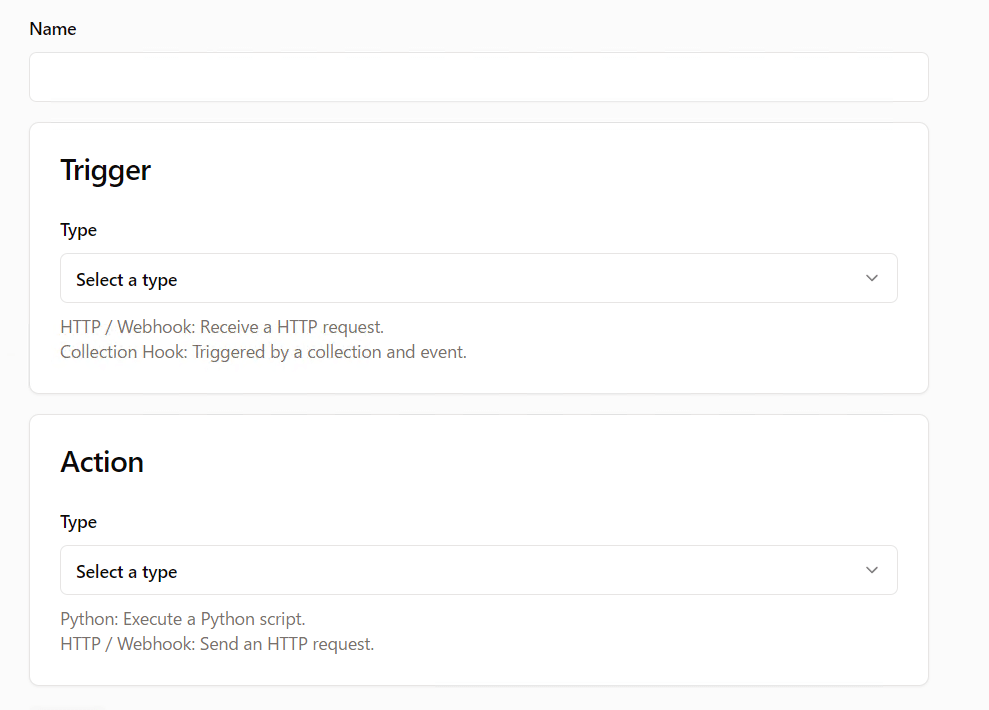
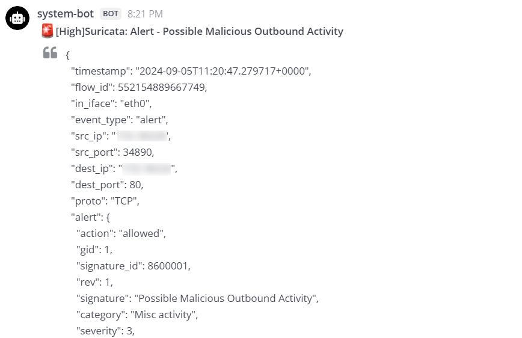

本記事ではファイル改竄やマルウェア感染、不正アクセスなどWebアプリケーションに対する様々な脅威を検知し管理する仕組みをWazuhで構築します。

## TOC

## システム概要

今回構築するシステムで検知する脅威は以下の通りです。

- サーバーおよびアプリケーション内におけるファイルの追加・変更・削除
- サーバーのマルウェア感染
- 不審なネットワークトラフィック
- アプリケーションに対する攻撃

上記で検知した脅威はレベルに応じて管理ツールに自動登録します。

## システム構成

今回のシステム構成は下図のようになります。
WebサーバーおよびアプリケーションサーバーにWazuhエージェントをインストールし脅威を検知します。
エージェントは検知した脅威情報を管理サーバーに送信し、管理サーバーはワークフローエンジンを介してインシデント管理ツールおよびチャットツールに脅威情報を送信します。

<figure></figure>


| Resource | Usage | Hosting Type | Licensing Model |
| - | - | - | - |
| [Wazuh](https://documentation.wazuh.com/current/index.html) | サーバーに対する様々な脅威を検知・管理する | Self Hosting（Docker container on Hetzner Cloud） | Free<br />Open Source |
| [Catalyst](https://catalyst.security-brewery.com/docs/category/catalyst-handbook/) | セキュリティに関するアラートやインシデントなどをチケット管理する | Self Hosting（Docker container on Hetzner Cloud） | Free<br />Open Source |
| [Caddy](https://caddyserver.com/docs/) + [Coraza](https://coraza.io/docs/tutorials/introduction/) | WebサーバーおよびWAF | Self Hosting（Docker container on Hetzner Cloud） | Free<br />Open Source |
| [n8n](https://docs.n8n.io/) | ワークフローを実行する | Self Hosting（Docker container on Hetzner Cloud） | Freemium<br />Open Source |
| [Mattermost](https://docs.mattermost.com/) | 脅威情報の通知先 | Self Hosting（Docker container on Hetzner Cloud） | Freemium<br />Open Source |


## Wazuhの設定

Wazuhの設定は`ossec.conf`で行います。
設定ファイルはWazuhマネージャーがインストールされたWazuhサーバー、またはWazuhエージェントがインストールされたエンドポイントの`/var/ossec/etc/ossec.conf`に配置されます。
設定可能な項目はマネージャー・エージェント両方で設定可、マネージャーのみで設定可、エージェントのみで設定可の3種類に分類されます。

設定項目一覧：https://documentation.wazuh.com/current/user-manual/reference/ossec-conf/index.html

### ファイル整合性監視

エンドポイントのファイルの作成、変更や削除を監視するための設定を行います。
エンドポイント側`ossec.conf`の`syscheck`セクションに監視したいディレクトリや監視から除外したいディレクトリを追加します。

```xml
<!-- File integrity monitoring -->
<syscheck>

  [...]

  <!-- Frequency that syscheck is executed default every 12 hours -->
  <frequency>43200</frequency>

  [...]
 
  <!-- Directories to check  (perform all possible verifications) -->
  <directories>/etc,/usr/bin,/usr/sbin</directories>
  <directories>/bin,/sbin,/boot</directories>

  <!-- 監視したいアプリケーションのディレクトリ -->
  <directories realtime="yes">/var/www/html</directories>
 
  <!-- Files/directories to ignore -->
  <ignore>/etc/mtab</ignore>
  <ignore>/etc/hosts.deny</ignore>
  <ignore>/etc/mail/statistics</ignore>
  <ignore>/etc/random-seed</ignore>
  <ignore>/etc/random.seed</ignore>
  <ignore>/etc/adjtime</ignore>
  <ignore>/etc/httpd/logs</ignore>
  <ignore>/etc/utmpx</ignore>
  <ignore>/etc/wtmpx</ignore>
  <ignore>/etc/cups/certs</ignore>
  <ignore>/etc/dumpdates</ignore>
  <ignore>/etc/svc/volatile</ignore>

  <!-- 監視から除外したいアプリケーションのディレクトリ -->
  <ignore>/var/www/html/var/cache</ignore>
  <ignore>/var/www/html/var/sessions</ignore>

  <!-- File types to ignore -->
  <ignore type="sregex">.log$|.swp$</ignore>

  [...]

</syscheck>
```

>[!NOTE]
>ファイルの整合性チェックは`frequency`に設定した秒数のサイクルで実行されますが、監視したいディレクトリに`realtime`オプションを付けることでリアルタイムの監視を行うことができます。

試しにアプリケーションのソースコードを変更してみると下図のように変更したファイルがダッシュボードのセキュリティイベントに表示されます。

<figure></figure>

### マルウェアの検知

#### エンドポイント（アプリケーションサーバー）の設定

まずはエンドポイント側の設定を行います。
マルウェアの検知には[YARA](https://virustotal.github.io/yara/)を使用します。
YARAはテキストやバイナリデータのパターンなどを定義したルールをもとにマルウェアや潜在的な危険性のあるファイルの識別と分類を行うツールです。

公式ドキュメントの[インストール手順](https://yara.readthedocs.io/en/latest/gettingstarted.html#compiling-and-installing-yara)を参考にしてエンドポイントにYARAをインストールします。

インストールが完了したらエンドポイントにYARAのルールをダウンロードします。
ルールは様々なコミュニティ・企業によって提供されています。
今回はNextron Systems社が提供しているYARAルールセット「[VALHALLA](https://www.nextron-systems.com/valhalla/)」を使用します。
ルールセットはAPI経由でダウンロードします（APIキーは[デモ](https://nextronsystems.github.io/valhallaAPI/#demo-access)用のキーを使用）。


```shell
sudo mkdir -p /tmp/yara/rules
sudo curl 'https://valhalla.nextron-systems.com/api/v1/get' \
-H 'Accept: text/html,application/xhtml+xml,application/xml;q=0.9,*/*;q=0.8' \
-H 'Accept-Language: en-US,en;q=0.5' \
--compressed \
-H 'Referer: https://valhalla.nextron-systems.com/' \
-H 'Content-Type: application/x-www-form-urlencoded' \
-H 'DNT: 1' -H 'Connection: keep-alive' -H 'Upgrade-Insecure-Requests: 1' \
--data 'demo=demo&apikey=1111111111111111111111111111111111111111111111111111111111111111&format=text' \
-o /tmp/yara/rules/yara_rules.yar
```

ダウンロードが完了したらエンドポイントにアクティブ・レスポンス用のシェルスクリプトを`/var/ossec/active-response/bin/yara.sh`に作成します。
アクティブ・レスポンスとはセキュリティイベントをトリガーにしてスクリプトを実行する機能です。
今回はファイルの作成や更新をトリガーにしてYARAでファイルのスキャンを行い、その結果をログファイルに出力します。
スクリプトは下記のようになります。

```bash
#!/bin/bash

read INPUT_JSON

# YARA実行ファイルのパス
YARA_PATH=$(echo $INPUT_JSON | jq -r .parameters.extra_args[1])
# YARAルールファイルのパス
YARA_RULES=$(echo $INPUT_JSON | jq -r .parameters.extra_args[3])
# セキュリティイベントのトリガーとなったファイル
FILENAME=$(echo $INPUT_JSON | jq -r .parameters.alert.syscheck.path)
# ファイルのmtime
MTIME=$(echo $INPUT_JSON | jq -r .parameters.alert.syscheck.mtime_after)
MTIME_EPOCH=$(date --date=${MTIME} +"%s")

LOG_FILE="logs/active-responses.log"

# ファイル書き込み中の場合は完了するまで待機
size=0
actual_size=$(stat -c %s ${FILENAME})
while [ ${size} -ne ${actual_size} ]; do
    sleep 1
    size=${actual_size}
    actual_size=$(stat -c %s ${FILENAME})
done

mkdir -p /tmp/lock
LOCK_FILE="/tmp/lock/$(sha256sum ${FILENAME} | awk '{ print $1 }').lock"

# ロックファイルを使用して重複起動を回避
if [[ -f $LOCK_FILE ]]; then
    OLD_MTIME_EPOCH=$(cat $LOCK_FILE)
    if [ $((MTIME_EPOCH - OLD_MTIME_EPOCH)) -gt 30 ]; then
        echo "$MTIME_EPOCH" > $LOCK_FILE
    else
        exit 1
    fi
else
    touch $LOCK_FILE
    echo "$MTIME_EPOCH" > $LOCK_FILE
fi

if [[ ! $YARA_PATH ]] || [[ ! $YARA_RULES ]]; then
    echo "wazuh-yara: ERROR - Yara active response error. Yara path and rules parameters are mandatory." >> ${LOG_FILE}
    exit 1
fi

# YARAスキャンを実行
yara_output="$("${YARA_PATH}"/yara -w -r "$YARA_RULES" "$FILENAME")"

if [[ $yara_output != "" ]]; then
    # マッチしたルールを一つずつログファイルに出力
    while read -r line; do
        echo "wazuh-yara: INFO - Scan result: $line" >> ${LOG_FILE}
    done <<< "$yara_output"
fi

exit 0
```

>[!NOTE]
>ファイルのダウンロードなどファイルの書き込みが完了するまでに時間がかかるケースでは、リアルタイムのファイル整合性監視によって同じファイルが何度も検知され、セキュリティイベント（ファイル更新イベント）が複数回発生することがあります。
>そのため、上記スクリプトではロックファイルを作成してファイルのタイムスタンプ情報を比較して、同じファイルに対してYARAスキャンが1回しか実行されないようにしています。

#### Wazuhサーバーの設定

まず、Wazuhサーバーにアプリケーションディレクトリのファイル作成・更新を検知するカスタムルールを作成します。
`/var/ossec/etc/rules/local_rules.xml`に以下のルールを追加します。
`if_sid`に指定している550はファイルのチェックサムの変更を検知するルールで、554はファイルが作成されたことを検知するルールです。
ここではファイル作成・更新を検知する550と554の関連ルールとして、アプリケーションディレクトリ配下のファイル作成・変更を検知するルール100200と100201を新たに定義しています。


```xml
<group name="syscheck,">
  <rule id="100200" level="7">
    <if_sid>550</if_sid>
    <field name="file">/var/www/html/</field>
    <description>File modified in the app directory.</description>
  </rule>
  <rule id="100201" level="7">
    <if_sid>554</if_sid>
    <field name="file">/var/www/html/</field>
    <description>File added to the app directory.</description>
  </rule>
</group>
```

次にアクティブ・レスポンスの設定を行います。
Wazuhサーバーの`/var/ossec/etc/ossec.conf`に以下の内容を追加します。
下記設定によりアプリケーションディレクトリ配下のファイル作成・変更をトリガーとしてYARAスキャンを実行するスクリプトを起動することができます。

```xml
<ossec_config>

  [...]

  <command>
    <name>yara_linux</name>
    <executable>yara.sh</executable>
    <extra_args>-yara_path /usr/local/bin -yara_rules /tmp/yara/rules/yara_rules.yar</extra_args>
    <timeout_allowed>no</timeout_allowed>
  </command>

  <active-response>
    <disabled>no</disabled>
    <!-- 実行するコマンド名 -->
    <command>yara_linux</command>
    <!-- コマンドを実行する場所（localはセキュリティイベントが発生したサーバーを表す） -->
    <location>local</location>
    <!-- 指定したルールIDに関わるセキュリティイベントの場合のみコマンドを実行する -->
    <rules_id>100200,100201</rules_id>
  </active-response>

  [...]

</ossec_config>
```

次にYARAスキャンの検知結果から情報を抽出するデコーダーとYARAスキャンの検知に対応するルールを作成します。
YARAスキャンの結果は`/var/ossec/logs/active-responses.log`に`wazuh-yara: INFO - Scan result: Blah Blah Blah`という書式で出力しています。
出力したログは設定ファイルの以下の設定によってログコレクターに収集されます。
収集したログはデコーダーによって情報を抽出され、該当するルールによってセキュリティイベントが作成されます。

```xml
<ossec_config>

  [...]

  <!-- 下記ファイルをログ収集対象に追加 -->
  <localfile>
    <log_format>syslog</log_format>
    <location>/var/ossec/logs/active-responses.log</location>
  </localfile>

  [...]

</ossec_config>
```

`/var/ossec/etc/decoders/local_decoder.xml`に以下のデコーダーを追加します。

```xml
<decoder name="yara_decoder">
  <prematch>wazuh-yara:</prematch>
</decoder>

<decoder name="yara_decoder1">
  <parent>yara_decoder</parent>
  <regex>wazuh-yara: (\S+) - Scan result: (\S+) (\S+)</regex>
  <!-- 上の正規表現のキャプチャグループと対になるラベル -->
  <order>log_type, yara_rule, yara_scanned_file</order>
</decoder>
```

そして`/var/ossec/etc/rules/local_rules.xml`に以下のルールを追加します。

```xml
<group name="yara,">
  <rule id="108000" level="0">
    <decoded_as>yara_decoder</decoded_as>
    <description>Yara grouping rule</description>
  </rule>
  <rule id="108001" level="12">
    <if_sid>108000</if_sid>
    <match>wazuh-yara: INFO - Scan result: </match>
    <description>File "$(yara_scanned_file)" is a positive match. Yara rule: $(yara_rule)</description>
    <group>malware,incident,</group>
  </rule>
</group>
```

以上の設定は完了です。
YARスキャンで脅威を検知した場合に独自のセキュリティイベントを発生させることができるようになりました。
アプリケーションの任意のディレクトリにマルウェアのサンプルをダウンロードしてイベントが発生するかどうか試してみます。

```shell
curl https://wazuh-demo.s3-us-west-1.amazonaws.com/mirai --output /var/www/html/html/upload/mirai
```

上記コマンドでダウンロードすると下図のようにセキュリティイベントが発生していることが確認できます。

<figure></figure>

ソースコードにWebShellを埋め込んでみます。
下図のようにセキュリティイベントが発生していることが確認できます。

<figure></figure>

### 不審なネットワークトラフィックの検知

#### エンドポイント（アプリケーションサーバー）の設定

不審なネットワークトラフィックの検知には[Suricata](https://docs.suricata.io/en/latest/what-is-suricata.html)を使用します。
SuricataはOISF（Open Information Security Foundation）によって開発されているオープンソースのネットワークIDS/IPSエンジンです。

エンドポイントにSuricataを[インストール](https://docs.suricata.io/en/latest/install.html)したら新しい検知ルール群をダウンロードします。

```shell
cd /tmp/ && curl -LO https://rules.emergingthreats.net/open/suricata-6.0.8/emerging.rules.tar.gz
sudo tar -xvzf emerging.rules.tar.gz && sudo mkdir /etc/suricata/rules && sudo mv rules/*.rules /etc/suricata/rules/
sudo chmod 640 /etc/suricata/rules/*.rules
```

次に`/etc/suricata/suricata.yaml`を修正します。

```yaml
vars:
  address-groups:
    HOME_NET: "＜エンドポイントのIPアドレス＞"

af-packet:
  - interface: "＜監視したいネットワークインターフェース（例：eth0）＞"

rule-files:
  - "*.rules"
```

`/var/ossec/etc/ossec.conf`に以下の内容を追加して、イベントログをログ収集の対象に加えます。

```xml
<ossec_config>

  [...]

  <localfile>
    <log_format>json</log_format>
    <location>/var/log/suricata/eve.json</location>
  </localfile>

  [...]

</ossec_config>
```

次に`/etc/suricata/rules/`ディレクトリ直下にルールファイルを追加して以下のオリジナルルールを追加し、エンドポイントから外部のネットワークに対して60秒間に30回を超えるアウトバウンドトラフィックを検知した場合にアラートを出すようにします。

```
alert tcp $HOME_NET any -> $EXTERNAL_NET any (msg:"Possible Malicious Outbound Activity"; flow:to_server; flags: S,12; threshold: type both, track by_src, count 30, seconds 60; classtype:misc-activity; sid:1000001; rev:1; metadata: severity high;)
```

#### Wazuhサーバーの設定

`/var/ossec/etc/rules/local_rules.xml`に以下のルールを追加し、metadataのseverityにhighを指定しているアラートの場合にルールレベルが9のセキュリティイベントが発生するようにします。

```xml
<group name="ids,suricata,">
  <rule id="86611" level="9">
    <if_sid>86601</if_sid>
    <field name="alert.metadata.severity" type="pcre2">\["high"\]</field>
    <description>Suricata: Alert - $(alert.signature)</description>
    <group>alert,</group>
  </rule>
</group>
```

以上で設定は完了です。
試しにエンドポイントにnmapでポートスキャンを行ってみます。
結果は下図のようになりセキュリティイベントが発生していることが確認できます。

<figure></figure>

エンドポイントから外部のサーバーに対してリクエストを多数送信してみます。
結果は下図のようになりセキュリティイベントが発生していることが確認できます。

<figure></figure>

### アプリケーションに対する攻撃の検知

#### エンドポイント（アプリケーションサーバー）の設定

今回はアプリケーション（EC-CUBE）のログイン認証に対する外部からのブルートフォース攻撃を検知する設定を行います。
まず、アプリケーションログのフォーマットをsyslog形式のヘッダーとボディで構成されるフォーマットにします。

```yaml
eccube.log.formatter.line:
  class: Monolog\Formatter\LineFormatter
  arguments:
      - "%%datetime%% ECCUBE: %%channel%%.%%level_name%% [%%extra.ip%%] [%%extra.session_id%%] [%%extra.uid%%] [%%extra.user_id%%] [%%extra.class%%:%%extra.function%%:%%extra.line%%] - %%message%% [%%extra.http_method%%, %%extra.url%%, %%extra.referrer%%, %%extra.user_agent%%]\n"
```

以下はログイン認証に失敗した時のログのサンプルです。

```
2024-09-01T00:00:00.000000+09:00 ECCUBE: security.INFO [192.168.1.1] [d0254ab9] [5345b59] [N/A] [Symfony\Component\Security\Http\Authentication\AuthenticatorManager:handleAuthenticationFailure:251] - Authenticator failed.  [POST, /mypage/login, http://example.com/mypage/login, Mozilla/5.0 (Windows NT 10.0; Win64; x64) AppleWebKit/537.36 (KHTML, like Gecko) Chrome/128.0.0.0 Safari/537.36]
```

`/var/ossec/etc/ossec.conf`に以下の内容を追加して、上記アプリケーションログをログ収集の対象に加えます。

```xml
<ossec_config>

  [...]

  <localfile>
    <log_format>syslog</log_format>
    <location>/var/www/html/var/log/prod/*.log</location>
  </localfile>

  [...]

</ossec_config>
```

#### Wazuhサーバーの設定

収集したアプリケーションログのデコーダーを`/var/ossec/etc/decoders/local_decoder.xml`に追加します。

```xml
<decoder name="eccube-security-info">
  <type>syslog</type>
  <program_name>ECCUBE</program_name>
  <prematch>security.INFO </prematch>
  <regex offset="after_prematch" type="pcre2">\[(\S*)\] \[(\S*)\] \[(\S*)\] \[(\S*)\] (.*)</regex>
  <order>srcip,session_id,uid,user_id,message</order>
</decoder>
```

デコーダーで抽出したメッセージを条件にログイン認証成功と失敗のルールを`/var/ossec/etc/rules/local_rules.xml`に追加します。

```xml
<group name="syslog,eccube,">
  <rule id="100400" level="3">
    <decoded_as>eccube-security-info</decoded_as>
    <description>EC-CUBE security information.</description>
  </rule>

  <rule id="100401" level="5">
    <if_sid>100400</if_sid>
    <field name="message">Authenticator failed</field>
    <description>eccube: Authentication failed.</description>
    <group>authentication_failed,</group>
  </rule>

  <rule id="100402" level="3">
    <if_sid>100400</if_sid>
    <field name="message">Authenticator successful</field>
    <description>eccube: Authentication succeeded.</description>
    <group>authentication_success,</group>
  </rule>
</group>
```

実際にログイン画面でログイン認証に失敗してみると該当のセキュリティイベントが発生していることが確認できます。

<figure></figure>

<figure></figure>

このままだとログイン認証失敗のアラートが大量にログ表示されてしまいますので同一IPアドレスからのログイン認証失敗の回数が閾値を超えた場合のみ表示するようにしたいと思います。以下のように既存のルールに`no_log`オプションを追加し、新しいルールを追加します。

```xml
<group name="syslog,eccube,">

  [...]

  <rule id="100401" level="5">
    [...]
    <options>no_log</options>
  </rule>

  <rule id="100402" level="3">
    [...]
    <options>no_log</options>
  </rule>

  <rule id="100403" level="7" frequency="10" timeframe="120">
    <if_matched_group>authentication_failed</if_matched_group>
    <same_srcip />
    <description>eccube: Too many login attempts from the same IP address</description>
    <group>authentication_failures,attack,alert,</group>
  </rule>
</group>
```

上記の修正により個々のログイン認証失敗はログ表示されなくなり、同一IPアドレスからのログイン認証失敗が120秒間に10回に達した場合にセキュリティイベントが発生するようになりました。
実際に試した結果は下図のようになります。

<figure></figure>

### WAFによる攻撃の遮断

ログイン画面に対するブルートフォース攻撃を検知できるようになりましたので、検知したIPアドレスをWAFで自動的にブロックする簡易的な仕組みを追加します。

今回WebサーバーとしてCaddyを使用しており、Caddyに[Corazaモジュール](https://github.com/corazawaf/coraza-caddy)を使用してOWASP Coraza WAFの機能を組み込んでいます。以下はCaddyファイルのWAFの設定内容です。

```
coraza_waf {
  load_owasp_crs
  directives `
  Include @coraza.conf-recommended
  Include @crs-setup.conf.example
  Include @owasp_crs/*.conf
  SecDefaultAction "phase:3,log,auditlog,pass"
  SecDefaultAction "phase:4,log,auditlog,pass"
  SecDefaultAction "phase:5,log,auditlog,pass"
  SecRuleEngine On
  SecDebugLog /dev/stdout
  SecDebugLogLevel 9
  SecRule REMOTE_ADDR "@ipMatchFromFile /caddy/banned_ips" "id:101,phase:1,t:lowercase,deny,status:403"
  SecRule REQUEST_URI "@streq /admin" "id:102,phase:1,t:lowercase,deny,status:403"
  SecRule REQUEST_BODY "@rx maliciouspayload" "id:103,phase:2,t:lowercase,deny,status:403"
  SecRule RESPONSE_STATUS "@rx 406" "id:104,phase:3,t:lowercase,deny,status:403"
  SecResponseBodyAccess On
  SecResponseBodyMimeType application/json
  SecRule RESPONSE_BODY "@contains responsebodycode" "id:105,phase:4,t:lowercase,deny,status:403"
  `
}
```

上記設定の以下の箇所でファイルに列挙されたIPアドレスとアクセスIPアドレスが一致する場合はアクセスをブロックするようにしています。

```
SecRule REMOTE_ADDR "@ipMatchFromFile /caddy/banned_ips" "id:101,phase:1,t:lowercase,deny,status:403"
```

ログイン認証失敗が閾値を超えた場合に発生するセキュリティイベントをトリガーにしてこのIPリストファイルを更新し、攻撃者のIPアドレスのブロックを自動化します。

#### エンドポイント（Webサーバー）の設定

アクティブ・レスポンス用のシェルスクリプトを`/var/ossec/active-response/bin/ip-block.sh`に作成します。
スクリプトは下記のようになります。

```bash
#!/bin/bash

read INPUT_JSON

BANNED_IPS_FILE="/caddy/banned_ips"

ip_address=$(echo $INPUT_JSON | sed 's/\\/\\\\/g' | jq -r .parameters.alert.data.srcip)

echo "$ip_address" >> "$BANNED_IPS_FILE"

# ファイルの更新を反映させるためにWebサーバーの再起動
rc-service caddy restart

exit 0;
```

#### Wazuhサーバーの設定

アクティブ・レスポンスの設定を行います。
`/var/ossec/etc/ossec.conf`に以下の内容を追加します。


```xml
<ossec_config>

  [...]

  <command>
    <name>ip_block</name>
    <executable>ip-block.sh</executable>
    <extra_args></extra_args>
    <timeout_allowed>no</timeout_allowed>
  </command>

  <active-response>
    <disabled>no</disabled>
    <command>ip_block</command>
    <!-- コマンドを実行するエンドポイントを直接指定 -->
    <location>defined-agent</location>
    <agent_id>＜エンドポイント（Webサーバー）のエージェントID＞</agent_id>
    <!-- 最大試行回数超過のルールID -->
    <rules_id>100403</rules_id>
  </active-response>

  [...]

</ossec_config>
```

>[!NOTE]
>今回は単一Webサーバーを想定してエージェントIDを直接指定しています。
>複数台構成の場合はlocationを`all`に設定して全てのエージェントでコマンドが実行されるようにし、コマンドにCaddyプロセスが存在すればファイルの更新を行うなどの処理を追加してください。

実際にログイン画面で最大試行回数を超過するとアクセスがブロックされることが確認できます。

<figure></figure>

<figure></figure>

＜試行回数超過後＞

<figure></figure>

## インシデント管理ツールへの登録および通知

発生したセキュリティイベントのインシデント管理ツールへの登録およびチャットツールへの通知を行うワークフローを作成します。

### Wazuhサーバーの設定

まず、n8nにイベントデータを送信するためのスクリプトをWazuhサーバーの`/var/ossec/integrations/custom-n8n`に作成します。

```py
#!/usr/bin/python3

import json
import logging
import sys
import os

try:
    import requests
except ModuleNotFoundError:
    print("No module 'requests' found. Install: pip install requests")
    sys.exit(1)

LOG_FILE = '/var/ossec/logs/integrations.log'

def main(args):
    alert_file_location = args[1]
    with open(alert_file_location) as alert_file:
        json_alert = json.load(alert_file)

    try:
        agent_id = json_alert['agent']['id']
        alert_level = json_alert['rule']['level']
        description = json_alert['rule']['description']

        api_key = args[2]
        hook_url = args[3]

        message: str = generate_message(json_alert)

        if not message:
            return

        send_message(message, api_key, hook_url)
    except json.JSONDecodeError as json_error:
        logging.error(f"Error decoding JSON: {str(json_error)}")
    except KeyError as key_error:
        logging.error(f"Key not found in JSON: {str(key_error)}")
    except FileNotFoundError:
        logging.error("Alerts file not found")
    except Exception as e:
        logging.error(f"Error processing alerts: {str(e)}")


def generate_message(alert: any) -> str:
    level = alert['rule']['level']

    if level <= 7:
        severity = 1
    elif level >= 8 and level <= 12:
        severity = 2
    else:
        severity = 3

    message = {
        'severity': severity,
        'title': alert['rule']['description'] if 'description' in alert['rule'] else 'N/A',
        'text': alert.get('full_log'),
        'rule_id': alert['rule']['id'],
        'timestamp': alert['timestamp'],
        'id': alert['id'],
        'all_fields': alert,
    }

    return json.dumps(message)


def send_message(message: str, api_key: str, hook_url: str) -> None:
    headers = {'Content-Type': 'application/json', 'Accept': 'application/json', 'X-ApiKey': api_key}
    res = requests.post(hook_url, data=message, headers=headers, timeout=10)


if __name__ == "__main__":
    try:
        logging.basicConfig(filename=LOG_FILE, level=logging.INFO, format='%(asctime)s - %(levelname)s: %(message)s', datefmt='%Y-%m-%d %H:%M:%S')
        main(sys.argv)
    except Exception as e:
        logging.error(str(e))
        raise
```

次にWazuhサーバーの`/var/ossec/etc/ossec.conf`に以下の内容を追加します。

```xml
<ossec_config>

  [...]

  <integration>
    <name>custom-n8n</name>
    <hook_url>＜n8nのWebフックURL＞</hook_url>
    <!-- ルールレベルが7以上のイベントのみ送信 -->
    <level>7</level>
    <alert_format>json</alert_format>
    <api_key>＜n8nで設定したAPIキー＞</api_key>
    <!-- 下記グループのイベントのみ送信 -->
    <group>malware,ids,attack,attacks,</group>
  </integration> 

  [...]

</ossec_config>
```

これで該当するセキュリティイベントが発生した時にn8nのWebフックにイベントデータが送信されるようになります。

### インシデント管理ツール（Catalyst）の設定

Catalystにデータを連携して自動でチケットを作成するためには[Reaction](https://catalyst.security-brewery.com/features/#reactions)というものを作成する必要があります。
Reactionはトリガーとアクションで構成され、トリガーがイベントをリッスンしアクションはトリガーがアクティブになった時に実行されます。

<figure></figure>

管理画面で作成画面を開き以下の内容を設定します。

■トリガー

| Name | Value |
| - | - |
| Type | HTTP / Webhook |
| Token | 認証用トークン |
| Path | Webhookのパス |

■アクション

| Name | Value |
| - | - |
| Type | Python |
| requirements.txt | pocketbase |
| Script | 下記スクリプトを入力 |

```py
import sys
import json
import os

from pocketbase import PocketBase

event = json.loads(sys.argv[1])
body = json.loads(event["body"])

client = PocketBase('http://0.0.0.0:8090')
client.auth_store.save(token=os.environ["CATALYST_TOKEN"])

severity = "Medium" if body["severity"] == 1 else "High"
groups = body["groups"].split(",")
type = "incident" if "incident" in groups else "alert"

if type:
  client.collection("tickets").create({
    "name": body["name"],
    "description": body["description"],
    "state": { "severity": severity }, 
    "type": type,
    "open": True,
  })
```

### ワークフローの作成

まずセキュリティイベントを受信するWebフックを作成します（ノードパネルから`On webhook call`を選択）。

<figure></figure>

ノードを追加して設定パネルで以下のように設定します。

| Name | Value |
| - | - |
| HTTP Method | POST |
| Path | 任意のパスを設定 |
| Authentication | Header Auth |
| Credential for Header Auth | Nameに`X-ApiKey`、Valueに`Wazuhサーバーのossec.confで指定したAPIキー`を設定 |
| Respond | Immediately |
| Response Code | 200 |

次に`HTTP Request`ノードを追加してCatalystにチケットを登録します（ノードパネルの`Helpers`から選択）。

<figure></figure>

ノードを追加して設定パネルで以下のように設定します。

| Name | Value |
| - | - |
| Method | POST |
| URL | Catalystで作成したReactionのWebフックURL |
| Authentication | Generic Credential Type |
| Generic Auth Type | Header Auth |
| Credential for Header Auth | Authorization Bearer ＜Reactionで設定したトークン＞ |
| Send Headers | ON |
| Header Parameters (Name1)  | Content-Type |
| Header Parameters (Value1)  | application/json |
| Header Parameters (Name2)  | Accept |
| Header Parameters (Value2)  | application/json |
| Send Body | ON |
| Body Content Type | JSON |
| Specify Body | Using Fields Below |
| Body Parameters(Name1) | name |
| Body Parameters(Value1) | &#123;&#123; $json.body.title &#125;&#125; |
| Body Parameters(Name2) | description |
| Body Parameters(Value2) | &#123;&#123; $json.body.text &#125;&#125; |
| Body Parameters(Name3) | severity |
| Body Parameters(Value3) | &#123;&#123; $json.body.severity &#125;&#125; |
| Body Parameters(Name4) | groups |
| Body Parameters(Value4) | &#123;&#123; $json.body.all_fields.rule.groups.join() &#125;&#125; |

次に`Code`ノードで通知用データの加工を行います（ノードパネルの`Data transformation`から選択）。

<figure></figure>

ノードを追加して設定パネルのコード入力欄に以下のJavaScriptを入力します。

```javascript
const notification = {}
const severity = ['Medium', 'High', 'Critical']

for (const item of $('Recieve security event from Wazuh').all()) {
  notification.severity = severity[parseInt(item.json.body.severity) - 1]
  notification.title = item.json.body.title
  // ログのデコーダーがjsonの場合はJSON形式のログにインデントを付けて見やすいように整形
  notification.log = item.json.body.all_fields.decoder.name === 'json' ? JSON.stringify(JSON.parse(item.json.body.text), null, 2) : item.json.body.text
  notification.isIncident = item.json.body.all_fields.rule.groups.some(g => g === 'incident')
}

return [notification]
```

最後に`Mattermost`ノードを追加してアラートを通知します。

<figure></figure>

ノードを追加して設定パネルで以下のように設定します。

| Name | Value |
| - | - |
| Credential to connect with | Mattermostで発行したアクセストークンとMattermostのURLを設定 |
| Resource | Message |
| Operation | Post |
| Channel Name or ID | 投稿したいチャネルのIDを設定 |
| Message | 下記のメッセージを入力 |

```
** {{ $json.isIncident ? ':fire: ' : ':rotating_light:' }}[{{ $json.severity }}]{{ $json.title }} **

> {{ $json.log }}
```

以上でワークフローは完成です。動作確認を行ってみます。

マルウェアをダウンロードすると下図のようにインシデントが登録され通知が届きます。

<figure></figure>

<figure></figure>

アプリケーションから外部のサーバーに多数のリクエストを送信すると下図のようにアラートが登録され通知が届きます。

<figure></figure>

<figure></figure>

アプリケーションのログイン認証に対してブルートフォース攻撃を行うと下図のようにアラートが登録され通知が届きます。

<figure></figure>

<figure></figure>
